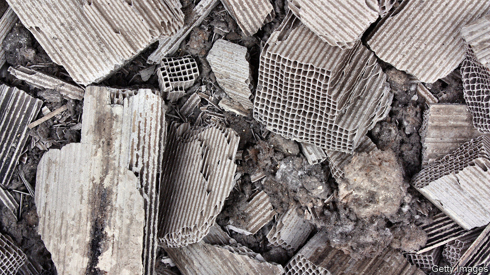
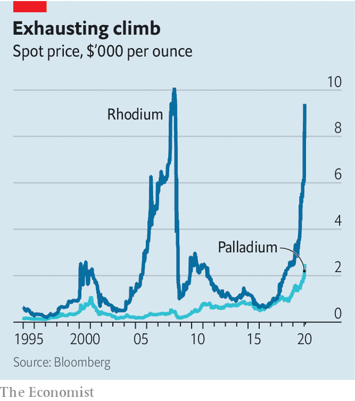

## Rhodium ride

# Why are rhodium prices on a roll?

> They have risen 63% so far this year

> Jan 25th 2020

WHEN ANNA SCOTT left her Honda Jazz in a commuters’ car park outside Oxford on January 10th, she had little reason to think that criminals would take an interest in the 12-year-old car. Yet the next afternoon a group of shifty characters were spotted sawing off its catalytic converter. Such incidents have become more frequent across Britain as prices for palladium and rhodium, metals contained in the devices, have rocketed. The price of rhodium has risen by 63% in the first three weeks of January alone, to $9,850 per ounce, around six times that of gold. There is no telling when it will fall back to earth.

Demand from carmakers is surging. More than four-fifths of global demand for rhodium comes from the automotive industry. The metal, together with platinum and palladium, helps convert toxic gases in a vehicle’s exhaust system (such as carbon monoxide) into less harmful substances before they leave the tailpipe. Facing stricter emissions regulations around the world, carmakers are taking even more of a shine to these metals. Although the price of palladium has reached a record high, that of platinum has stayed relatively stable. The contrast reflects a shift in production towards petrol and hybrid cars, which tend to use greater quantities of palladium in their converters, and away from diesel engines, which use more platinum.

Rhodium is used in both petrol and diesel cars. That is because it is especially good at cleaning up nitrogen oxides, says Roger Breuer, an analyst at Arlington Group Asset Management, an investment firm. Another reason its price is sky-high is the tightness of its supply. More than four out of every five ounces of rhodium are mined in South Africa, extracted in minuscule quantities alongside more abundant metals such as platinum, palladium and gold. According to an analysis by Stantec, a consulting firm, a mine in the Waterberg region of South Africa due to begin development this year will produce 63% palladium, 29% platinum, 6.5% gold and just 1.5% rhodium.

The small size of the rhodium market (just 792,000 ounces last year, about 1% of that of gold) makes it prone to huge price swings. In 2008, after mining in South Africa was interrupted by blackouts, the price climbed above $10,000 an ounce. This time, a lack of capital investment has squeezed supply, according to Impala Platinum, the world’s second-biggest platinum miner.

Rhodium is expected to remain in high demand this year. BASF, a German chemicals giant, reckons that Chinese carmakers’ demand for the metal will increase by 40% in 2020. But because electric vehicles do not use catalytic converters, demand in the longer term is far from assured. Rhodium could quickly lose its sheen.