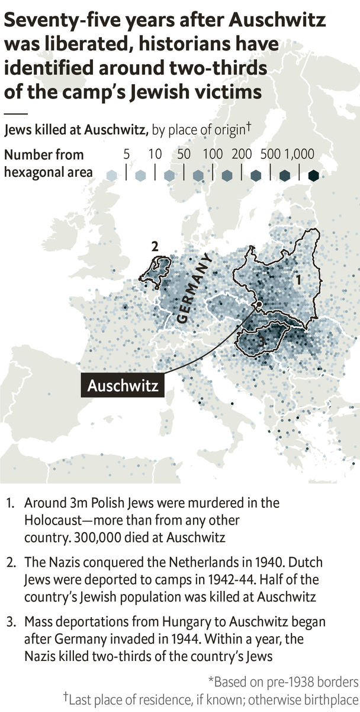

## A memorial and a name

# Archivists are racing to identify every Jewish Holocaust victim

> On the 75th anniversary of the liberation of Auschwitz, just 400,000 Holocaust survivors are still alive

> Jan 25th 2020

SIMONE MARIENBERG, a five-month-old baby, had been born in Saint-Martin-Vésubie, a hilly village in France. Salomon Ieoyda, who was close to 90, came from Thessaloniki in Greece. At least 40 members of the Horovitz family arrived from Hajduhadhaz in Hungary. There were more than 9,300 Davids and 14,400 Esthers.

The 1.1m people killed at Auschwitz, an extermination camp in occupied Poland, were born as far away as Finland and Morocco. Most of the victims, after journeys of brutalising squalor, were led directly from the trains to the gas chambers. When the Red Army liberated the Third Reich’s biggest death factory on January 27th 1945, 75 years ago this week, it found 7,000kg of human hair shorn from the corpses.

The tally of the dead is hard to comprehend. Of the 9.5m Jews in Europe before the war, 6m were murdered. If you spent five minutes reading about each of them, it would fill every waking hour for 90 years. The overall civilian death toll attributed to the Nazis—including Gypsies, disabled people, gays, prisoners and bystanders to combat—was perhaps three times greater.

Yad Vashem (“A Memorial and a Name”), a museum in Israel, is determined to commemorate Holocaust victims as individuals. In 1946 Sarah Friedlander, a survivor of Bergen-Belsen, became the first director of its archive, which documented Jews’ lives using testimonies from relatives. In 2004 Yad Vashem published its database of victims online. Since then, it has grown from 2.7m people to 4.8m, thanks to digital analysis of the museum’s 210m documents. The records include 736,000 murdered Jews who were sent to Auschwitz.

The most detailed entries provide photos, a biography, links to other relatives and place of death. As well as memorialising each victim for ever, this effort reveals the extent of the losses across Europe. The map above shows the last recorded residence— or birthplace, if the pre-Holocaust home is unknown—of all identified Jews killed at Auschwitz. Even though that camp was responsible for just one-sixth of the death toll, it claimed lives from nearly everywhere in Nazi-occupied territory, and those of many people born elsewhere, too.

Yad Vashem is racing against time to reach 6m names. Today, 400,000 Jews who survived or fled the Nazis and their collaborators are alive, reckons the Claims Conference, a body that sends them €480m ($564m) a year in compensation, mostly from the German government. By 2030 there could be fewer than 100,000 surviving Jews who lived in or near Axis territory during the war. As Alexander Avram, the database’s director, said in 2017, “Every new name is a small victory against oblivion.” ■

Sources: Yad Vashem; United States Holocaust Memorial Museum; Claims Conference

## URL

https://www.economist.com/graphic-detail/2020/01/25/archivists-are-racing-to-identify-every-jewish-holocaust-victim
