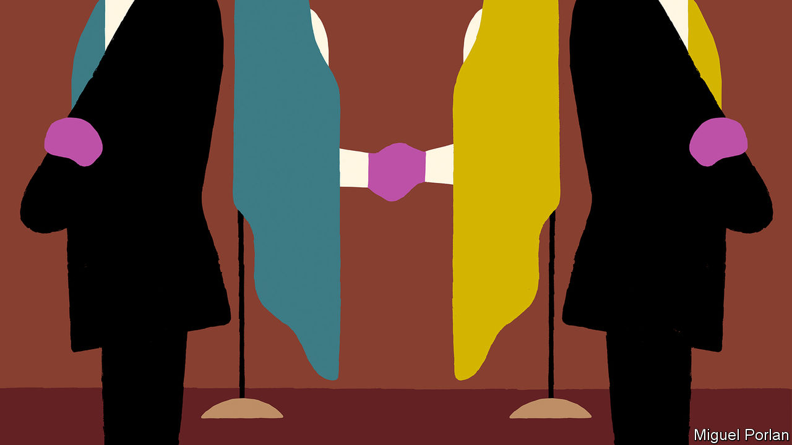
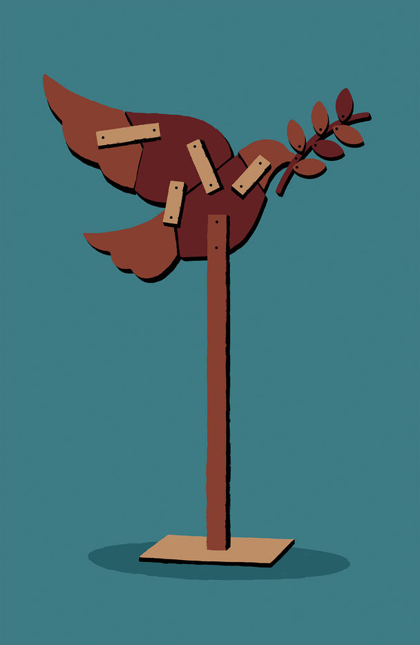

## Not your average diplomats

# Conflict resolution relies increasingly on diplomatic back channels

> It is hard to measure how well they work

> Jan 23rd 2020

TALKS BETWEEN the Colombian government and the FARC rebels were stuck. The two sides could not agree on how to bring those responsible for crimes during the country’s 52-year civil war to account. But with the help of Inter Mediate, a British charity, a way forward was found, involving the appointment of three independent lawyers on each side. In 2015 a pioneering transitional-justice deal was reached.

When official efforts to resolve a conflict are lacking or bogged down, another way must be found. “You need a referee,” says Jonathan Powell of Inter Mediate, “and that has to be someone who’s trusted by both sides.” The involvement of third parties can take many forms. They can help as advisers (as in Colombia). They may open a back channel (as South Africa’s ruling National Party did in order to negotiate an end to apartheid with the African National Congress—representatives of the two hostile sides secretly met in an English country house owned by a gold-mining firm). Increasingly, they establish entire alternative avenues for dialogue. Such diplomacy, known as Track 2, fills the void left by the official sort in Track 1.

The term, first used in 1981 by an American diplomat, Joseph Montville, covers everything from modest workshops to major initiatives. Even the author of a book on the subject, Peter Jones of the University of Ottawa, says Track 2 “defies easy definition”. To complicate matters, some variants merge into Track 1.5 (run privately but with involvement of public officials), while Track 3 connects communities.

They all have one thing in common: they have been growing. “When I first started in the early 1990s, you could probably count on two hands the number of organisations involved in this kind of work, but in the last ten years there’s been a proliferation,” says Hrair Balian of the Carter Centre in Atlanta. One reason, perhaps, is an increase in discord. The UN Office for the Co-ordination of Humanitarian Affairs reckons there were 402 “political conflicts” in 2016, up from 278 a decade earlier. (It defines conflict broadly, including anything from the bloodbath in Syria to tetchy exchanges between Scottish nationalists and the British government.)

Track 2 initiatives proliferated during the cold war. The Dartmouth Conferences fostered contacts between cultural figures, scholars and politicians from East and West; the Pugwash Conferences brought together scientists. With communism’s collapse the need for alternative tracks diminished. The first two decades after the fall of the Berlin Wall brought some 30 major peace agreements, according to David Harland of the Swiss-based Centre for Humanitarian Dialogue (HD), a leader in private diplomacy. But the next decade saw only seven or eight. Technology has enabled smaller groups to pile into conflicts, making them messier and harder for the UN’s state-centric system to handle, Mr Harland argues. Meanwhile, two or three new wars start each year.

These tend to be within countries, not between them. In the trickiest cases, “Track 1 as a conflict-resolution tool has really lost its significance,” says Luxshi Vimalarajah of the Berghof Foundation in Berlin, another leader in the field. The need for more flexible ways to bring the parties together creates a gap for private peacemakers.

Some, like Jimmy Carter, a former American president, have brought skills honed in government. Martti Ahtisaari, a president of Finland and like Mr Carter a Nobel peace laureate, set up Crisis Management Initiative (CMI). Mr Powell co-founded Inter Mediate after, as a British official, striving for peace in Northern Ireland.

For size HD, with some 250 people, could rival the diplomatic service of many a country. At the other end are numerous think-tanks and NGOs. In the middle are expert facilitators like Mr Jones’s Ottawa Dialogue or the United States Institute of Peace (USIP). Nancy Lindborg, USIP’s boss, says that, after a post-cold-war lull, the resurgence of regional and great-power rivalry once again requires more reliance on Track 2 and 1.5.

Peace-building is not the only area for Track 2. In Delhi on February 3rd-5th the US-India Track II Dialogue on Climate Change and Energy will gather, as it has each year in India or America since 2010, supported by the Aspen Institute and other think-tanks. Since Donald Trump dumped the Paris accord, such meetings (like similar sessions with China) offer a chance to explain how much is still happening on the climate front. By one estimate, action at subnational levels could reduce America’s greenhouse-gas emissions by up to 37% compared with 2005 levels by 2030.

As for Track 3, it is a way of trying to ensure that a peace effort is “inclusive, so that you don’t have elite settlements”, says Jonathan Cohen of Conciliation Resources in London. In Yemen CMI is working on local ceasefires and opportunities for a wider range of voices to have their say in the official UN-led peace drive. Women’s representatives “have identified concrete, actionable steps to ensure women’s inclusion in the peace process and in broader political decision-making,” says Sylvia Thompson, who manages CMI’s Yemen initiative.

Private diplomacy has always existed. But it has acquired not only a fancy name but a reputation and a set of established practices. Its reputation rose with some high-profile successes. The agreement that ended the civil war in Mozambique came through patient work by Sant’Egidio, a Catholic organisation. HD helped to facilitate a ceasefire between Indonesia and separatists in Aceh: the Indonesian government “wouldn’t let a foreign government anywhere near its internal affairs”, recalls Martin Griffiths, who played a leading part (he is now the UN special envoy for Yemen). Similarly, Spain’s desire to avoid mediation by other governments offered an opening for private diplomacy in negotiations with the Basque terrorists of ETA. Whereas officials tend to favour the state, private facilitators can be more even-handed.

Although Track 2 is private, the public sometimes gets a glimpse. “Oslo”, a play, dramatises the back-channel talks in the 1990s between Israelis and Palestinians that led to the Oslo accords. It highlights a vital aspect: deniability. Track 2 creates a safe space where ideas can be aired and proposals tested, without official fingerprints. It can enable contacts with a secretive state such as North Korea, or between adversaries such as Saudis and Iranians.

A Track 2 dialogue may begin with a working paper and an outline of familiar stances before moving on—after an icebreaker dinner—to a more creative discussion. Over time, with luck, trust and familiarity develop. The Oslo meetings made progress in part because many of those involved had taken part in workshops between Israelis and Palestinians organised for years by Herbert Kelman, a Harvard social psychologist. What Mr Jones calls “a facilitated, problem-solving dialogue” can help participants move from parroting fixed positions towards a joint discussion and then joint proposals, which they can take to their respective authorities.

No one would claim that Track 2 is easy, or quick. Facilitators have to “provide the space without dictating solutions”, says Ms Vimalarajah. “I’ve never seen a process that’s been very linear.” This is not a game you get into unless you’re comfortable with a low batting average, notes another expert. “Track 2 is limited, let’s be honest,” says Eugene Rumer of the Carnegie Endowment for International Peace, a think-tank. He has been involved in “no bullshit” exchanges between Americans and Russians on security issues; the modest achievement may be to feed a fresh idea or two back to the Kremlin or the White House. Sometimes facilitators do get tantalisingly close to a breakthrough—on rights for Kurds in Turkey, for example—only to be stymied by a mood change in government.

Is Track 2 worth all the effort? Not everyone is a fan. Diplomats sometimes frown on outsiders’ encroachment. America’s Logan Act of 1799 criminalises unauthorised negotiations that undermine government policy. The ethics of dealing with people who have blood on their hands is tricky.

One worry is confusion. “There’s a proliferation of actors,” says Lakhdar Brahimi, a former Algerian diplomat now with The Elders, a group of peace-promoting statesmen. “Nobody can control it.” He points to Afghanistan and South Sudan as examples of “overcrowding”, with a profusion of well-meaning special envoys and NGOs. Quality can suffer, too. “I really question the activities of some NGOs pretending to do Track 2,” says Mr Balian of the Carter Centre, “especially when they start advocating for a particular side in a dispute.”

A second concern is that Track 2 can remain a mere talking-shop. Informal initiatives should be closely connected to official diplomacy from the start: if Track 1 people have not been involved in the initial brief they will not be interested in the debrief. An obvious way of ensuring a credible transmission mechanism is to include some official representatives: hence the increasing popularity of Track 1.5.

A third challenge is measuring effectiveness. Backers—supportive governments, notably Nordic ones, and charitable foundations—want to know if their money is well spent. But how to judge the success of what is typically a long-term enterprise, largely hidden from view? Pathways for Peace, a UN-World Bank study, estimates that spending more on conflict-prevention efforts can save anything from $5bn a year to $70bn. Specific measures for the cost effectiveness of Track 2 are harder to devise.

The full impact can take years to become visible. In Sudan the Carter Centre facilitated a “Guinea worm ceasefire” in 1995, enabling health services to reach remote villages; this led to formal negotiations, a peace agreement and ultimately to the separation of Sudan and South Sudan in 2011. More often it is a matter of building relationships or preparing solutions for use when the political time is ripe.

At its best, unofficial diplomacy complements the official sort. “They could do things that we couldn’t do,” says Michael Keating of his time as UN envoy for Somalia (he has since switched to the private side as head of the Brussels-based European Institute of Peace), “and we could do things that they couldn’t do.” But as this diplomatic ecosystem continues to expand, it needs to evolve, with tighter co-ordination, better measures and, old hands argue, a greater focus on the grassroots. The broader the support at the base, the sturdier a peace is likely to be. ■

## URL

https://www.economist.com/international/2020/01/23/conflict-resolution-relies-increasingly-on-diplomatic-back-channels
