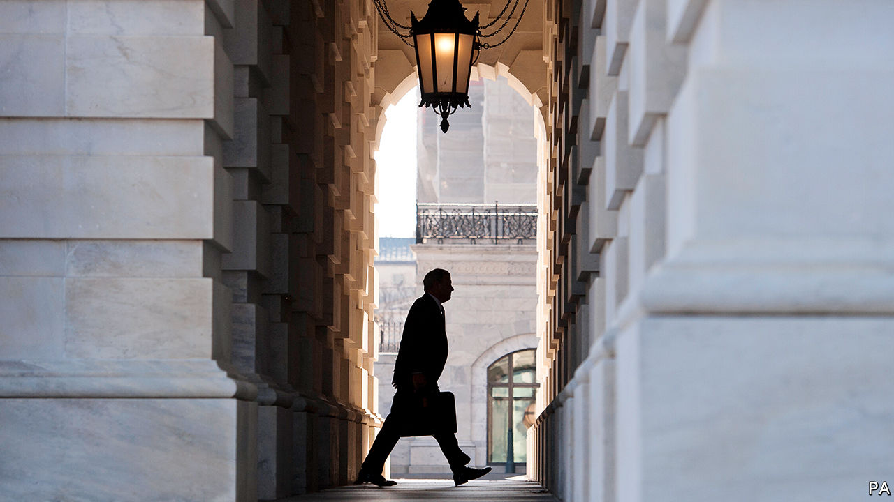

## Impeachment

# America’s anything-goes presidency

> What will be the result of Donald Trump’s tussle with Congressional Democrats?

> Jan 23rd 2020

IT IS THE oldest problem in politics: what should you do when a ruler who legitimately holds office betrays the people he rules? The impeachment clause in America’s constitution is a 200-year-old remedy to that problem, but it was informed by a tussle on the other side of the Atlantic that goes back much further—to the impeachment of Michael de la Pole, the king of England’s finance minister, in 1386. When the authors of America’s constitution were designing a system of self-government, they borrowed from that ancient tradition. If Americans picked a president who then committed “Treason, Bribery, or other High Crimes and Misdemeanours”, then the legislature could remove him.

Impeachment has always been hard to use. No president has ever been impeached in the House and convicted in the Senate, and not because no president has done anything that would warrant removal. Although the threshold for removal was thus already set very high, in the course of Donald Trump’s impeachment inquiry and trial, it has been sent somewhere into the outer atmosphere. At the same time, Mr Trump’s defence has rested on an exorbitant interpretation of executive power. This will have consequences for the rest of Mr Trump’s presidency—he will no doubt be acquitted—and for how America is governed when he is gone. They will not be good.

The harm to the mechanism of impeachment is partly the fault of the House Democrats. Rather than wait for support from the courts over whether the White House should be compelled to release evidence and witness testimony to an impeachment inquiry, they rushed the hearings because the most politically expedient thing to do was to get it over with as fast as possible. But much more blame lies with the president and his party—Mr Trump for his blanket refusal to participate, and his party for supporting him in that endeavour (see [article](https://www.economist.com//united-states/2020/01/25/the-strange-impeachment-trial-of-donald-trump)).

The Senate majority leader, Mitch McConnell, last week swore an oath “to do impartial justice” in Mr Trump’s Senate trial, a month after he promised “total co-ordination” with the White House. He has kept only one of these promises.

After complaining that the impeachment process in the House was dreadfully unfair on the president, Mr McConnell this week designed a process in the Senate with the aim of letting Mr Trump off the hook in perhaps little more than a week. This has entailed Republican senators swallowing some odd ideas from the president’s legal team. One of these is the circular argument that there is no need for the White House to release any evidence because the president has done nothing wrong, and that the absence of that same evidence means the case against Mr Trump is non-existent. Another is that the president cannot be impeached because he has not broken a federal law. This expansive view of executive power would permit an awful lot of injury to the republic.

Relatively unbounded by the mechanism of impeachment, Mr Trump could do as he pleases in the remainder of his first term (and perhaps in a second). He could interfere in domestic investigations, bend foreign policy out of shape to damage a political rival, or solicit help from another government in November’s election—China, Russia, are you listening? Once re-elected, there would be fewer checks on him. The result, perversely, is that the failed trial of a president deemed unfit for office by the House for misdemeanours that seemed to warrant impeachment and removal would emerge more powerful than ever.

His supporters might conclude that is a good thing. But even they should think again. American politics has a tendency to swing from one pole to another. A Democratic equivalent of Mr Trump would no doubt enjoy freedom from the possibility of impeachment at some future date. Precedent is not binding when it comes to impeachment trials, but what happens in this one will inform the next. And the lesson from the impeachment trial of 2020 seems likely to be: anything goes.■