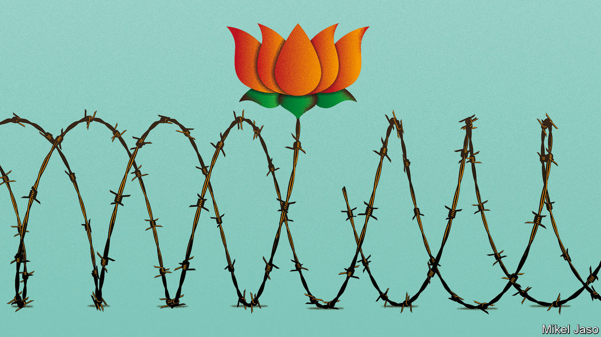

## Intolerant India

# Narendra Modi stokes divisions in the world’s biggest democracy

> India’s 200m Muslims fear the prime minister is building a Hindu state

> Jan 23rd 2020

LAST MONTH India changed the law to make it easier for adherents of all the subcontinent’s religions, except Islam, to acquire citizenship. At the same time, the ruling Bharatiya Janata Party (BJP) wants to compile a register of all India’s 1.3bn citizens, as a means to hunt down illegal immigrants (see [Briefing](https://www.economist.com//briefing/2020/01/23/narendra-modis-sectarianism-is-eroding-indias-secular-democracy)). Those sound like technicalities, but many of the country’s 200m Muslims do not have the papers to prove they are Indian, so they risk being made stateless. Ominously, the government has ordered the building of camps to detain those caught in the net.

You might think that the BJP’s scheme was a miscalculation. It has sparked widespread and lasting protests. Students, secularists, even the largely fawning media have begun to speak out against Narendra Modi, the prime minister, for his apparent determination to transform India from a tolerant, multi-religious place into a chauvinist Hindu state.

In fact, the scheme looks like the most ambitious step yet in a decades-long project of incitement. The BJP first rose to national prominence by agitating for the demolition of a mosque in the city of Ayodhya, to make way for a temple to Ram, a Hindu deity. The destruction of the mosque in 1992 by a mob of Hindu extremists, followed by deadly riots, only propelled the party’s ascent. Likewise, a massacre of Muslims in the state of Gujarat in 2002, when Mr Modi was chief minister, made him a hero to Hindu nationalists around the country.

Alas, what has been electoral nectar for the BJP is political poison for India. By undermining the secular principles of the constitution, Mr Modi’s latest initiatives threaten to do damage to India’s democracy that could last for decades. They are also likely to lead to bloodshed.

The sad truth is that Mr Modi and the BJP are likely to benefit politically by creating divisions over religion and national identity. Such subjects keep the party’s activists and their allies in Hindu-nationalist groups energised—always a boon, given India’s relentless sequence of state elections. They also distract attention from awkward topics such as the economy, which has struggled since the BJP’s thumping election victory last year (see [article](https://www.economist.com//finance-and-economics/2020/01/23/indias-economy-risks-swapping-stagnation-for-stagflation)). Most important, Mr Modi seems to calculate that a sizeable minority of Indian voters are sympathetic to his constant insinuation that Muslims are dangerous fifth-columnists, always scheming to do Hindus down and sell out their country to Pakistan. That is enough to keep him in office. Because of India’s first-past-the-post electoral system and a divided opposition, the BJP won its outright majority in parliament with just 37% of the vote.

Just now the BJP may be hunting for a new grievance. The Supreme Court recently issued a ruling that had the effect of depriving it of its favourite cause, by clearing the way for a Hindu temple to be built at the site of the demolished mosque in Ayodhya. The citizenship ruckus appeals to the party for the very same reasons that it has prompted widespread alarm. The plan to compile a register of genuine Indians as part of a hunt for foreign interlopers affects all 1.3bn people in the country. It could drag on for years, inflaming passions over and over again, as the list is compiled, challenged and revised. Just how the register will be drawn up, and what the consequences of exclusion are, remain woolly. Indeed, Mr Modi is already claiming it has all been misunderstood. Meanwhile, the hullabaloo helps reinforce the notion, so electorally valuable to the BJP, that Hindus, although about 80% of the population, are threatened by shadowy forces that it alone has the courage to confront.

This imperils the inspiring idea of India as the world’s largest democracy. Mr Modi’s policies blatantly discriminate against his Muslim compatriots. Why should a secular government shelter persecuted Hindus from Afghanistan, Bangladesh and Pakistan, but explicitly vow not to take a single downtrodden Muslim? The citizenship row is only the latest in a series of affronts, from the BJP’s lionising of vigilantes thought to have killed Muslims to the collective punishment of the people of the Kashmir valley, who have suffered arbitrary arrests, smothering curfews and an internet blackout for five months.

Since independence, India has confounded predictions that its democracy would crumble by accommodating its many constituencies of language, ethnicity, caste and religion. A secular and impartial government, even if flawed in many other ways, protects all these groups. The deliberate and sustained persecution of one of them constitutes an implicit threat against all—and so puts the political system at risk. Voters should recall that the BJP has experimented with policies that disadvantage other minorities, from low-caste Hindus who defy the party’s view of their religion to speakers of languages other than Hindi.

Because his rabble-rousing has a human cost, Mr Modi is also tarnishing the memory of Mahatma Gandhi, a preacher of non-violence. As it is, many Muslims have been lynched or beaten to death for supposed slights to Hinduism, such as loving a Hindu woman or killing a cow. From time to time the stoking of anti-Muslim sentiment leads to massacres like the one in Gujarat, in which more than 1,000 people were killed. By perpetually firing up Hindus and infuriating Muslims, the BJP makes fresh bloodshed more likely.

Mr Modi may imagine he can keep communal tensions under control, ramping them up and tamping them down as his political fortunes demand. But even if he is only cynically exploiting religious bigotry, many in the Hindu nationalist rank-and-file are true believers. They are not easily restrained, as the slaughter in Gujarat showed. With his warlike rhetoric about Pakistan, his head-cracking in Kashmir and his flagrantly biased approach to citizenship, the prime minister has raised the zealots’ expectations. He may not want to take things too far—he has a country to govern—but they will have no such compunction.

Happily, many Indians have already had enough, as the recent protests show. The Supreme Court, which this week declined to suspend the citizenship law, should heed this, show some unexpected spine and declare it unconstitutional. And rather than stoke hostility between two of the world’s great religions, Mr Modi should look for other paths to voters’ hearts. ■

## URL

https://www.economist.com/leaders/2020/01/23/narendra-modi-stokes-divisions-in-the-worlds-biggest-democracy
