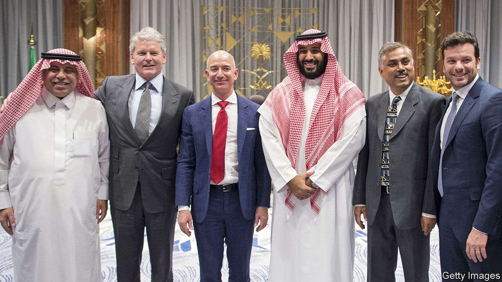

## Alexa, define chutzpah

# Did Saudi Arabia’s crown prince hack the Amazon king?

> Muhammad bin Salman has gone after journalists, dissidents—and now, perhaps, the world’s richest man

> Jan 25th 2020BEIRUT

THREE MONTHS ago, as executives gathered in Riyadh for a conference, a supporter of the Saudi crown prince allowed himself a moment of doubt. The businessman was fond of Muhammad bin Salman’s efforts to open a closed country and diversify its economy. But he fretted that the prince was too impulsive for his own good. He had already locked up relatives, launched an ill-fated war and allegedly murdered a critic. “He can’t get out of his own way,” the businessman said.

On January 22nd UN investigators alleged that the de facto ruler of Saudi Arabia may have hacked the mobile phone of Jeff Bezos, the founder of Amazon, an e-commerce giant. According to a forensic report prepared for Mr Bezos, the world’s richest man received an infected video file on WhatsApp, a messaging service, sent from a number used by the crown prince. It opened a back door on the billionaire’s phone, which was soon used to steal large amounts of data—though the UN did not say exactly what, or how it was used. It called for an “immediate investigation”. The Saudi embassy in Washington, DC, said the accusations were “absurd”.

Surreal as they may seem, though, the allegations make sense. Last year the National Enquirer, an American tabloid, published an exposé about an extramarital affair between Mr Bezos and a television presenter. He, in turn, accused the newspaper of trying to blackmail him with leaked photos. An investigator working for Mr Bezos later accused the Saudi government of being behind the leaks. The Enquirer’s parent company, American Media LLC, has a relationship with the Saudis. In 2018 it published a glossy propaganda magazine extolling the virtues of Prince Muhammad.

On the face of it, the Saudis had reason to go after Mr Bezos. He owns the Washington Post, which counted among its contributors Jamal Khashoggi, a Saudi journalist whose critical columns angered Prince Muhammad. In October 2018 Khashoggi was murdered and dismembered inside the kingdom’s consulate in Istanbul. The CIA concluded that the prince probably ordered the killing (he denies this).

In normal times a Saudi prince hacking America’s richest man would cause a diplomatic crisis. But it is hard to imagine President Donald Trump being too angry. He views Saudi Arabia as a vital ally and has largely turned a blind eye to the prince’s rash behaviour. He imposed no heavy punishment for the murder of Khashoggi, who lived in Virginia. And judging by his tweets, Mr Trump is no fan of “Jeff Bozo” or of the Post’s critical reporting.

Foreign investors may be more concerned. Prince Muhammad has sought to woo them. He met Mr Bezos during a tour of America in 2018 (the men swapped phone numbers at a dinner in Los Angeles). But investors have been turned off by the prince’s “anti-corruption” drive in 2018, during which scores of tycoons were locked up, and the murder of Khashoggi. Foreign direct investment climbed modestly in 2019, to $3.5bn in the first nine months of the year, but it is still well below levels from earlier in the decade. Businessmen may not want to deal with a leader they think may bug their phones.

The same goes for foreign leaders. Intelligence officials in America and elsewhere will no doubt wonder if Mr Bezos was the only target. The president’s son-in-law, Jared Kushner, is known to chat often with Prince Muhammad on WhatsApp.

On the bright side, wags quip, the alleged hack was perhaps another example of burgeoning ties between Israel and the Gulf states. Though the UN could not pinpoint the malware used, researchers believe it relied on Pegasus, spyware designed by NSO Group, an Israeli firm. It is the subject of multiple lawsuits—including one by WhatsApp itself—that accuse it of providing spyware to authoritarian regimes. (NSO Group denies wrongdoing.)

The report, if true, is perhaps most troubling for Prince Muhammad’s own subjects. Scores of the government’s critics have ended up in jail. A Saudi dissident living in Canada, Omar Abdulaziz, claimed in a lawsuit filed in Israel in 2018 that Pegasus was used to tap his phone and monitor his communications with Khashoggi. If the world’s richest man is a target, any Saudi citizen has good reason to worry. ■

## URL

https://www.economist.com/middle-east-and-africa/2020/01/25/did-saudi-arabias-crown-prince-hack-the-amazon-king
