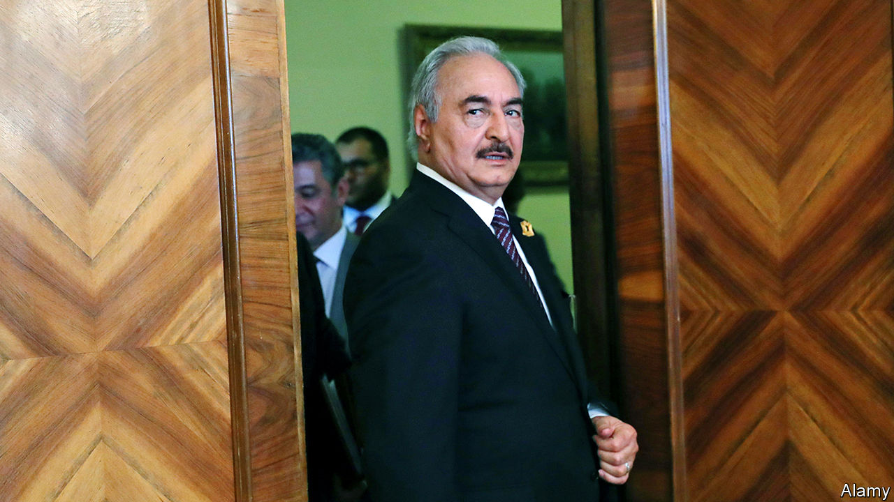
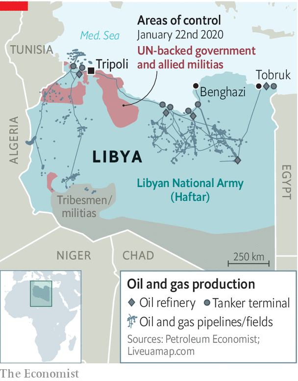

## The spoiler

# Khalifa Haftar, the Libyan warlord, is not interested in compromise

> And he’s under no pressure from his main foreign backer to make peace

> Jan 23rd 2020BEIRUT

TO CALL IT a success is a sign of low expectations, not high achievements. On January 19th the parties in Libya’s civil war gathered in Berlin for a peace conference. The Libyans themselves—Fayez al-Sarraj, who leads the UN-backed government in Tripoli, and General Khalifa Haftar, the warlord who controls most of the country—were invited only at the last minute. The summit was mostly an effort to plead with foreign powers that have turned a local conflict into a global proxy war.

It ended with a joint promise to respect a UN arms embargo and end outside support for the conflict. The Germans said they were cautiously satisfied. Missing from the final communiqué, though, was any formal ceasefire or threat of sanctions for states that ignore the embargo. Days after the conference, foreign cargo planes were once again shuttling military supplies into the war-torn country.

The UN envoy, Ghassan Salamé, tells anyone willing to listen that such foreign meddling is Libya’s biggest problem. In recent months attention has focused on Russia and Turkey. The former sent hundreds of mercenaries from the Wagner Group, a private-security firm with ties to the Kremlin, to support General Haftar. Turkey then sent its own guns-for-hire, up to 2,000 Syrian militants, to defend Tripoli.

Neither country has really tried to tip the balance of power. Both have economic interests in Libya: billions of dollars in stalled construction projects for Turkey, the prospect of lucrative energy deals for Russia. But both view the country mostly as a bargaining chip in their dealings with each other—they back opposing sides in Syria—and with Europe.

The real spoiler remains General Haftar (pictured). Famously cantankerous, the 76-year-old warlord seems uninterested in compromise. He launched an offensive to capture Tripoli in April hours after the UN secretary-general, António Guterres, landed in the capital to prepare for a peace conference. Summoned to Moscow on January 13th to discuss a ceasefire, he walked out early, angering Russian leaders.

But the general has other considerations. For a start, his biggest tactical advantage is not a few hundred mercenaries. It is his control of the skies, which he owes to the United Arab Emirates (UAE), his most reliable foreign backer. It has deployed a fleet of Chinese-made drones capable of striking anywhere in Libya. A panel of UN investigators reported in December that the UAE also sent air-defence systems and other kit last year. The government in Tripoli cannot compete. Its Turkish-made drones carry only small munitions and have a range of less than 200km. Diplomats say the UAE has urged General Haftar not to accept a ceasefire.

He also worries about dissent in his own ranks. His self-styled Libyan National Army is riven with tribal and regional splits. Some commanders served under Muammar Qaddafi; they naturally mistrust the general, who betrayed the dictator. Big offensives help to submerge those disputes. But the general fears retreat might encourage a challenge to his leadership.

As delegates gathered in Berlin, gunmen aligned with General Haftar cut off oil shipments from Libya’s main ports. The closure has halted almost all of Libya’s production and will starve the Tripoli government of revenue (oil accounts for more than 90% of its budget). These are hardly the actions of a man interested in peace. ■

## URL

https://www.economist.com/middle-east-and-africa/2020/01/23/khalifa-haftar-the-libyan-warlord-is-not-interested-in-compromise
