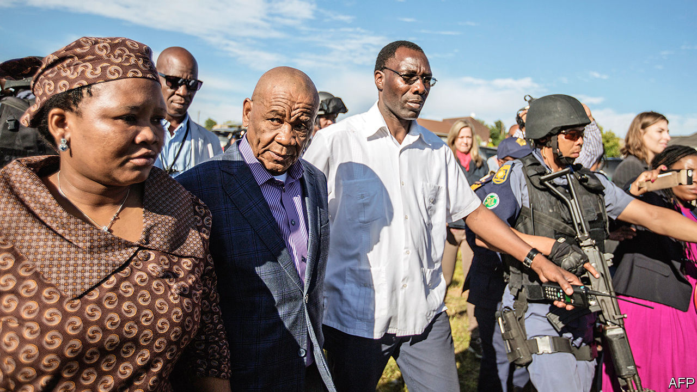

## Murder in the mountains

# One first lady is dead in Lesotho. Another has fled

> Belated efforts to solve a murder have plunged Lesotho into chaos

> Jan 23rd 2020JOHANNESBURG

ON JUNE 14TH 2017 Lipolelo Thabane was killed by gunmen outside her home near Maseru, the capital of Lesotho. Two days later Thomas Thabane, her estranged husband (pictured, right), was sworn in as prime minister of the mountainous kingdom. By his side was his new partner, the future Maesaiah Thabane (left), whom he married less than three months later. In his inaugural address Mr Thabane called the death of Lipolelo “senseless”. Yet in recent weeks belated efforts to get to the bottom of the killing have plunged one of the world’s smallest countries into chaos.

Rumours of violent chicanery have long haunted the first family. Mr Thabane’s daughter from his first marriage has alleged that Maesaiah, wife number three, had a hand in the death of Lipolelo, wife number two. The supposed motive: Maesaiah wanted to be the official first lady but was being blocked by the high court, which in 2015 ruled that Lipolelo would retain that role until she divorced Mr Thabane, a process she was drawing out in order to keep the perks of office. Mr Thabane has accused his daughter of trying to topple him so as to help her husband, another politician.

In December the case moved from speculation to allegations. The police issued an arrest warrant for Maesaiah after she went on the run to escape questioning by investigators. They want her and her 80-year-old husband to explain, among other things, why there had been a phone call from the crime scene to a number linked to Mr Thabane. In response, the prime minister tried to suspend the police chief but was blocked by the courts on January 9th. Maesaiah, 42, is still missing. The police have interviewed her husband.

On January 16th an envoy from South Africa, the country that encircles Lesotho and upon which the kingdom is economically reliant, paid Mr Thabane a visit. The next day the prime minister seemed to accept that having a wife on the lam was a distraction from his day job. He said he would resign, though he has yet to give a date. Rivals are already jockeying to replace him.

Part soap opera, part Shakespeare, the case is not the only drama to have befallen Lesotho in its modern history. For most of the century before 1966 the kingdom was a British colony, rather than part of South Africa. After independence that year Chief Leabua Jonathan began two decades of autocratic rule, suppressing opposition and briefly expelling the king (before allowing the monarch to return in a symbolic role). In 1986 the armed forces took over, backed by the neighbouring apartheid regime. Democracy returned in 1993, and with it unseemly squabbles for power among an ever-growing number of parties, which are encouraged to split by a system of partial proportional representation.

These parties have no real ideological differences, says John Aerni-Flessner of Michigan State University. But since there is not much of a domestic economy—most of Lesotho’s income comes from supplying water to South Africa, fees from the regional customs union and remittances—politics is the way to get rich. Lipolelo’s murder is not the first with political consequences in recent years. In 2014 there was also a coup that toppled Mr Thabane, who fled to South Africa fearing for his life, only to regain power in 2017, when his supplanters’ coalition fell apart.

It is unclear why the actions against Mr Thabane and his third wife came when they did. It may have been the eventual product of hard work by dogged detectives. Alternatively, it may reflect how dimly the Basotho elite view the first lady. She is often compared to Grace Mugabe, another relatively young woman who married a veteran African leader and became the apparent power behind the throne.

Whatever the truth, the country can ill afford chaos. Its official unemployment rate is 23.5%, one of the highest in the world. Just 20% of people in rural areas have access to electricity. A legacy of high rates of HIV/AIDS means that life expectancy is 53, compared with 60 in the late 1980s. The immediate victim of this saga was of course Lipolelo Thabane. But the people of Lesotho are victims, too. ■

## URL

https://www.economist.com/middle-east-and-africa/2020/01/23/one-first-lady-is-dead-in-lesotho-another-has-fled
