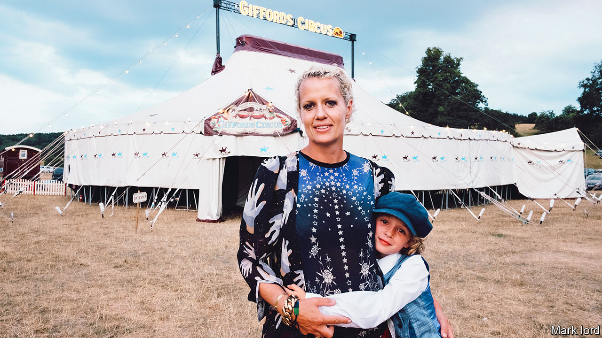

## The triumph of magic

# Nell Gifford died on December 8th

> The founder of a miniature village-green circus, in the old-fashioned style, was 46

> Jan 25th 2020

WHO WOULD dream of starting a travelling circus at the dawn of the 21st century? Who would brave mud, late-night pull-downs, rats in the straw-bales, leaky caravans, temperamental animals, lack of loos, lack of baths, unless they had been born to it? Who would put up with, and then triumph over, suspicious local councils and the indifference of English rural folk? Nell Gifford would. From 1998, when she and her husband Toti took the great decision, she built up Giffords Circus from one ex-hire tent and one wagon found in a hedge to a treasured summer institution of the southern counties. As soon as her shining procession of hand-painted burgundy wagons appeared in a town, queues would form and tickets would fly out as fast as they could be printed.

Audiences might have soured on the big noisy circuses of the recent past, with their sad exploited tigers and creepy clowns, but hers was different. It was a pocket circus, with a small ring and a troupe of perhaps four dozen performers, all of whom worked, sang and danced together. The horses were few but beautiful, and at various times there were hens, doves, hawks and five dachshunds. Most of the costumes were home-stitched and the sets were made on-site, the old-fashioned way. Yet all the thrill of the circus was there full-on, from the lights at evening strung around the tent to the flames struck up by the knife-thrower, from the fearless pirouetting of Rebecca, the bareback ballerina, to the risky tumbling of Tweedy the clown, from the glittering costumes of the dancers to the terrifying sky-flips of the gymnasts. And there she was at the centre of it all, dressed in whatever leotard or feathers or hat the show demanded, eyelashes curled with foil and make-up running with sweat, the picture of happiness.

What was a middle-class graduate from Oxford doing in such a place? She had many answers. Childhood dreams came into it, of ponies, candy-striped tents and dressing-up boxes, and of living in a velvet-lined wagon under the stars. The ring allowed her to ride horses, which she loved, in ways that magnified their mystery and possibilities. She could push her fizzing creativity to the extreme, whether piling on sequins, plaiting manes, devising moons for actors to swing from, or deciding that the theme of the next show should be Cockerels, or Snow, or Xanadu. The minions of her imagination were scurrying round all the time, especially in haberdasher’s shops among the fabrics or in museums among the puppets, making a thousand little odd links, seeking out ideas.

Powerful magic also lay at the heart of this. She wanted people to imagine her tent was lit by candles. A good circus, she wrote, was a sublimely existential thing, a golden present moment, even a crisis that tipped into excess, and then it vanished. It was over, and she would sometimes wander into the tent before pull-down just for that still-magical smell of animals, popcorn and trodden grass.

Nonetheless it was a business, and the road had been long to get there. She and Toti started with a purple ring-binder of ideas, almost no money and almost no experience. He had a zebra-striped tractor, could landscape gardens and build things, and was good at keeping the mad project going. She had odd-jobbed for circuses for a while, selling ice-creams, rolling up rubber mats, raking sawdust and occasionally performing, as when the French Santus Circus allowed her to be a ring-mistress. In her head, though, were the images that had amazed her at the Circus Roncalli in Germany, where visitors sipped champagne and the front-of-house staff wore designer uniforms, celebrating shows that were also works of art. She would have elegance and order in her miniature circus, too.

Meanwhile, as they renovated their first wagon, they worked in a freezing breeze-block hut, were fed for nothing by a friendly publican, and ran up debts of £100,000. Slowly they found performers—Rebecca in Stow-on-the Wold, her horse on the Welsh borders, a Russian strongman in Birmingham—and built movable accommodation for them. Then in 2000, penniless, they played at the Hay Festival, were packed out, and everything changed. They were in Tatler and Vogue; by 2007, ever-growing, they needed a choreographer and a director. By 2010 they had a permanent base on a farm, with a big rehearsal barn and a building for each section. They were no longer innocent, she felt. But they were famous.

People still wondered why she had plunged into circus so entirely. It was, after all, a closed world in which she would always be a “josser”, an outsider. She was asked once by one of her gymnasts, as they ate together after a show, what she had been running away from when she founded Giffords, and that took her aback. But it was a pertinent question. In 1991 her mother Charlotte had fallen so badly from a horse that she had been irreversibly brain-damaged. In her loving untidy bohemian way, Charlotte had created the world for her children—the large messy breakfasts, the fairy stories she told on walks, the wet roses she brought in from the garden. When that world suddenly collapsed all her children, then teenagers, needed to build another. Nell’s was the circus.

For circus was also family. She felt safe and at home there, being by the horses, in her community, in her tribe. And it was through families that circus was passed down. So when in 1999 she and Toti wrestled with names for theirs, “Giffords” came to seem obvious. Here was her multilingual travelling world of Cuban strongmen, Ethiopian jugglers, Italian acrobats and even a dashing Hungarian rider, Attila, in his glorious indigo robes—all helping, when necessary, to babysit her twins, Cecil and Red, or cook up a pot of supper, or give a wagon a strong shove out of the mud.

She needed them, too, when the cancer struck, not that she intended to slow down for a minute. If she felt tired at Giffords she would paint vivid watercolours of circus scenes, or recline on her day-bed to watch rehearsals. When her blonde hair fell out she liked the boyish cropped look, which went well with the dashing outfits she copied from her Cossack riders. Or she could wear, as she did in the ring last summer, a flowing wig crowned with flowers to complement her long white dress and her wonderful white stallion, a queen of circus, not about to fade away. ■

## URL

https://www.economist.com/obituary/2020/01/25/nell-gifford-died-on-december-8th
