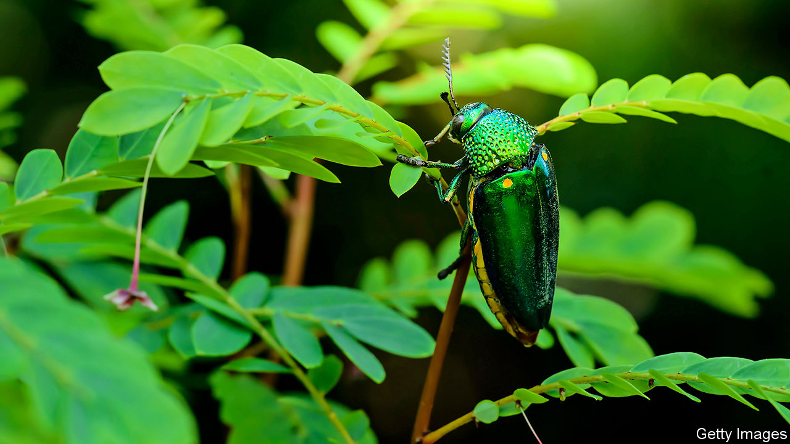

## Animal colouration

# Bright, iridescent beetles are surprisingly well camouflaged

> On the right sort of leaf they are hard to spot

> Jan 23rd 2020

THE JEWEL beetle is so called for a reason. When illuminated, the insect’s carapace dazzles with a sparkling green prismatic spray. That this bright colouration sends some sort of signal to the world has long seemed obvious. Most researchers assume that the signal in question is either a warning to predators or a display of fitness to mates. Work published this week in Current Biology by Karin Kjernsmo at the University of Bristol suggests, however, that the jewel beetle’s iridescence is neither of these. It is instead an “antisignal”, intended not to show the animal off, but to hide it.

Much animal colouration is the product of pigments. A jewel beetle’s hue is different. It is generated by tiny structures that diffract light falling on them, creating an interference pattern from which colours emerge. Dr Kjernsmo questioned the idea that jewel beetles and species like them use their colours to attract mates, because such sexual selection usually results in only the male being brightly coloured, rather than both sexes, as with jewel beetles. She also questioned the idea that beetle colouration is a warning. For such a warning to work an organism must either be toxic to consume or dangerous to approach. Jewel beetles are neither. Nor do they mimic any known creature with these properties, which is the other way that something which looks like warning colouration can evolve (albeit as a bluff, rather than the real thing). There is, however, a third variety of defensive colouration. This is crypsis, in which colour acts as camouflage.

At first sight, it seems absurd that colouration as bright as a jewel beetle’s might be cryptic. But intuition is not data, so Dr Kjernsmo decided to do some experiments. First, she and her colleagues built dummy beetles out of epoxy resin using silicone dental moulds created from the shed exoskeletons of real beetles. They then painted these dummies in a range of colours not sported by real beetles, namely violet, ocean blue, a mix of peacock green and metallic green, and black. They also made some dummy beetles that were iridescently coloured like real ones, by gluing the exoskeletons of real beetles onto the replicas. Lastly, they created yet further dummies that were the colour of real beetles, but without the iridescence.

For the experiment they pinned the dummies to dead mealworms, to provide a reward for any predator taking an interest, and then attached them to plants like beech, hazel, holly and ivy that were growing in a local nature reserve. They then monitored each dummy 2, 24 and 48 hours later. If the mealworm had been eaten, the dummy was recorded as probably having been attacked by a bird. If it had had its fluids sucked out, a spider was probably responsible. If it had been chopped into bits, the culprits were likely to have been ants.

The research team found that 646 of the 886 dummies they had deployed were attacked by birds. They also found that iridescent and black dummies took longer for the birds to discover, and were more likely to survive for the full 48 hours.

The survival of black dummies, which are presumably hard to spot, was no surprise. What intrigued Dr Kjernsmo was the survival of the iridescent dummies. She therefore ran another experiment, this time involving people. She distributed more dummies through the woods and asked volunteers to find them. Each of 36 participants was equipped with a laser rangefinder and asked to walk along one of the two paths. Participants were told to stop and point the rangefinder at a model as soon as they saw it. This yielded two sets of data: whether a model was spotted and, if it was, how close it had to be to a hunter to be noticed.

The upshot was that when models were on glossy leaves such as holly and ivy they were indeed much harder to spot—something presumably true of real beetles as well. So, in this species at least, iridescence really does act as cryptic colouration. As long as a beetle chooses the right leaf to perch on.■

## URL

https://www.economist.com/science-and-technology/2020/01/23/bright-iridescent-beetles-are-surprisingly-well-camouflaged
