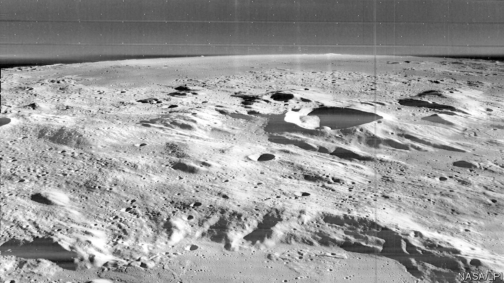

## Space exploration

# How to make oxygen from moondust

> Use lunar regolith

> Jan 25th 2020

IF PEOPLE ARE to travel extensively in space and set up bases on astronomical objects such as the Moon and Mars then they will need to make or find out there the things required to support life—including food, water and breathable air. Researchers are already working on ways to grow food in space, and icy deposits that could provide water are known to exist on the Moon and other celestial bodies. Besides being available for drinking, such water could be split into its constituent elements of hydrogen and oxygen using electricity from solar panels. Such electrolysis is already the main way of making oxygen on the International Space Station (ISS). Much of its raw material is water recycled from waste, sweat and urine. Now, though, a group of European researchers have discovered how to take water out of the loop. They have worked out how to generate oxygen by electrolysing regolith, the dusty material that covers the Moon’s surface.

The European Space Agency (ESA) announced on January 17th that a prototype oxygen-generating plant using regolith has been set up at its research centre in the Netherlands. Not only could such a machine use a readily available material to make breathable air for people living on the Moon, it could also be used to produce rocket fuel, says Beth Lomax of the University of Glasgow, who is working on the project. Liquid oxygen is one of the main propellants employed in space rockets. A lunar refuelling station would be a boon for deep-space exploration because the Moon’s low gravity means less fuel is required for take-off. Such missions could therefore be flown more efficiently, allowing larger payloads.

Oxygen, in the form of oxides, is the most abundant element in lunar regolith, accounting for 40-45% of its mass. That the element can be extracted from regolith was originally demonstrated by Derek Fray and Carsten Schwandt of Cambridge University, as part of research on a novel way to separate metals from their oxides. Last year, Dr Lomax and a group of colleagues working with Metalysis, a British company attempting to commercialise the Cambridge process, built on this regolith work.

Metalysis has developed a form of electrolysis that can extract high-value metals such as tantalum (used in electronic capacitors) and niobium (used to make super-strong alloys) from powdered metal oxides mixed into a bath of molten salt. Although the process operates at around 900°C, it does not involve melting the materials, which would require much higher temperatures. Using a carbon electrode, the molten-salt process strips oxygen from the oxides as carbon dioxide and carbon monoxide.

By tinkering with this process, Dr Lomax and her team were able to devise a form of molten-salt electrolysis that produces oxygen directly. They tested it on commercially available simulated regolith, a substance based on a recipe obtained from samples brought back from the Moon. In September 2019 they reported in Planetary and Space Science that they had extracted 96% of the oxygen present in the simulated regolith—although they could actually collect only around a third of that because the rest reacted with parts of the apparatus, which was not built to withstand oxygen’s corrosive effects.

In light of this the researchers have designed a new, oxygen-proof prototype that should be able to collect all of the gas liberated from regolith. This prototype could be automated and it should also be possible to reduce its operating temperature, says Alexandre Meurisse, a researcher at ESA who is working on the project.

The agency plans to produce a version of the machine that could be flown to the Moon and operated there. A single unit would produce around six tonnes of oxygen a year—though bigger generators could be developed. On Earth, a typical adult human breathes in 9.5 tonnes of air a year. By mass, oxygen makes up about 23% of that (most of the rest is nitrogen), although only around a third of the oxygen present is extracted with each breath. The upshot is that human beings require, on average, 740kg of oxygen per year to keep themselves alive. In an enclosed environment (as already happens on the ISS) the generated oxygen would be mixed with air that had been cleaned and scrubbed of carbon dioxide. Plants, if they could be made to grow, would also help remove CO2.

As a bonus, once regolith has had its oxygen extracted the leftovers may also be useful, says Mark Symes, a colleague of Dr Lomax at Glasgow. What remains is a mixture of alloys rich in aluminium and iron, and containing various amounts of other materials, such as silicon, calcium, magnesium and titanium.

Unrefined, this mix could be used as a building material by forming it into bricks or tiles to build shelters. It might also be used as the “ink” in a 3D printer, to create such structures more directly. Dr Symes thinks it may even be possible to siphon off specific metals or alloys directly from the generator, for more specialised purposes. If so, that means a regolithic oxygen-generator would not only help keep people alive on the Moon but could also provide the materials to build and fuel a rocket to transport them deeper into space.■

Editor's note (March 29th 2020): This piece has been modified to acknowledge earlier work in the area of extracting oxygen from regolith by Derek Fray and Carsten Schwandt.