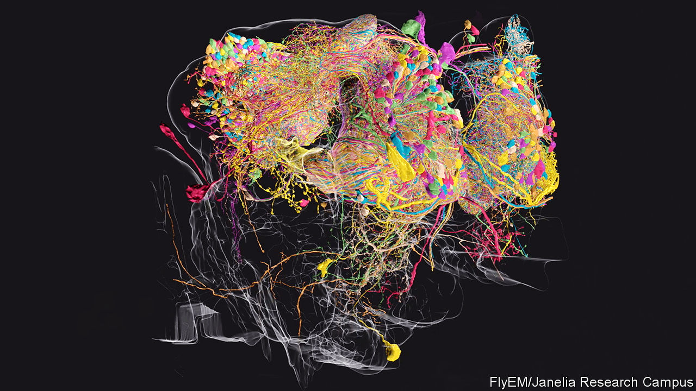

## Neuroscience

# The biggest, most detailed map yet made of brain cells

> It is part of a fly’s brain, but other brains will follow

> Jan 23rd 2020

AT THE BEGINNING of the 20th century Santiago Ramón y Cajal, a Spanish neuroscientist, became known for his exquisite drawings of the branching, treelike cells of the brain and spinal cord. In 1906 he was awarded a Nobel prize for this work, which gave the world its first glimpse into the structure of these neurons, and an inkling of how they are arranged in an animal’s central nervous system.

A century later Cajal’s legacy—supercharged by modern microscopy, heavy-duty robotics and a dollop of machine learning—is thriving. The objective now is to create connectomes. These are three-dimensional maps of all the neurons in entire brains, and how those neurons link together. This week sees the publication of an important step on the road to a complete brain connectome: a map of about a quarter of a fruit fly’s cerebral capacity.

That map, of what its cartographers refer to as the fly’s hemibrain—a set of around 25,000 neurons in the centre of the organ—has been more than a decade in the making. It is the brainchild of Gerry Rubin, a biologist who was also responsible for mapping the fruit fly’s genome as a proof of principle for the Human Genome Project. Dr Rubin is now boss of the Janelia Research Campus in Virginia, a part of the Howard Hughes Medical Institute that is dedicated to neuroscience. The hemibrain connectome is the first phase of the campus’s FlyEM project, to map the fruit fly’s entire brain, which contains around 100,000 neurons. That is a drop in the ocean compared with the 85bn in a human brain, or even the 70m in a mouse brain. But, like the fly’s role in the Human Genome Project, it will be a proof of principle.

Each of the hemibrain’s neurons is connected to hundreds of others through junctions called synapses, for a total of more than 20m synapses. These neurons and synapses form circuits that are responsible for a fly’s ability to learn, navigate, sleep and tell the time of day. The only full connectome created so far is that of C. elegans, a nematode worm which has either 302 or 385 neurons in its nervous system, depending on whether it is hermaphrodite or male (there are no purely female C. elegans). The neurons in C. elegans have around 7,000 synapses between them. Mapping the fly hemibrain is thus a big step forward.

Elucidating the connectome of C. elegans involved techniques Cajal himself would have recognised. The researchers who did it sliced their worms into thin sections using diamond knives, stained the slices to show the cells within them up more clearly, and then took electron-microscope pictures of the result. Identifying neurons and synapses within the thousands of images thus obtained was a task for expert human eyes.

Dr Rubin and his crew have automated things. One of the teams on the campus has, for example, developed a way to speed up the slicing and imaging part of the operation. This technique, which works like an atomic-scale sandblaster, fires a beam of gallium ions at a sample of brain tissue. That etches off a layer of the tissue a few nanometres thick from the sample’s surface. A scanning electron microscope (SEM) then takes a picture of the newly exposed surface. That done, the gallium beam etches away another few nanometres and the process is repeated until the whole sample has been studied.

The microscopes involved have been built especially for FlyEM. They sit on air-filled pads to minimise vibrations that might ruin the images, and the room containing them rests on its own concrete slab, to separate it from the remainder of the laboratory. Moreover, while run-of-the-mill SEMs usually operate for hours at a time at most, the FlyEM machines are designed to operate continuously for months.

The result is millions of high-resolution images that have been stitched together to create 3D representations of the fruit fly hemibrain (see image above of the olfactory pathway). The next step was to label the neurons and synapses within. Doing that manually, in the way used for C. elegans, would have taken centuries, according to Stephen Plaza, the project’s manager. Clearly this was a non-starter. So he turned to Google for help.

Computer vision has improved enormously in recent years and is routinely used to scan through hundreds of hours of CCTV or satellite images to identify objects of interest to the authorities. Modern artificial-intelligence (AI) algorithms perform better than people at classifying images and, between 2015 and 2018, doubled their performance in object segmentation, a trickier task that involves picking multiple objects from a single image. At Janelia’s behest, Google trained one of its AI algorithms to recognise neurons and synapses within the FlyEM images. As this algorithm scrolled through the pictures, it also attempted to trace the fibrous protuberances called dendrites and axons that connect one neuron to another.

To start with, the researchers trained the AI on pictures that had already been marked up by human experts. As it churned through further images, human proofreaders checked its decisions and fed errors back to it, so that it could improve its understanding of what neurons look like in different contexts. As the AI got better, the manual workload lessened and the speed with which images were correctly annotated shot up. With the AI’s help, Dr Plaza and his team of 50 proofreaders cut the time required for the annotation down from centuries to a couple of years.

The FlyEM data released this week are available to all neuroscientists, professional or amateur, to use as they see fit. Anyone with an internet connection can look up lists of neurons that are connected to each other and see 3D diagrams of what each of those cells, with its myriad dendritic and axonal branches, looks like.

At Janelia, several groups are already mining these data to glean insights. Vivek Jayaraman’s team, for example, studies how a fruit fly’s brain helps the insect first to understand its orientation in space and then to employ that information to help it navigate. Until now Dr Jayaraman has worked with theoretical models of which parts of the brain might talk to each other. The hemibrain map has shown him the actual physical connections between the neurons involved. He, Dr Rubin and other researchers at Janelia will publish their insights over the coming months.

With the hemibrain complete, FlyEM’s researchers expect to finish the rest of the fruit fly connectome within the next two years, and thus to gain further insights into fly neurology. But other consequences of the project are crucial, too. The advances in automation and machine learning that are being made through it will be as valuable as the biological insights. And, as the technology gets better, connectome reconstructions will happen faster, allowing the mapping of bigger brains in larger numbers.

In the future, the aim is to obtain connectomes for several strains of mouse and, eventually, several people too. Looking at the differences in wiring between typical and atypical brains might shed light on conditions such as schizophrenia and autism. Looking at the differences between human brains and those of other species may help explain just what it is that makes humans neurologically special.

Dr Rubin estimates that assembling a mouse connectome would cost around $500m (more than ten times what FlyEM will have cost when finished). He is confident such a project could be started within ten years. A human-brain connectome would be orders of magnitude more difficult. But not, he reckons, impossible. In 1990, at the beginning of the Human Genome Project, he recalls that many scientists thought sequencing animal genomes would always be too expensive and difficult. Those detractors said that biologists should choose between mouse and human, since it would probably be impossible to do both. “And now”, he points out, “we have projects where we’re going to do 10,000 human-genome sequences.”■