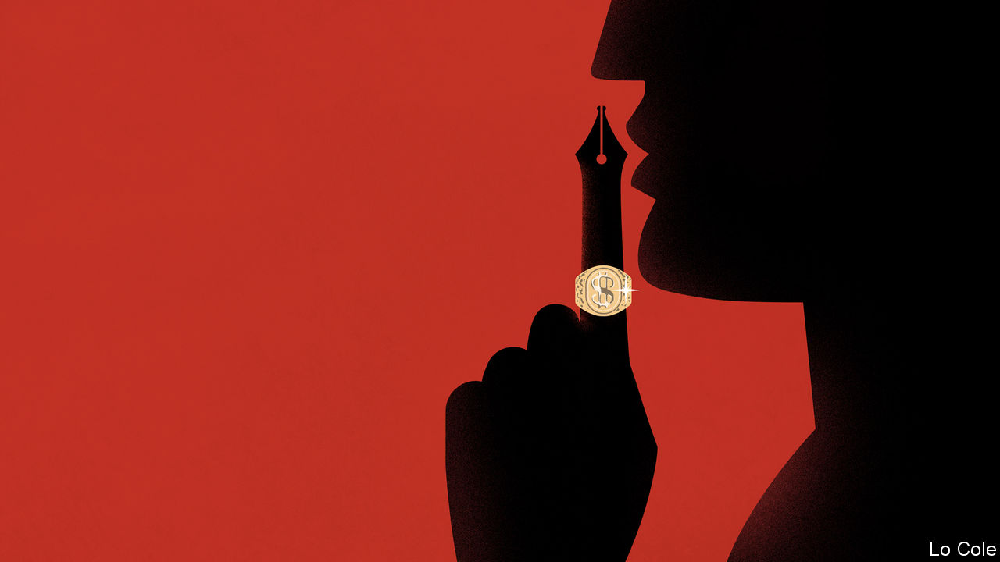

## Bello

# Learning from Carlos Denegri, a crooked Mexican newsman

> A historical novel about a journalist who “sold silence” is relevant today

> Jan 23rd 2020

IN 1939 CARLOS DENEGRI, a young reporter, investigated a murder by gunmen working for Maximino Ávila Camacho, the governor of the state of Puebla and brother of the next president of Mexico. Denegri delivered a detailed account of Ávila’s crimes to the editor of Excélsior, the country’s most important newspaper. The editor did not publish it, explaining that the governor was a source of much paid advertising. “In this business we don’t only sell information and advertising space: above all, we sell silence,” he went on. Denegri quickly lost his idealism, and accepted a monthly stipend from the governor “for publicity and information services”.

These imagined words provide Enrique Serna, a Mexican writer, with the title of his new novel, El vendedor de silencio (“The Merchant of Silence”), a semi-fictionalised biography of Denegri, the country’s most prominent journalist from the 1940s to the 1960s and once named by the Associated Press as one of the ten most influential reporters in the world. Mr Serna offers a rich account of the incestuous relationship between politics and the media and the machismo and impunity that lay at the heart of the authoritarian rule of the Institutional Revolutionary Party (PRI), which governed for seven decades until 2000. Although the author calls his book a “historical novel”, it has contemporary relevance. Mexico has never really overcome these flaws. Andrés Manuel López Obrador, its current president, is nostalgic for the “guiding state” of the old PRI.

There were several secrets to the PRI’s durability. A ban on presidential re-election allowed the system to renew itself every six years. Political stability went hand in hand with a strong economy, at least until the 1970s. The party was the vehicle by which the warlords of the Mexican Revolution of 1910-17, against General Porfirio Díaz, were brought into the system and offered the chance to get rich. As Denegri’s stepfather, who became a minister, tells him in the novel: “In political intrigue, personal wealth matters a lot. It gives you security, it gives you cachet, it crowns you as a winner.” That is the story of other “revolutionary” elites in Latin America, from the Peronists in Argentina to the chavistas in Venezuela.

The role of the press, and later television, was vital in all this. It was “a free press that [did] not make use of its freedom”, wrote Daniel Cosío Villegas, a historian. With few exceptions, which were crushed, it collaborated voluntarily. “Those were the rules of the game and [Denegri] hadn’t invented them, just perfected them with more skill than any other journalist,” writes Mr Serna.

A gifted reporter who accumulated a vast archive of dirt on prominent Mexicans, Denegri prostituted his talents. He received monthly cash-stuffed envelopes from presidential press secretaries, ministers, state governors and businessmen. His modus operandi was sometimes blatant. Mr Serna has him showing the governor of Zacatecas two articles, one exposing his corruption, the other sycophantic. “You decide which article you want published: the first is free, the second costs 50,000 pesos.”

Denegri’s sense of impunity derived from his closeness to successive presidents. It extended to his personal life. An alcoholic as well as a workaholic, he frolicked in Mexico City’s nightclubs and brothels. The PRI might as well have been called the PMI—the Party of Institutionalised Machismo. Mr Serna notes that “wife-stealing was until recently the favourite sport of the revolutionary elite”. Denegri indulged in violent misogyny, which would contribute to his undoing (a twist best saved for readers of the novel). His corruption, too, was not victimless. Mr Serna’s Denegri extracts a bribe from the governor of Sinaloa in the 1950s by passing on a denunciation by an opponent of his involvement in drug-trafficking. The governor has the opponent murdered.

Mexico’s media became freer with the end of the PRI’s regime and the arrival of democracy. But that freedom is still fragile. The main television and radio stations have quietly sidelined critical broadcasters, both under Mr López Obrador and his predecessor. The new president scorns independent journalists as the “fifi press”, a term originally used to describe papers hostile to the revolution. Scores have been murdered by drug-traffickers and/or local political leaders. A reinvigorated feminist movement denounced the continuing strength of machismo last year. Mr Serna’s book should serve not just as a retelling of history but as an urgent warning.