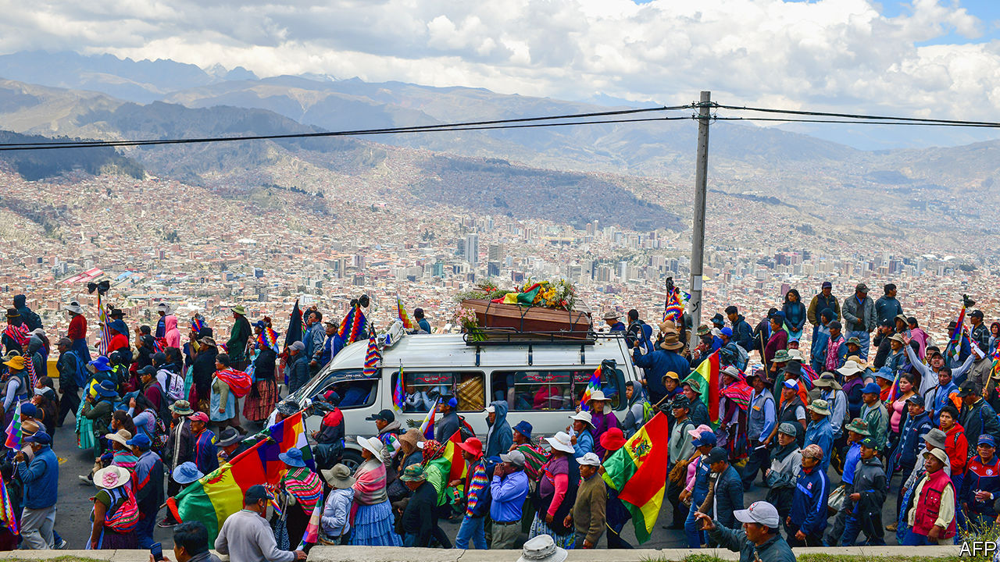

## Elusive estabilidad

# The current calm in Bolivia is fragile

> The main political forces have agreed on the ground rules for a new election. But that does not guarantee stability

> Jan 23rd 2020EL ALTO

ON A RECENT afternoon, workmen were repairing the wall around the Senkata gas plant in El Alto, a working-class city in the mountains above La Paz, Bolivia’s administrative capital. Backers of Evo Morales, the left-wing president who quit on November 10th, had blocked lorries from leaving the plant and knocked down the wall. On November 19th soldiers opened fire, killing ten people. Fresh paint now covers much of the rebuilt wall, but one mural remains from the chaotic presidential campaign that preceded Mr Morales’s resignation: his face and the word estabilidad (stability) in big capital letters. Restoring that to Bolivia will involve much more than fixing the wall. “The country is coming out of shock,” says Milenka García, a vice-president of El Alto’s neighbourhood association (Fejuve) who represents District 8, an area of cinder-block homes and dusty streets that includes the gas plant.

The crisis began on October 20th, when Mr Morales, who became Bolivia’s first indigenous president in 2006, tried to rig his re-election, sparking protests across the country. He fled to Mexico after losing the support of the police and the army, saying he had been toppled in a coup. His supporters set fire to buses and the homes of politicians and journalists who had criticised him. Opposition protesters burned the wiphala, a multicoloured flag that represents indigenous people, and barricaded the legislature to congressmen from Mr Morales’s Movement to Socialism (MAS). At least 36 people died in clashes between the two groups and at the hands of security forces.

Miraculously, Bolivia has found a way out of the violence. That is largely thanks to a collaboration between two women who were unknown before they stepped into the political vacuum: Jeanine Áñez, the senate’s second vice-president, who became Bolivia’s caretaker president after the people ahead of her in the line of succession resigned, and Eva Copa, a MAS senator who became the head of the legislature. Ignoring Mr Morales’s calls to boycott the interim president, Ms Copa persuaded her party to work with her and other conservative politicians to plan new elections. “The priority in those moments was to pacify the country and stop the violence,” she says.

Bolivia has a new electoral tribunal, which will oversee presidential and congressional elections on May 3rd. International observers and updated software will help ensure that the vote is a fair one, says Salvador Romero, the tribunal’s chief. “The election is the moment Bolivians will come together again,” he predicts.

But a fair vote alone will not ensure estabilidad. That is because on nearly all other issues Ms Áñez, Ms Copa, their supporters and the many other factions with a role in post-Morales Bolivia are angrily divided. Their rifts reflect ethnic, economic and regional splits.

Ms Áñez, a conservative Catholic who had fervently opposed Mr Morales, is not acting like a caretaker. She has eliminated controls on agricultural exports. She has sought closer ties with the United States and joined other democracies in recognising Juan Guaidó, leader of the opposition to Venezuela’s dictatorial regime, as the country’s rightful interim president. She has sent home hundreds of Venezuelan diplomats and Cuban doctors. On December 30th she expelled the Mexican ambassador and two Spanish diplomats, accusing them of attempting to help nine senior officials from Mr Morales’s government escape from the Mexican embassy, where they have sought refuge. 

“A transition government isn’t a dead government,” says the interior minister, Arturo Murillo. At his urging, prosecutors are investigating hundreds of politicians and civil servants from the MAS for corruption, sedition, terrorism and electoral fraud. Two-thirds of judges will have to reapply for their jobs, says Álvaro Coimbra, the justice minister. He portrays this as a step towards re-establishing the independence of the judiciary, which Mr Morales had bent to his will.

But the crackdown looks like an attempt to weaken the MAS. On November 14th, after broadcasts showed government forces tear-gassing protesters, the communications minister threatened to put journalists on trial for sedition. The ministry has announced plans to censor dozens of community radio stations, which tend to support the MAS. On December 31st authorities arrested four people who had worked on social media for the Morales government, branded them “digital warriors” and charged them with misuse of public funds and sedition. They say they have been denied due process, as do other adherents of the old regime who are under investigation. Mr Murillo has little interest in mollifying the MAS’s supporters. If poor and indigenous people are angry with the government, it’s “because we don’t let them steal, and we don’t give them carte blanche for looting and narco-trafficking”.

All this encourages the false belief that Mr Morales was toppled by a coup, says Jim Shultz of the Democracy Centre, a think-tank in San Francisco, California. The interim government is acting as if “the hand of God came down and told the right to take power”, he says. Diego Pary, a former foreign minister, wonders how fair elections can take place “when one party is being hounded”. When he met a journalist for an interview outside the ministry, he dared not get out of his car.

The MAS itself is divided, both in its response to Ms Áñez’s government and over its future. Its most radical voice is that of Mr Morales, who has moved to next-door Argentina. In a radio interview on January 12th he said that Bolivians should form armed militias “like in Venezuela” to defend themselves against the caretaker government, which he has accused of governing for elites only. He later claimed he was talking about slingshots, not guns. In speeches on January 22nd, when Bolivia celebrates its “plurinational” (multi-ethnic) state, he sounded less combative, focusing on his government’s achievements. Marches on that day were peaceful.

MAS leaders in Bolivia are mostly staying off the streets for now. “It’s not in our interest to mobilise, we have to go to battle at the polls,” says Andrónico Rodríguez, a young organiser of coca farmers who led protests last year. With Mr Morales abroad, moderates like Ms Copa are gaining influence. They are backed by grassroots supporters of the MAS who are disenchanted with Mr Morales. “We’re like the obedient child who always gets ignored,” says Ms García of the El Alto Fejuve, which has been aligned with the MAS. Mr Morales’s government favoured rich farmers and coca growers while El Alto waited in vain for money it was promised, she says. Now groups like Fejuve are helping to restructure the party. 

After weeks of assemblies throughout the country, supporters chose as the MAS’s presidential candidate David Choquehuanca, a former foreign minister who is popular among poor Bolivians and, like Mr Morales, is Aymara. They named Mr Rodríguez as his running-mate. Mr Morales countered with his own nominee. On January 19th, at a press conference in Buenos Aires, he declared that Luis Arce, a former finance minister and his confidant, would run for president. Mr Choquehuanca would be his running-mate. That is not the final word. The MAS would discuss Mr Morales’s “proposal”, Ms Copa said. On January 20th the government announced that it was investigating Mr Arce for corruption.

Polls suggest that 20-25% of voters support the MAS. Its candidate, whoever that may be, will join a large field. Ms Áñez, whose government has the backing of roughly half of Bolivians, has not said whether she will run. Another standard-bearer of the right may be Luis Fernando Camacho, a civic leader from the low-lying eastern department of Santa Cruz who led the protests against Mr Morales. Carlos Mesa, a centrist who was Mr Morales’s strongest challenger in October, is also running. Mr Morales’s absence from the race may make it more about issues than personality, says Jorge (Tuto) Quiroga, a former president who helped negotiate his exit and is also planning to run. That may be wishful thinking.

Even if the election is clean, many Bolivians could reject the result. “The challenge facing the next president is to govern for all Bolivians,” says Soledad Chapetón, El Alto’s mayor, who is indigenous but from a party that opposes the MAS. Supporters of Mr Morales burnt her house, but she thinks that reconciliation is possible.

The residents of District 8 are more pessimistic. Teenagers point out that Ms Áñez’s original cabinet had no indigenous ministers (she has since added a few). Parents say that their kids have nightmares about soldiers shooting into crowds. The wife and three children of Pedro Quisbert, a factory worker who was killed outside the gas plant, left to “escape the memories”, says his father, Primitivo, who stayed. Through a crack in the door of his house he blames both sides for the violence, but says he will vote for someone “from the humble class”. The massacre “broke the possibility of dialogue”, he says. It will be up to Bolivia’s next leader to prove him wrong. ■

## URL

https://www.economist.com/the-americas/2020/01/23/the-current-calm-in-bolivia-is-fragile
