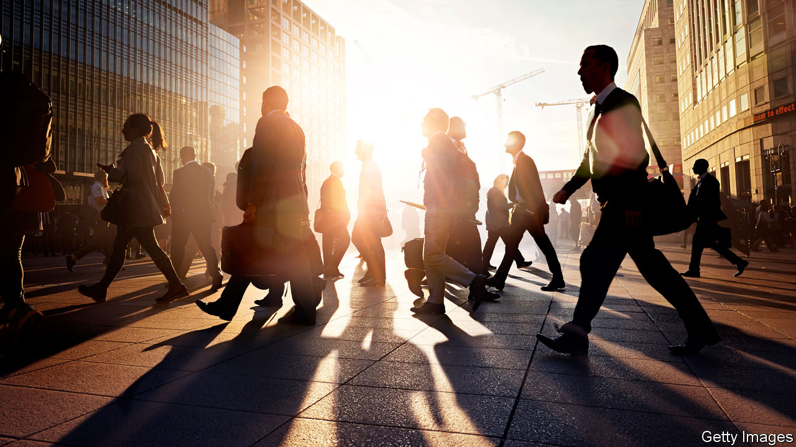

# Business this week

> Jan 23rd 2020

The IMF trimmed its forecast for global growth in 2020, to 3.3%. The fund welcomed both the easing of the trade war between China and the United States and the diminishing probability of a no-deal Brexit, but said the prospects for economic growth remain weak overall. America’s GDP is expected to expand by 2% in 2020 and the euro area’s by 1.3%. Although the clouds are still swirling over Brexit, Britain’s economic outlook is slightly brighter than had been forecast in the past. Its economy is projected to grow by 1.4% this year and 1.5% in 2021. In other good news for the new government, Britain’s labour market has strengthened. The employment rate is at its highest level since records began in 1971, and labour-market inactivity is at a low.

China’s economy grew by 6.1% last year, the slowest pace since 1990. The trade war with America hit already-weak consumer spending and exacerbated a slowdown in the property market. The IMF reckons that China’s GDP will expand at an even slower rate, by 6% this year and 5.8% next year.

An annual worldwide survey of chief executives conducted by PwC found that 53% think that global economic growth will decline over the coming year. That compares with 29% who were asked the same question about economic prospects in 2019 and just 5% in 2018.

Boeing pushed back the date for when it expects regulators will allow the 737 MAX to fly again until the middle of the year. It had hoped to get regulatory approval this month. Airlines now cannot count on the plane’s return to service for the busy summer season.

France agreed to delay collecting revenues from a new sales tax on digital companies, a concession to America, which claims the levy is aimed solely at American tech giants like Google and Amazon and is threatening to retaliate with tariffs on French goods. The two countries hope to reach a formal resolution by the end of the year. Steven Mnuchin, America’s treasury secretary, warned Britain and Italy to hold off on plans for digital taxes of their own, or else “we’ll be having similar conversations with them”.

Netflix added 423,000 subscribers in America during the last quarter of 2019. Although that was well below expectations, it gained 8.3m customers in other countries. The video-streaming firm tallied 167m users overall, with international viewers accounting for an ever larger slice of its base. In a harbinger of potential problems, the weakness in Netflix’s domestic market coincided with the roll-out of rival services from Disney, Apple and others, which will compete with Netflix worldwide.

Vodafone became the latest big name to pull out of the association that is developing Libra, a digital currency devised by Facebook that has run into difficulties with financial regulators. The departure of the global telecoms group leaves only a handful of widely recognised “partners” in the association, such as Uber.

Gap scrapped a plan to hive off its Old Navy clothing line into a separately listed company. The retailer has concluded that the “cost and complexity” of pursuing the split would not produce the expected benefits.

Prosecutors for the Brazilian state of Minas Gerais charged 16 people with homicide over the collapse of a dam last January that killed 270 people. Among those indicted were the former chief executive of Vale, the mining company that owned the dam, and five people from the German firm that had certified the dam’s safety.

Doubts were raised about whether the HS2 high-speed rail project in Britain would go ahead, after the estimate for its cost soared to as much as £106bn ($140bn). The government is expected to make a final decision on whether to give HS2 the green light next month.

In its biggest acquisition since 2007,  BAE Systems agreed to pay $1.9bn for a GPS system widely used by America’s armed forces and owned by Collins Aerospace. The defence company is already one of the Pentagon’s largest suppliers.

The share price of Alphabet continued to climb, after the market capitalisation of Google’s parent company passed the $1trn mark. It joins three other American companies that have seen their stockmarket value rise above that level: Amazon (briefly), Apple and Microsoft. They all have some way to go to become the world’s most valuable listed company. That crown now belongs to Saudi Aramco, which is worth $1.8trn following its IPO last month.

Tesla’s market value accelerated past $100bn for the first time, making it the world’s second-most-valuable car company, after Toyota. Tesla’s share price has risen by a third since the start of the year. It still accounts for only a tiny fraction of global car sales. Last year it delivered 367,500 vehicles, compared with 11m from Volkswagen alone.