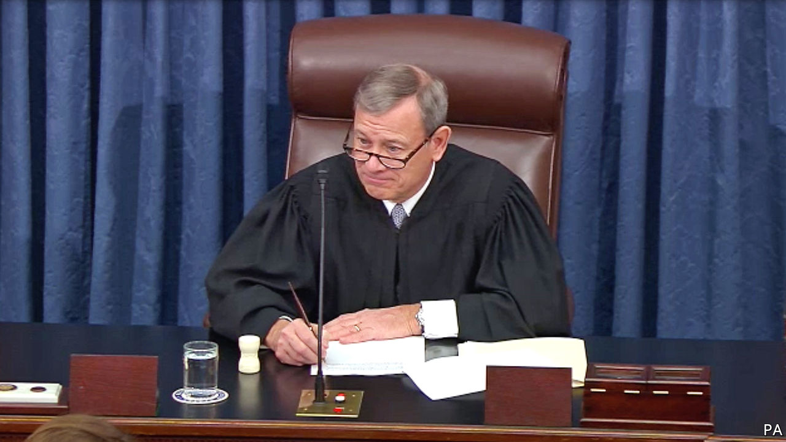
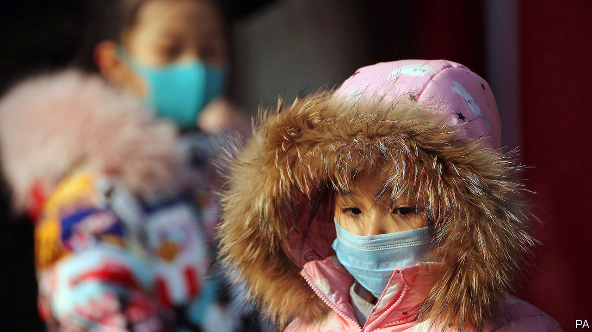

# Politics this week

> Jan 23rd 2020

The opening arguments were heard in the Senate trial that will decide whether to remove Donald Trump from power following his impeachment by the House of Representatives. The president faces two charges: abuse of power, for pressing the Ukrainian government to investigate a political rival, and obstruction of Congress, for directing officials to ignore subpoenas. Mr Trump’s defence team includes Ken Starr, whose investigations led to Bill Clinton’s impeachment, and Alan Dershowitz, who helped defend O.J. Simpson. They argue the charges “do not remotely approach the constitutional threshold for removing a president from office”. See [article](https://www.economist.com//leaders/2020/01/23/americas-anything-goes-presidency).

Brazilian prosecutors asked a judge to indict Glenn Greenwald, an American journalist, for helping a group that had hacked the phones of judges and lawyers. Mr Greenwald used messages between judicial officials, including Sergio Moro, who is now Brazil’s justice minister, in stories that revealed inappropriate collaboration in pursuing corruption cases. Mr Greenwald says he obeyed the law and has called the investigation an attack on press freedom. See [article](https://www.economist.com//the-americas/2020/01/23/brazilian-prosecutors-go-after-glenn-greenwald-an-american-journalist).

Roberto Alvim was sacked as Brazil’s “special secretary of culture”, after he appeared in a video outlining the mission of his office in terms that seemed to echo language used by Joseph Goebbels, Hitler’s propaganda chief. Mr Alvim said any similarity with Goebbels’s words was a “rhetorical coincidence”. Jair Bolsonaro, Brazil’s president, said the speech was “unfortunate”.

Honduras ended the mandate of the Mission to Support the Fight Against Corruption and Impunity, which is backed by the Organisation of American States. The mission helped the attorney-general’s office prosecute 133 people for graft. The government said it had committed “excesses”.

Prosecutors in Mexico questioned 53 policemen in connection with the disappearance of Homero Gómez, who manages a habitat for monarch butterflies. Environmentalists fear that Mr Gómez has been harmed by loggers.

UN experts called for an investigation into allegations that the crown prince of Saudi Arabia, Muhammad bin Salman, hacked the phone of Jeff Bezos, the boss of Amazon. A WhatsApp account belonging to Prince Muhammad has been implicated in the breach. It may have been an effort to “influence, if not silence” the Washington Post’s reporting on Saudi Arabia, said the experts. Mr Bezos owns the Post. See [article](https://www.economist.com//node/21778724).

At a summit in Berlin foreign powers promised to stop interfering in Libya’s civil war. But forces aligned with the government in Tripoli, which is supported by Turkey, and those of Khalifa Haftar, who is backed by Egypt, Russia and the United Arab Emirates, continued fighting. General Haftar’s men also shut down key ports and oil facilities. See [article](https://www.economist.com//middle-east-and-africa/2020/01/23/khalifa-haftar-the-libyan-warlord-is-not-interested-in-compromise).

Iran threatened to quit the nuclear Non-Proliferation Treaty if Britain, France and Germany refer it to the UN Security Council over breaches to the nuclear deal they signed in 2015. The only country ever to withdraw from the NPT was North Korea, which then tested nuclear weapons.

A missile attack on a military training camp in Yemen killed 100 soldiers. The government blamed the Houthi rebels, who control the north. The Houthis did not claim responsibility.

Lebanon formed a new government, ending a months-long political deadlock. But protests continued in Beirut over corruption and an economy in crisis. In Iraq anti-government protests resumed after weeks of relative calm. Several people were reportedly killed and scores wounded in the unrest in Baghdad and other cities.

Some 700,000 leaked documents gave clues as to how Isabel dos Santos became Africa’s richest woman. She is the daughter of Angola’s former president. Angolan prosecutors accused her of embezzlement and moneylaundering. Ms dos Santos, who now splits her time between London and Dubai, denied the allegations.

Prince Harry and Meghan Markle finalised a deal about their independent future away from duties for the British royal family. In a statement the palace said that Harry and his wife will not use their HRH titles and will not represent the monarchy in any official capacity. The couple also confirmed “their wish” to repay the taxpayers’ money spent on refurbishing their home in Britain. The couple now also live in Canada.

Vladimir Putin appointed a new cabinet in Russia, following his declaration of sweeping political reforms that could let him stay in power after his term as president expires in 2024. Most of the cabinet retained their jobs, including Sergei Lavrov as foreign minister. The new prime minister is Mikhail Mishustin, a more pliable technocrat than Dmitry Medvedev, who has resigned.

Luigi Di Maio resigned as head of Italy’s Five Star Movement, while remaining foreign minister. The quixotic populist party finished first in an election in 2018 but has since lost half its support. It now ranks behind the nationalist Lega and centre-left Democrats.

Hundreds of people in China were confirmed to have been infected by a newly identified form of coronavirus, a type that includes the one responsible for a deadly outbreak of SARS in 2003. Most of the cases have been found in the city of Wuhan, where the outbreak began. Seventeen people with the virus, which can cause pneumonia, have died. Travel restrictions were imposed on Wuhan and two nearby cities. See [article](https://www.economist.com//leaders/2020/01/25/the-world-is-better-prepared-than-ever-to-stop-the-wuhan-coronavirus).

A Chinese court sentenced a former head of Interpol, Meng Hongwei, to 13-and-a-half years in prison. Mr Meng was convicted of taking more than $2m in bribes. He was arrested in 2018 while on a trip back to China from France.

The newly appointed head of the Chinese government’s office in Hong Kong, Luo Huining, strongly hinted that the territory should pass legislation relating to national security. He said current loopholes in the “national-security mechanism” could allow “external forces” to engage in infiltration and sabotage.

The International Court of Justice in The Hague issued an interim ruling in the Gambia’s complaint against Myanmar for genocide. It ordered Myanmar to take measures to prevent further harm to Rohingyas, a Muslim minority that were victims of an army-led pogrom in 2017. The decision comes despite the personal appearance of Aung San Suu Kyi, Myanmar’s leader, before the court in December to argue against any such order. The court has no power to enforce its ruling.

## URL

https://www.economist.com/the-world-this-week/2020/01/23/politics-this-week
