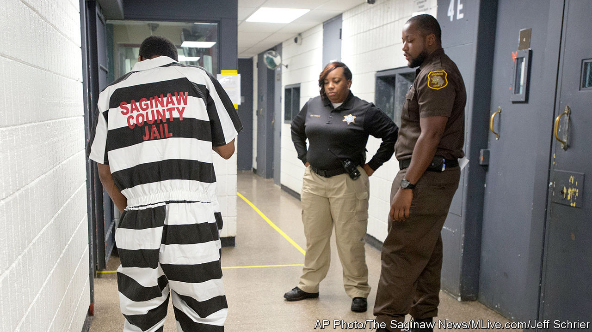

## Criminal justice

# Michigan plans to overhaul its jail system

> The state could prove a model for others

> Jan 23rd 2020CHICAGO

WHEN CRIME rates were last as low as they are today in Michigan, the Beatles topped the charts with “Hey Jude”. Half a century on, Michigan’s police arrest fewer people with each passing year. In the decade to 2018 arrests fell by one-fifth. One might expect, in turn, the state’s jails to be eerily empty. Quite the opposite. A new study by Pew Charitable Trusts found 16,600 people were held in county jails on an average day in 2016, over three times more than in 1970.

This fits a nationwide pattern. Even as crime rates and the number of arrests fall, jail populations in many states remain high. County-run jails are the front end of America’s criminal-justice system, where more people are put behind bars than are ever thrown into prison. (Jails house people who are awaiting trial, whereas prisons are typically for locking up felons.) In 2017 jails nationally handled 10.6m admissions, compared with just 607,000 who went into the country’s prisons.

That is good for nobody. Crowded jails are a financial burden for counties. It cost $478m to run Michigan’s in 2017. Pew researchers point to evidence that people jailed or imprisoned, even briefly, are far likelier to be rearrested within two years than others who pass through the justice system but are not locked up.

If America is to put fewer people behind bars, the priority will be fixing its jails. Several states are trying. Starting this month, New York no longer demands cash bail from those arrested for minor, non-violent crimes. New Jersey ended cash bail in 2017 and has seen its jail population shrink, even as crime rates continue to fall.

Now it is Michigan’s turn. After holding public hearings and gathering expert testimony across the state in the past year, a task force on jail reform published 18 policy recommendations for legislators on January 14th. These include spending more on mental-health care, reclassifying many of the 1,900 misdemeanour offences as civil infractions, changing rules on cash bail and promoting more non-custodial sentences for minor crimes.

Some of this builds on other states’ efforts. But Michigan is worth watching for at least two reasons. For a start, the proposed reforms are based on unusually fine-grained data gathered by Pew researchers. The state’s lieutenant-governor, Garlin Gilchrist, admitted last month that officials previously could not even say “with a straight face” how many inmates were held in its 81 county jails, for how long and why.

Pew sampled data from 20 jails accounting for 40% of inmates in 2017. It found many locked up for non-violent and modest wrongdoing, including traffic offences. Overall, African-Americans were over-represented behind bars and women increasingly likely to be detained. Researchers noted a striking boom in rural jail populations. That might be explained by the lack of mental-health services beyond cities. Pew also found a small core of one-fifth of all inmates who stay inside the longest and account for over 80% of all “jail-bed days” per year. Getting more of these long-termers out of jails would do most to reduce the pressure on them.

The second reason to watch Michigan is its bipartisan approach. A Democratic governor, Gretchen Whitmer, and Republican legislative leaders are co-operating, at least so far. Ms Whitmer convened the task force—which included members from both parties—and legislators are likely to implement many of its recommendations.

Changing laws at the federal and state level will not fix everything. The MacArthur Foundation, a grant-giving organisation, notes wide disparities in jail populations between counties within states, which suggests that training for local decision-makers, such as sheriffs too fond of jailing people, or allocating more money for local health services, could matter as much as legislative change from above.

The opportunity in Michigan is to track the data to see how things change and for the parties to co-operate on policy. The jail population may not shrink back to levels of the early 1970s, but Michigan seems poised to take a hint from the Beatles lyric and make it better. ■