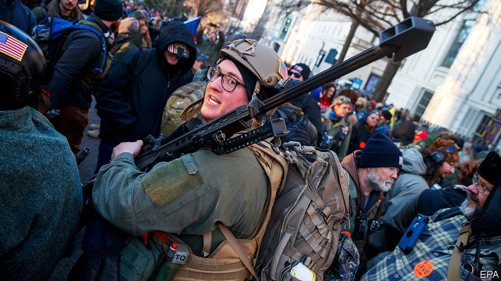
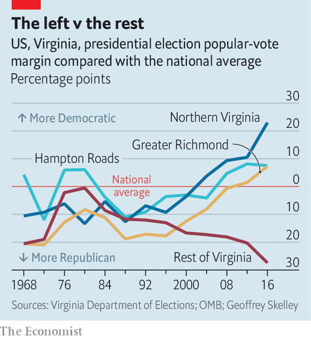

## Bad shot

# Virginia’s gun rally won’t halt gun-control laws

> An army of 22,000 protesters cannot reverse demographic change

> Jan 23rd 2020RICHMOND

IT WOULD BE difficult to find a more polite crowd than the one which gathered in Richmond, Virginia on the morning of January 20th. As a helicopter buzzed overhead and police officers manned a cordon, thousands of people marched on the centre of the city waving handmade signs with jokes, chanting amiably. That many in the crowd were carrying guns and several signs called for violent insurrection against a “tyrannical” government only slightly distracted from a mostly good-natured protest. Men in full-body camouflage apologised when the barrels of their AR-15 rifles bumped into people.

The protest, by about 22,000 people, was organised by the Virginia Citizens Defence League, a statewide pro-gun lobby group, to campaign against gun-control measures planned by Virginia’s new legislature. In November the Democratic Party took control of all three branches of the state’s government.

The calm of the event came as a relief. A few days before, the FBI arrested three men, alleged to be part of a white-supremacist movement, who had planned to attend the rally. They had apparently expressed hope that the protest might spark a “civil war”. Various far-right figures attended, including Alex Jones, the founder of InfoWars, a conspiracy-theory website. Many Virginians feared a repeat of the far-right rally in 2017 that rocked Charlottesville, another city in the state, and led to the death of a counter-protester.

Cool heads probably prevailed because, unlike the rally in Charlottesville nearly three years ago, most protesters in Richmond were not actually white supremacists. Most were gun-owners who could not believe that in Virginia, associated with hunting and conservative political values, the public had voted for a government that might pass tighter gun restrictions. “Our country was built on the ability to protect your family, protect your property and fight for your freedom,” said Jamie LeBeau, who drove from Lynchburg, two hours away, to attend the rally. Her husband Erich expressed outrage that congressmen would continue to have armed guards, but his guns might be taken away.

Yet the chance of that is minimal. While various gun-control bills have been introduced in Virginia, most are modest. They involve expanding background checks and limits on how many guns someone can buy at once. The most controversial is a “red-flag” law, which would allow family members or the police to petition a court to take guns from somebody who may be dangerous. To many protesters, that is a front for a wider plan to confiscate guns or even to introduce communism. “Once they take our ability to fight back, what are they going to do? They can take anything they want,” said a man who called himself “Geoff”, wearing camouflage, a rifle and several magazines of ammunition. He suggested—falsely—that Democrats won Virginia’s elections by getting illegal immigrants to vote.

Over the past decade or so, as the suburbs of Washington, DC, Richmond and the Hampton Roads region have grown, the state has gradually become more Democratic-leaning than the rest of the country. At the same time, the rest of the state has become sharply more Republican-leaning. In rural parts of Virginia, gun crime is quite rare but almost everyone will know somebody who uses a gun safely.

Yet as urban America has grown at the expense of its rural parts, the share of Americans who support stricter gun laws has risen from less than half in 2010 to two-thirds now. For the most part, that has not led to much tightening of gun laws. Virginia may be a hint that politics is at last catching up. Rallying in Richmond may have made gun-toting Virginians feel better, but it has made no difference to their chances of stopping the new laws.■

## URL

https://www.economist.com/united-states/2020/01/23/virginias-gun-rally-wont-halt-gun-control-laws
