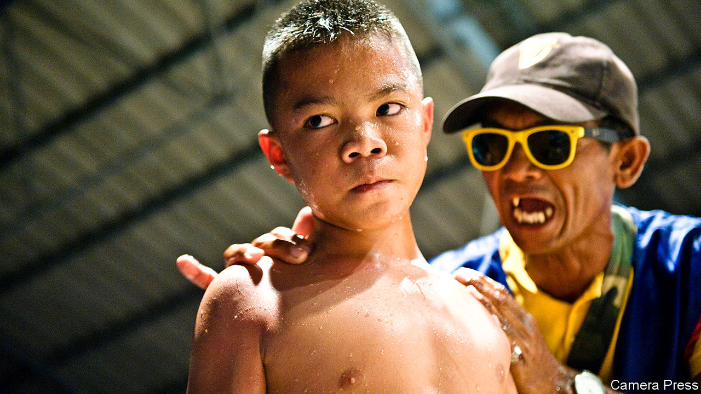

## Muay too young

# Despite a tragedy, children continue to compete in Thai boxing bouts

> And tourists are still watching eagerly

> Jan 30th 2020

THE DEATH of Anucha Thasako was supposed to change everything. After several sharp blows to the head during a Thai boxing bout in 2018, the scrawny 13-year-old fell to the floor, unconscious. The referee rushed to his side, to no avail. There was no doctor in attendance. Anucha died soon afterwards from a brain haemorrhage. He had been boxing since the age of eight, and had taken part in around 170 fights.

The footage of the deadly bout, which circulated widely on social media, stirred uproar. The government, which had anyway been considering restrictions on child boxing, pledged to rush through a bill to ban children under 12 from participating in formal competitions and to oblige those between 12 and 15 to wear protective headgear. But the plan quickly lost steam.

Participants and fans protested loudly, arguing that the only way to prepare for a career in Thai boxing or muay thai, which dates to at least the 18th century, is to start young. Eliminate child boxing, they argued, and the whole sport would atrophy. The government no longer talks of tightening the rules for young boxers. Gongsak Yodmani, the head of the Sports Authority of Thailand, describes child boxing as standard practice. The authority’s official tally shows only 635 boxers below the age of 15, although others put the number of children who train and compete informally as high as 100,000.

For some children, boxing is a route out of poverty. Those participating in public fights earn 300-500 baht ($10-16) a bout when they are starting out, says Samart Payakaroon of the Muay Thai Naiyhanomtom Association, a lobby group. Professional boxers can earn thousands of dollars a match. Muay thai “is a very honourable way to escape poverty”, says Chatri Sityodtong, the founder of One Championship, a martial-arts promoter.

But doctors say that blows to the head from “the art of eight limbs”, which involves punching, kicking, kneeing and elbowing, may stunt children’s development and increase the risk of Parkinson’s and Alzheimer’s. A study from Mahidol University found that boxers under the age of 15 had lower IQs than average; those who had been fighting the longest were furthest behind. The study’s lead author, Jiraporn Laothamatas, considers putting children in the ring a form of child abuse.

One force helping sustain the sport, underage bouts included, is tourism. The Tourism Authority of Thailand energetically promotes muay thai. Foreigners tend to snap up the most expensive seats in the biggest stadiums, looking for a slice of Thai life. Many may not realise how young some of the fighters they are watching are—although the weight categories should give them an inkling. Anucha was competing in the under-41kg division. ■

## URL

https://www.economist.com/asia/2020/01/30/despite-a-tragedy-children-continue-to-compete-in-thai-boxing-bouts
