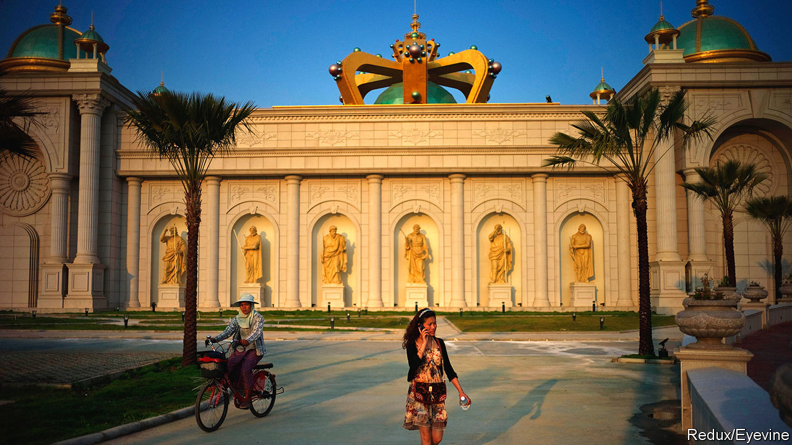
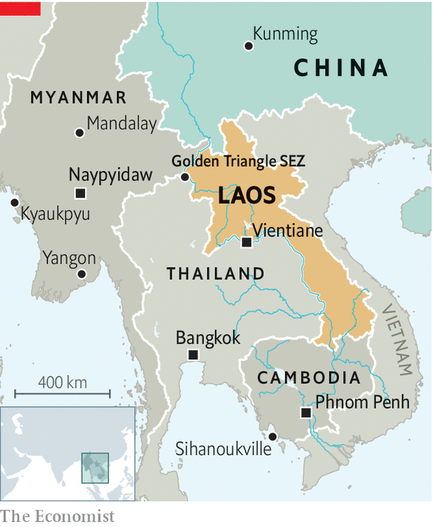

## Viva Laos Vegas

# South-East Asia is sprouting Chinese enclaves

> “Special economic zones” bring lots of Chinese investment and workers, but little benefit

> Jan 30th 2020GOLDEN TRIANGLE SPECIAL ECONOMIC ZONE

IN A REMOTE part of northern Laos, the bamboo forest gives way to cranes. A city is being carved out of jungle: tower blocks cloaked in scaffolding loom over restaurants, karaoke bars and massage parlours. The beating heart of Golden Triangle Special Economic Zone (so called because it sits at the point where Laos, Myanmar and Thailand converge) is the casino, a palatial confection featuring faux-Roman statuary and ceilings covered in frescoes. “Laos Vegas” does not cater to Laotians, however. Croupiers accept only Chinese yuan or Thai baht. Street signs are in Chinese and English. The city’s clocks are set to Chinese time, an hour ahead of the rest of Laos.

Over the past decade, China has become one of the biggest investors in South-East Asian countries: in 2018 it was the source of nearly 80% of foreign direct investment in Laos. Some of this capital is flowing along well-worn routes to places like Mandalay, a city in Myanmar where there is a long-established Chinese community. But much of it is flooding into “special economic zones” (SEZs) to take advantage of assorted incentives such as faster permitting, reduced tax or duties and looser controls on the movements of goods and capital.

Chinese businesses don’t need much convincing. The Chinese government began encouraging them to invest abroad in the 2000s. The Belt and Road Initiative, China’s giant scheme to develop infrastructure abroad, has accelerated the trend. In addition to railways, highways and pipelines, it promotes SEZs, which “are now a preferred mode of economic expansion for China”, says Brian Eyler of the Stimson Centre, an American think-tank. Under the banner of belt and road, 160 Chinese companies have poured more than $1.5bn into SEZs in Laos, according to Land Watch Thai, a watchdog. Between 2016 and 2018 China invested $1bn in one SEZ alone: Sihanoukville, a city on Cambodia’s coast. 

Where Chinese capital goes, labour follows. In Mandalay the Chinese have swelled from 1% of the population in 1983 to 30%-50% today. In places with SEZs the shift has been even sharper. In 2019 the governor of the surrounding province told the Straits Times newspaper that the number of Chinese in Sihanoukville had soared over the previous two years to almost a third of the population. The economic clout of Chinese migrants grows with their numbers. In Mandalay 80% of hotels, more than 70% of restaurants and 45% of jewellery shops are owned and operated by ethnic Chinese, according to market research conducted in 2017.

The influx of migrants has fuelled anti-Chinese sentiment across the region. But poor South-East Asian governments court Chinese investors anyway because they hope Chinese money will kick-start their economies. In some respects the investment has borne fruit. In Laos foreign investment has contributed to effervescent GDP growth, which averaged 7.7% a year over the past decade.

But in a study of SEZs in 2017 Focus on the Global South, a think-tank headquartered in Bangkok, concluded that the “legislative and governance structures” underpinning SEZs in Cambodia and Myanmar “have been skewed toward the interests of investors and against those of locals and the environment”. Alfredo Perdiguero of the Asian Development Bank agrees that SEZs in Laos, Cambodia and Myanmar “have not yet been able to spread the benefits” to the broader economy.

In part this is because Chinese companies tend not to hire locals. By 2018 Laotian workers had secured just 34% of the jobs created by all 11 SEZs in Laos—a far cry from the 90% the government had promised. Chinese firms argue that local workers lack skills, but civil society groups in Myanmar respond by pointing to a technical college near Kyaukpyu, a Chinese-inspired SEZ and port; nobody from the college has been hired to work there, according to a report published last year.

There is little local sourcing of other inputs, either. The garment factories of Sihanoukville SEZ, for instance, import their cloth, buttons and thread. The Chinese workers and visitors in South-East Asia’s SEZs often patronise Chinese-owned shops and restaurants, and circumvent sales taxes by paying for goods and services via Chinese apps like Alipay. “The money doesn’t even leave China essentially,” says Sebastian Strangio, author of a forthcoming book on China’s growing influence in South-East Asia. That, along with the tax breaks, mean there is little benefit for host governments: in 2017 the Laotian exchequer raised just $20m from its SEZs—less than 1% of its revenue.

As is common with big developments in the poorer countries of South-East Asia, locals are seldom consulted about the construction of SEZs. Golden Triangle SEZ was built over the rice paddies of Ban Kwan village; over 100 households were forced to relocate against their will. And then there is the question of law enforcement within the SEZs, whose light regulation can be as attractive to criminals as to legitimate businesses. In 2018 American authorities declared that the Golden Triangle SEZ was a hotbed of “drug trafficking, human trafficking, money laundering, bribery and wildlife trafficking”. They called the company that operates the SEZ a “transnational criminal organisation” and placed sanctions on its chairman, Zhao Wei. He denied the accusations, calling the move “unilateral, extraterritorial, unreasonable and hegemonic”. Many South-East Asians might say something similar about the way the region’s SEZs are run. ■

## URL

https://www.economist.com/asia/2020/01/30/south-east-asia-is-sprouting-chinese-enclaves
