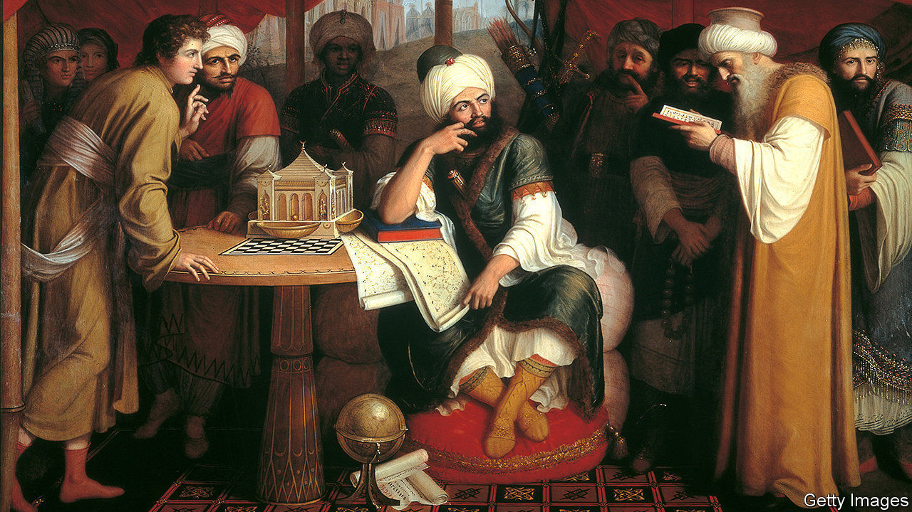

## Secret gardens

# The forgotten glories of Islamic civilisation

> Justin Marozzi explores 15 cities, one for each century of the faith’s history

> Jan 30th 2020

Islamic Empires. By Justin Marozzi. Pegasus Books; 512 pages; $35. Allen Lane; £25.

ISLAMIC CIVILISATION got off to a rocky start. Its first city, which lay in an arid Arabian desert, excluded non-Muslims and sentenced apostates to death. That inauspicious beginning makes the subsequent fecundity all the more startling. Within decades, its great metropolises aspired to reproduce paradise on Earth. In “Islamic Empires” Justin Marozzi, an Arabic-speaking writer, encounters 15 of them, one for each century of Islam’s history. His book is a relief from the often downbeat tone of literature about the region.

Damascus had a Christian majority when it became Islam’s capital three decades after the Prophet’s death in 632. Its caliph, Muawiya, adopted many of the natives’ ways. His treasurer, physician and favourite wife were all Christians; for a time Greek and Pahlavi remained the official languages. Leaders decorated their pleasure palaces with frescoes of bare-breasted women and bacchanalian feasts. Baghdad, founded in 762 and the world’s first circular city, was even more dissolute. True, Harun al-Rashid, its greatest caliph, memorised the Koran. But the life he led with his court poet, Abu Nawas, was so ribald that detractors called him commander of the unfaithful. Such permissiveness endured. The Ottoman sultan decriminalised homosexuality in 1858, a century before Britain.

These cities were as multinational, multi-ethnic, multilingual and multicultural as the empires they ruled. When Omar, the third Sunni caliph, conquered Jerusalem, he cleaned up the Temple Mount, which Christians had made a dung heap to symbolise Jewish degradation, and invited Jews back to pray with Muslims. The Arabic name for the city, Beit al-Maqdis, was adapted from the temple’s name in Hebrew, Beit Hamikdash (“Place of Holiness”). The pluralism set a precedent. Whereas Christian conquerors expelled Muslims and closed their mosques in Spain, Hungary and Greece, Muslim overlords welcomed other faiths.

Under Islam, Cordoba may have been Europe’s largest city (it also gave the continent deodorant and toothpaste). Istanbul, conquered in 1453, became the seat of the Orthodox patriarch and chief rabbi as well as of the caliph (though Hagia Sophia, a Byzantine cathedral, became a mosque). Shah Abbas’s new capital, Isfahan, had 29 churches and an Armenian cathedral.

This openness, Mr Marozzi says, made Islamic cities a “giant ideas laboratory”. After the arrival of paper in the eighth century, they opened madrassas, or academies, with vast libraries. Qarawiyin, founded by a woman in 859 in the north African city of Fez, is the world’s oldest continually surviving academic institution. According to Ibn Tudela, a 12th-century Jewish visitor to Baghdad, the caliph of the era read Hebrew. The third Mughal emperor, Akbar, launched a new universal creed, complete with an interfaith think-tank, the Ibadat Khana. Manicured parks studded emerald cities on the edges of deserts. Cairo’s roof gardens bloomed with orange groves. In the 16th century Babur was known as the Gardener King after planting ten parks in his city, Kabul.

As the threats from a resurgent West mounted, however, some rulers turned inward; the faithful grew defensive. Defeat and intolerance went hand in hand. Sultan Hossein, a shah of the Safavid dynasty, shut Christians and Jews indoors when it rained lest they contaminate Shias. He lost Isfahan to the Afghans in 1722 and was beheaded in his dazzling Hall of Mirrors. “Craters had replaced flowerbeds,” reflects Mr Marozzi as he wanders through what had been Kabul’s terraced gardens. “The heterogeneous has given way to the homogeneous.”

Mr Marozzi resists the impulse to say modern Islam has reverted to its harsh, intolerant origins. With their free trade, multinational populations, sybaritic excesses, showpiece museums and soaring architecture, his last two cities, Dubai and Doha, recall those of the heyday he mourns. The appetite for huge sports events, such as the football World Cup of 2022, testifies to their global ambitions. If only they could also recover Islam’s intellectual buzz. ■

## URL

https://www.economist.com/books-and-arts/2020/01/30/the-forgotten-glories-of-islamic-civilisation
