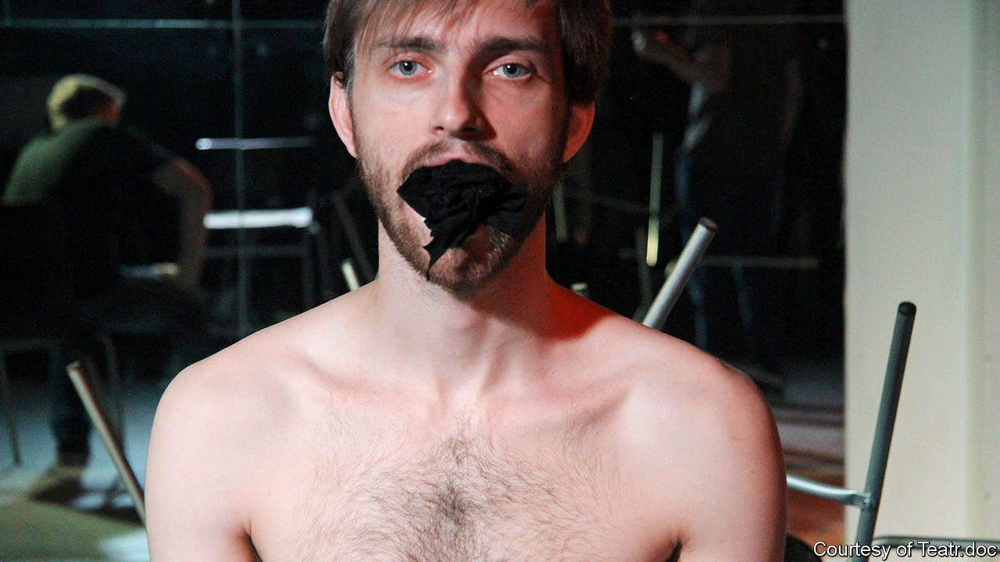

## Pursued by a bear

# The many ways to censor cutting-edge art in Russia

> Bullied by the state, Teatr.doc is now being targeted by ultraconservatives

> Jan 30th 2020MOSCOW

ANASTASIA PATLAY thought something was amiss when she checked the young man’s ID. He seemed a couple of years below the strict 18+ requirement for this performance of “Out of the Closet”, a play adapted from interviews with gay men and their families. That restriction was not the choice of Ms Patlay, the director, but a demand of Russian federal law, which since 2013 has banned the “promotion of non-traditional sexual relationships” to minors. A photocopy of his passport, which Ms Patlay snapped on her phone, suggested he had recently turned 19. Perhaps she was being paranoid, but Teatr.doc, which specialises in verbatim dramas assembled from real-life documents and transcripts—and has long been described as “Russia’s most controversial theatre company”—had already had enough trouble from the authorities.

Her hunch was vindicated; the spectator was a plant sent by a far-right group. Shortly after the show began, he and his friend walked out to rendezvous with a dozen more agitators. Together they accused the theatre staff of illegally exposing children to “gay propaganda”. (The passport had been doctored; in reality, the youngster was 15.) Then they invaded the auditorium, stopping the play and shouting homophobic slurs. Police were called and a fight broke out; Teatr.doc complained about the invasion, the saboteurs that a minor had been admitted.

No charges were brought, but that sting last August turned out to be the start of a protracted ordeal for the Moscow-based company at the hands of ultraconservatives. Despite all the official pressure that Teatr.doc had suffered, this campaign was (and is) a new and different problem. It encapsulates the dual challenge of artistic censorship in Russia—which, as Vladimir Putin’s rule has progressed, has come to be enforced by freelance outfits as well as the state, and as much for supposedly moral reasons as over political dissent.

Teatr.doc was founded in 2002 by Elena Gremina and Mikhail Ugarov, husband-and-wife playwrights who were inspired by verbatim drama workshops in Russia led by the Royal Court theatre of London. Its shows elicited strong responses from the start, not only because of the content—subjects included homelessness, immigration and HIV—but also their style and everyday language. Productions that drew particular ire (and acclaim) included “September.doc”, in which actors read comments made in internet chat rooms following the Beslan school siege of 2004, and “One Hour Eighteen Minutes”, a reference to the time doctors were denied access to Sergei Magnitsky, a whistle-blowing lawyer, before he died in police custody. “They went after things that ail the society,” says John Freedman, a critic and translator of Russian drama, “and they did it in a way that was quite direct.”

Despite its quality, Teatr.doc only ever played in small venues. It has been obliged to find a new one three times in the past six years after leases were terminated, supposedly because of noise and safety complaints. Bomb scares have been reported at several performances, shutting them down, but no explosives have been found. Instead, police have exploited the scares to check audience members’ documents.

It might seem odd for the authorities to expend so much effort on niggling an experimental troupe. But as well as being a salutary demonstration of power, such treatment nudges the Kremlin’s opponents to rally round artists who can be caricatured as libertine extremists. Some alternative targets—pop stars, say—have higher profiles, but also followings too big to alienate. Teatr.doc is not the only cutting-edge company to have faced official harassment. Kirill Serebrennikov, director of the Gogol Centre theatre in Moscow, spent almost 20 months under house arrest as part of an ongoing embezzlement case.

In 2018 both of Teatr.doc’s founders died, leaving the company to be run by Ms Gremina’s son, Alexander Rodionov; many wondered if it would carry on. It did, but the intimidation continued—only in a new form. A month after the sting on “Out of the Closet”, protesters threw foul-smelling chemicals through the window during a performance of “War is Close”, a play about the conflict in eastern Ukraine. Again, no charges were brought. Instead, at the end of last year authorities launched an investigation of Teatr.doc following a complaint from an activist group called the National-Conservative Movement. It accused the theatre of disseminating LGBT propaganda, justifying terrorism in “War is Close”, and promoting drug use in another production. Staff were questioned; the theatre handed over the scripts of the plays for review.

Last month police said they would not bring criminal charges, in what Ms Patlay called a victory for “common sense”. But her adversaries have not gone away.

In this parallel censorship drive, far-right agitators have taken aim at several other shows and exhibitions. “Side by Side”, an LGBT film festival, has been picketed, as have art shows with religious themes. In 2015 the director of a Siberian opera house was forced out after his staging of Wagner’s “Tannhäuser” was deemed sacrilegious by Orthodox Christians. Such independent provocateurs are scarier than the authorities, says Ms Patlay, “because they are unpredictable and they are new”. She thinks they have been emboldened by the increasingly reactionary rhetoric of Russia’s politicians. And they appear to operate with the state’s tacit consent. “The lack of punishment for them and the inaction from police—it sends a signal that we are not defended.”

On the contrary, says Valentina Bobrova, the National-Conservative Movement’s founder. Outfits like hers may further the Kremlin’s bid to stoke a culture war between conservatives and those it portrays as radicals, but she insists the movement is privately funded and has no links with the authorities. She says she never had much hope that her complaint would close the company—and that it is not the likes of her but liberal voices that hold too much sway in modern Russia. “Teatr.doc is an enemy of our country that is working from within,” she says. “We cannot stay quiet and we decided to act.” She was behind the disruption of “Out of the Closet”, too. Her members are looking out for other signs of “anti-Russian” activity.

Ms Patlay worries about the effect of all this on the audience, who might conclude “that you have to be particularly brave to go to the theatre. And we don’t have the right to ask spectators to be brave.” As to whether Teatr.doc has managed to change Russian society, she is illusionless. “I don’t think the percentage of decent people has increased,” she accepts. “But those people who are still here, who haven’t emigrated, perhaps it is a support of some kind.” At the very least, she says, the company has shown it is possible to talk openly about things that others would rather hush up. ■

## URL

https://www.economist.com/books-and-arts/2020/01/30/the-many-ways-to-censor-cutting-edge-art-in-russia
