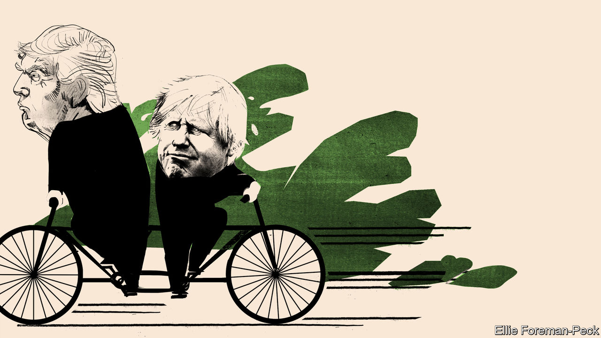
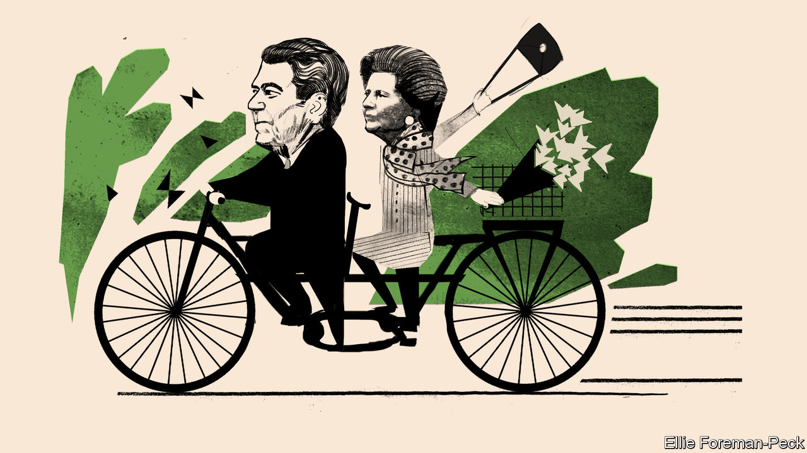
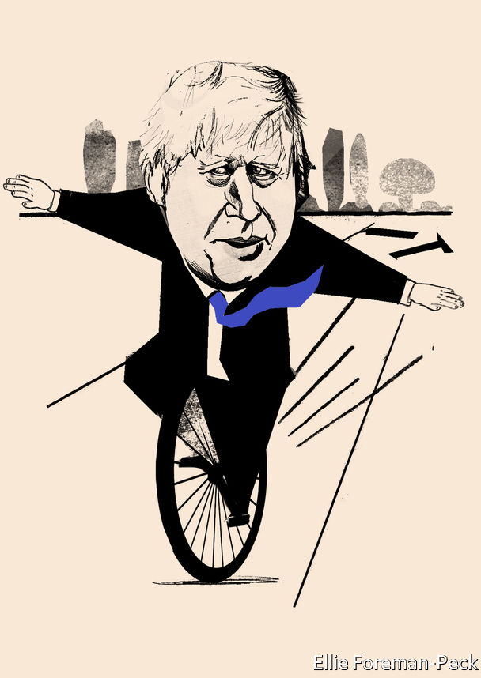

## The special relationship

# A weaker post-Brexit Britain looks to America

> Good luck with that

> Jan 30th 2020LONDON AND WASHINGTON, DC

THE TITANS of Brexit have a tendency to gush over Britain’s bond with America. Before the referendum in 2016, Boris Johnson—now prime minister, then mayor of London—predicted that, outside the European Union, the thriving British would be “even better and more valuable allies of the United States”. Britain’s relationship with America had long been “special”, enthused Liam Fox as trade secretary in 2018. But Brexit provided a “once-in-a-generation opportunity to raise it to a new level”.

Yet in the week that Britain actually leaves the EU it finds itself at loggerheads with America on tax, trade and technology. If the British government persists with plans for a digital-services tax that would hit tech giants, America has said it will retaliate with punitive tariffs on British car exports. And despite heavy American lobbying and suggestions that the countries’ intelligence-sharing could be at risk, Mr Johnson decided on January 28th to allow Britain to buy 5G telecoms kit from Huawei of China. Mike Pompeo, America’s secretary of state, had warned against letting China “control the internet of the future”.

The decision on Huawei came two days before Mr Pompeo was due to join his British counterpart, Dominic Raab, in London for a public conversation on “the future of the special relationship”. At first glance, and despite the croonings of Brexiteers, that relationship appears to be in poor shape. Thomas Wright of the Brookings Institution, a Washington think-tank, describes it as “in its worst state since the Suez crisis” in 1956.

Mr Wright has catalogued many ways in which President Donald Trump “tormented” the previous government, under Theresa May. Although Mr Trump has a better rapport with Mr Johnson than he had with Mrs May, tensions have not disappeared. Meanwhile, competition for America’s attention has been growing. Under the energetic Emmanuel Macron, France emphasises that it is the “oldest ally” of the United States. China’s rise is also tugging America away from Europe.

All this adds to a sense of uncertainty, post-Brexit, about Britain’s status and role in the world. The so-called special relationship has always been lopsided: Helmut Schmidt, a German chancellor, once quipped that it was so special only one side knew it existed. But for nearly half a century, membership of the European club allowed the British to stop fretting too much about their influence in the world. They were “the bridge between the US and Europe”, as Tony Blair, one of the most enthusiastic proponents of the special relationship (and an ardent Remainer), put it as prime minister in 1997. Britain could wield influence on both sides of the Atlantic. Now that the bridge is breaking, questions about Britain’s power are back.

After the second world war Britain struggled to find its place in America’s shadow. Winston Churchill envisaged Britain as part of three great circles among the democracies: the Commonwealth, the English-speaking sphere and a united Europe. In 1946, in a speech in Fulton, Missouri, he had proposed a “special relationship” with the United States, a “fraternal association” of English-speaking peoples involving not only kindred societies but military collaboration. Another prime minister, Harold Macmillan, patronisingly positioned Britain as playing Athens to America’s Rome, teaching a “vulgar, bustling” people how to run a rising empire.

None of this proved convincing. In 1962 Dean Acheson, a former American secretary of state, concluded that Britain had lost an empire but not found a role. Its attempt to find one away from Europe, based on a “special relationship” with America and on being the head of a Commonwealth, he said, was “about played out”.

Joining what was then the European Economic Community in 1973 offered something of a solution. As Ray Seitz, an American ambassador to London, noted in a valedictory speech in 1994: “If Britain’s voice is less influential in Paris or [Berlin], it is likely to be less influential in Washington.” In Mr Blair’s formulation: “Strong in Europe and strong with the US...There is no choice between the two. Stronger with one means stronger with the other.”

Special or not, the relationship has often been fraught. Apart from the Suez debacle, friction arose between Harold Wilson and Lyndon Johnson over Wilson’s refusal to support the war in Vietnam. Even Margaret Thatcher and Ronald Reagan, who were so chummy that Reagan’s successor, George H.W. Bush, said “he was just smitten by her”, fell out over America’s invasion of Grenada in 1983.

Yet over the years, in several different spheres, America and Britain have grown closer. Some 28 Nobel prizes have been awarded jointly to people from the two countries. British actors, such as Daniel Craig, are as likely to play an American detective in Hollywood movies as American ones, such as Renée Zellweger, are to put on plummy British accents to play characters such as Bridget Jones.

The economic ties are especially deep. New York and London, the world’s top two financial centres, are rivals but they are also intertwined. Nearly a fifth of Britain’s exports go to America, more than double the share going to Germany, the next-biggest partner. America accounts for 15% of Britain’s total trade. American investment in Britain supports an estimated 1.5m jobs, and 1.3m vice versa. Britain attracts more than 10% of American foreign R&D.

As much as anything, though, it is shared values and habits of co-operation that have bound Britain and America together. Britain, says Nicholas Burns, a former American ambassador to NATO, is “the country we trusted the most, and worked most closely with.” At the State Department, where British diplomats enjoy a level of access afforded no other country, Britain was “the most like-minded country” with America, and “the first port of entry” with the EU on many issues, according to Amanda Sloat, a Europe specialist who served there under the Obama administration. In an Emerson poll from October 2019, 40% of Americans saw Britain as their country’s most valuable ally and strategic partner, far ahead of next-placed Canada on just 22%.

This closeness has often been evident at the top, starting with the wartime partnership between Churchill and Franklin Roosevelt. Whether it was the free-market freedom-championing of Thatcher and Reagan or the war-fighting of Mr Blair and George W. Bush, British and American leaders have tended to act in tandem.

One of the questions facing the special relationship today is whether or not the same will apply for Mr Johnson and Mr Trump. They have a lot in common; perhaps unsurprisingly, they openly express admiration for one another. Yet other leaders, including Mr Macron, have learnt that it is unwise to place high hopes in a “bromance” with Mr Trump. And if Mr Trump expects that Mr Johnson will go along with his wishes on issues such as the Iran nuclear deal or relations with China he is likely to find himself disappointed.

Mr Johnson’s own instincts may even lean towards European positions on many issues, from climate change to Ukraine. As long as the Trump administration remains in place, “we appear to be more aligned with the Europeans on values and interests than with the United States,” suggests Sir Peter Westmacott, a former British ambassador to Washington. Federica Mogherini, until recently the EU’s foreign-affairs representative, expects continuity, too.

Huawei provided a first test of Britain’s post-Brexit policy. Now two other areas will come to the fore: defence and trade. Traditionally, the Anglo-American relationship has been deepest in military, nuclear and intelligence matters. Britain’s armed forces have fought alongside their ally in every major campaign of the past three decades. “The way we fight is nearly indistinguishable,” says Philip Breedlove, a retired American general who served as NATO’s Supreme Allied Commander Europe from 2013 to 2016.

Partly this is down to an unparalleled level of integration. Every major in the British Army goes through a course in America, and more than 1,000 British military and civilian defence staff are based across 29 American states. Some military assets are held virtually in common, while British defence firms are more closely involved than those of any other country in building the F-35 warplane. Britain also depends on America to build, sustain and defray the costs of its nuclear arsenal.

Their spooks lean heavily on one another, too. Britain’s signals-intelligence agency, GCHQ, and its American counterpart, the NSA, are bound by the Five Eyes pact, which includes Australia, Canada and New Zealand. Documents leaked by Edward Snowden, a former NSA contractor, showed that Britain had a sweet deal: America paid at least £100m to GCHQ in 2009-12 and 60% of Britain’s high-value intelligence was derived from the NSA. But the benefits are not one-sided. Michael Hayden, an ex-NSA director, once told his British counterpart that if Fort Meade, the NSA’s Maryland headquarters, was to suffer a catastrophe, he planned to entrust the machinery of American electronic espionage to Britain. 

This strategic intimacy dates to the second world war. However, it is not immutable. Kori Schake of the American Enterprise Institute (AEI), a think-tank, warns that “Britain is perilously close to becoming just like any other Western military rather than the preferred partner of the US any time rules need enforcing.”

In recent years the sorest point has been British defence cuts. In 2015 Barack Obama demanded, in terms that would foreshadow Mr Trump’s rhetoric, that David Cameron, then prime minister, pay his “fair share”. General Ray Odierno, then head of the US Army, said that he was “very concerned” by the belt-tightening, which amounted to an 18% fall in real-terms spending over the previous five years. 

Those warnings helped trigger a spending boost, but three years later James Mattis, then Mr Trump’s defence secretary, fired another shot across the bow of his British counterpart. “France and the US have concluded that now is the time to significantly increase our investment in defence,” he warned in a letter, adding ominously: “It is in the best interest of both our nations for the UK to remain the US partner of choice.” That prompted another hurried injection of cash, but Britain has struggled to keep up. The size of its armed forces has fallen for nine consecutive years. Brexit might lead to further reductions.

Still, American diplomatic and military insiders tend to pooh-pooh the idea that the relationship is in crisis, or that France could supplant Britain. “The UK is still our most capable partner militarily, and our most valuable partner politically,” says Rachel Ellehuus, who handled European and NATO policy at the Pentagon until 2018.

However there are some signs of wavering in Britain. On January 12th Ben Wallace, Britain’s defence secretary, questioned America’s reliability as a partner. Britain was “very dependent” on American surveillance and air cover, warned Mr Wallace. “We need to diversify our assets,” he added. British spending on American kit is already slated to run to $32bn over the next decade, around 7% of the defence budget each year.

But the options for diversification are limited. Brexit has left Britain cut out of a new European defence fund and a project to build a European satellite-navigation system. Going it alone is pricey: a proposed British-built alternative constellation would cost around £5bn. So Britain will have a lot to wrestle with as it conducts a comprehensive review of security, defence and foreign policy. Mr Johnson has promised it will be the most radical assessment since the end of the cold war.

The other test of the special relationship, on trade, is likely to be similarly fraught; all the more so given the rancour in Congress over the Huawei decision. Tom Cotton, a Republican on the US Senate’s Armed Services Committee, tweeted that “I fear London has freed itself from Brussels only to cede sovereignty to Beijing.”

However, the desire for a deal is not in doubt. Both sides are aiming for a comprehensive free-trade agreement, which could dismantle non-tariff barriers. Negotiators share an interest in strong intellectual-property protection, recognition for each other’s professional qualifications and maintaining the free flow of data.

If Britain really wanted, it could probably get a deal in relatively short order. America has a template trade deal that it tries to push on all of its negotiating partners. David Henig of the European Centre for International Political Economy, a think-tank, reckons Britain could sign up to most of the text on tariff reductions and services without a hitch. As a gesture, the Americans could offer some special access to their public-procurement market.

Indeed, American officials have been helping to bring their British counterparts up to speed, in some cases informing them of stumbling-blocks in negotiations with the EU. The warmth stems only partly from a genuine wish to strengthen their relationship. It also reflects a desire to thumb American noses at the EU—and pull Britain away from its regulatory orbit.

In some crucial areas, Britain is going to have to choose between the American system of regulation and the European one. Take the issue of food standards, often simplified to a debate about chlorinated chicken. The EU bans its import on the basis of the precautionary principle, which says that there must be scientific evidence proving something is safe for it to be allowed. America flips that burden of proof; in order for a product to be banned there must be scientific evidence proving it is unsafe.

American negotiators scoff that the EU’S approach is “unscientific”. Regardless, if Britons opt for the American way, they may quickly find themselves embroiled in the EU’s non-tariff barriers for their own products. The EU has made it clear that any future free-trade deal with Britain will have to include provisions to prevent any “unfair competitive advantage” that Britain could get by undercutting its environmental and regulatory measures. To put it another way: if Britain wants to diverge from the EU’s standards and follow an American model instead, its market access to its biggest and closest neighbour will suffer.

If negotiators get bogged down, as they probably will, then they could aim instead for a quick and shallow deal, delivering political wins on both sides of the pond. Such a deal could defuse the dispute over digital-services taxes, or perhaps America’s complaints over Britain’s subsidies for Airbus, a European aircraft manufacturer.

Despite these potential hurdles, leaving the EU does not mean Britain has lost all its leverage with the country Iran dubbed “the Great Satan” to Britain’s “little Satan”. Britain can still draw on a depth of diplomatic capital that offers it clout. It remains in the G7 and the G20 and plays a big role in NATO. Britain has a wide network through the Commonwealth and earns influence as a major player in development aid. Not least, it retains one of the five permanent seats on the UN Security Council. As the country emerges from agonising over the Brexit negotiations, it can start to devote more energy to working out how to make the most of these assets under its new, semi-connected status with the continent.

Indeed, whatever the intrinsic merits of the Huawei decision—the British view was that security risks could be managed and that the alternative suppliers were not yet up to scratch—it dispels the idea that a weakened Britain leaving the EU will always bend to America’s will. When Britain ingratiates itself with America, things do not necessarily end well, as Mr Blair’s enthusiasm for the war in Iraq showed. A clear-headed view of the country’s national interests (which in the Huawei case include Britain’s wish for strong trade relations with China) serves it best.

Outside the constraints of the EU, Britain could have some scope to be more agile. Take sanctions. It is true that Britain is losing the ability to champion these through the EU. But it also no longer has to be bound by the need to thrash out lowest-common-denominator agreement. It could, potentially, take the initiative on its own.

Some would like to see Britain take the lead in areas where, for now, America seems to have lost interest, such as championing democracy. (Though that would mean standing up to China.) Because Britain knows America so well it has “a huge opportunity to help countries trying to deal with [it]...do it more nimbly and more strategically,” says Ms Schake of the AEI.

Britain could remain in the bridge business. The two countries may never regain the first-name closeness shared by “Ron” and Margaret or even George and Tony. But a different American administration could both rekindle something of that romance, as well as help its ally remain closely connected with the continent. For now, however, Mr Trump seems to favour a divide-and-conquer approach. And that threatens the ardour between Boris and Donald. ■

## URL

https://www.economist.com/briefing/2020/01/30/a-weaker-post-brexit-britain-looks-to-america
