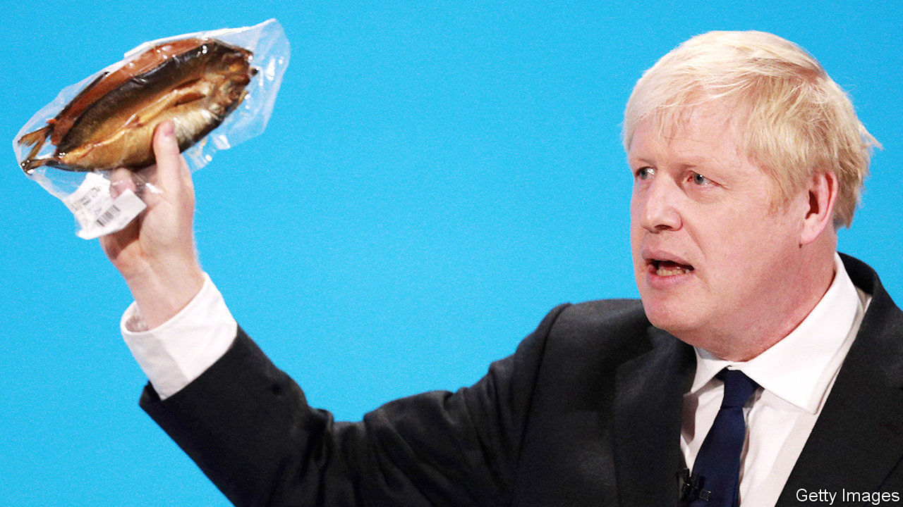

## The press

# Brexit spells farewell to the media’s euro-myth

> A staple of tabloid journalism is no more

> Feb 1st 2020

EUROCRATS HARRUMPHED about British journalists’ “euro-myths”—ludicrous stories about supposed EU regulations forcing cows to wear nappies or outlawing the Sunday roast. They also got the joke. When Boris Johnson, as master of the genre in his first career as a journalist, claimed that the EU was about to ban a beloved British snack, Martin Bangemann, a German official, milked it for laughs. “I’ve never even heard of prawn cocktail crisps,” he chortled.

There were three main categories of myth. Some were nonsense, such as the Daily Express’s claim in 2010 that the EU was planning to force member states to liquefy corpses and pour them down the drain (it was a suggestion made by Belgian undertakers to avoid the carbon emissions from cremations). Another sort claimed that some symbol of British identity—brandy butter, car-boot sales and English acorns—was about to be banned. In 1992 the EU’s London office started a webpage devoted to debunking such claims. But in many cases it had to admit there was more than a grain of truth. When British newspapers reported a plan to outlaw the radioactive green used to colour frozen mushy peas, it turned out that they were partly correct; the crisps, similarly, were briefly illegal (because of a British clerical error).

A third, more sinister sort of euro-myth described cunning plans to force European or other ideologies on Brits, whether by accepting sharia law or changing all “.co.uk” domain names to “.eu”. A steady drip-feed of such stories may have hit home. This sub-genre, popular with the pro-Brexit press, reached its zenith in the five years before the referendum in 2016.

Still, most people, it seemed, were able to tell euro-myth from euro-reality. In 2016 YouGov found that only a tenth of Britons believed that the bloc planned to ban the sale of rhododendrons. Only 14% believed it wanted to change “Bombay mix” to “Mumbai mix”.

The supply of euro-myths will decline after Brexit, for Britain’s newspaper culture is unique in the EU in its appetite for mocking bureaucracy and petty rules, says Geoff Meade, a Press Association veteran of Brussels. But the demand among the nation’s hacks for this type of story will persist, so they will hunt for absurdities closer to home. Whitehall’s mandarins should watch out.

## URL

https://www.economist.com/britain/2020/02/01/brexit-spells-farewell-to-the-medias-euro-myth
