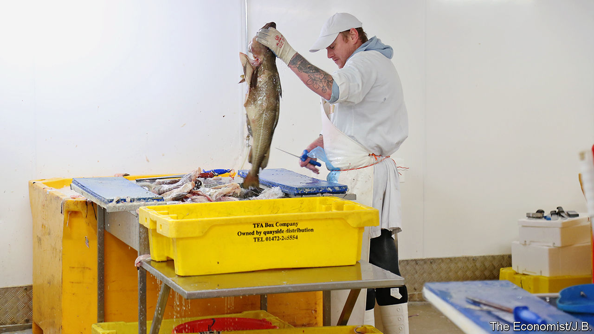

## Fisheries after Brexit

# Britain’s fisherfolk fret about being sold down the river—yet again

> Brexit presents them with a scaly problem

> Jan 30th 2020

BREXIT’S NEW freedoms resound especially with fishermen who felt betrayed when Britain joined the common fisheries policy (CFP) in 1973, giving up fishing rights to other European countries. Michael Gove, in charge of EU negotiations, believes the CFP destroyed his father’s Aberdeen fishing business. The appeal of taking back control of Britain’s fish post-Brexit, as Iceland did in the 1970s, is strong.

Britain’s seawaters give it a strong card. Yet it is not an easy one to play. One reason is that fish have a pesky habit of swimming across boundaries. Another is catching and eating habits. Two-thirds of the fish landed in Britain is exported, mostly to the EU. But most of the fish eaten in Britain is imported, mostly caught (often by Brits) in EU waters. Trade barriers would disrupt both sides.

Next are historic rights for EU countries, many of which long predate the CFP. Some arise because EU businesses bought British vessels and their quotas. Removing these rights might entail litigation and compensation. Also fish-processing, which could face tariffs after Britain leaves the CFP, has become a big business in ports like Grimsby—and it depends on the unfettered import and export of fish caught all over Europe.

The biggest problem is politics. Barrie Deas of the National Federation of Fishermen’s Organisations says Britain should follow Norway’s example by adjusting allowable catches in its favour and settling quotas annually with the EU. But he fears political polarisation. Ireland’s Leo Varadkar has suggested Britain might have to give up control so as to get better terms elsewhere. France’s Emmanuel Macron has said that, if it rejects open access to its waters, Britain will not get a trade deal. Since fisheries account for less than 0.1% of Britain’s GDP, compared with 4% for cars or 7% for financial services, fishermen may be right to worry about being traded away once more.