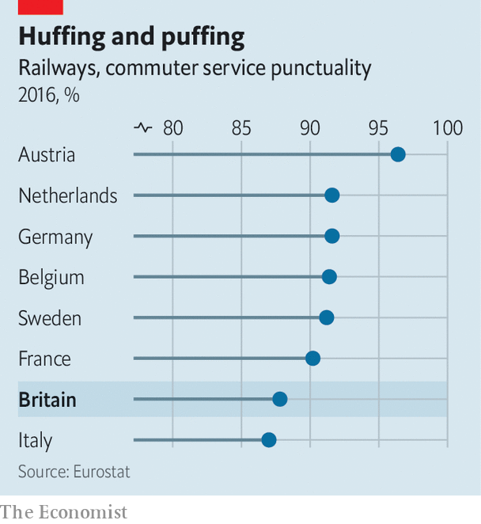

## Railways

# Britain’s government renationalises Northern Rail

> Angry commuters mean this is likely to be the first of several

> Feb 1st 2020

COMMUTERS IN THE north of England have had a miserable year. In the year to October 2019 just over half Northern Rail’s trains arrived on time and passenger satisfaction was, understandably, lower than with any other operator. On January 29th the government lost patience with the firm and announced that Arriva Rail North, the franchise’s operator, would be stripped of its franchise on March 1st, five years ahead of schedule. Under the “operator of last resort procedure”, the service will then be run by a publicly owned company on an arm’s length basis for an unspecified length of time. The East Coast Mainline was taken over in a similar way in 2018 and remains in public hands. Northern is unlikely to be the last firm that finds itself targeted by the transport secretary.

On many measures Britain’s railways look to be in good shape; both passenger numbers and freight volumes have grown at a decent clip while fares, at least for tickets bought in advance, are mid-priced by European standards. But when it comes to commuter services, punctuality rates lag behind international peers, season tickets are pricey and train cancellation rates high. For the 10% of Britons who commute to work by rail, the fact that the country operates a decent freight system is scant consolation for their regular morning delays. As services have deteriorated and reliability fallen, rail has become a live political issue. More than 50% of Britons now support renationalising the whole sector and Northern Rail’s failings anger voters in the northern English seats which turned Tory for the first time in the 2019 election.

Arriva argues that the poor service was beyond its control. It blames a prolonged industrial action by the RMT trade union and delayed or cancelled infrastructure projects. More than half of all rail delays in Britain are caused by problems with infrastructure, such as signalling, which is already operated by the government. Passenger numbers have doubled since the mid-1990s, without the needed investment to expand services. The result has been overcrowding and often poor reliability on many lines. But whoever is actually responsible, commuter anger tends to be directed at the operating companies. TransPennine Express, Greater Anglia and South Western Railway are all now seen as at risk of nationalisation.

A government white paper on rail, setting out a new strategy for the network, has, much like a commuter rail service, been subject to frequent delays. The direction of travel, though, seems clear. Grant Shapps, the transport secretary, has spoken of the need for a “fat controller” sitting at the centre of the system providing more direction. The current system of franchises, according to Keith Williams, who chairs the panel that will produce the white paper, “has had its day”. It looks set to be replaced by the concession model already operated by London Overground and Merseyrail. Under that model, while a private operator physically runs the trains in return for a flat fee, other decisions and ticket-price levels are set by a public body. Revenue and financial risks are carried by the public sector rather than the operator.

Implementing this will take years. In the meantime, more ad hoc nationalisations of failing franchises are likely.■