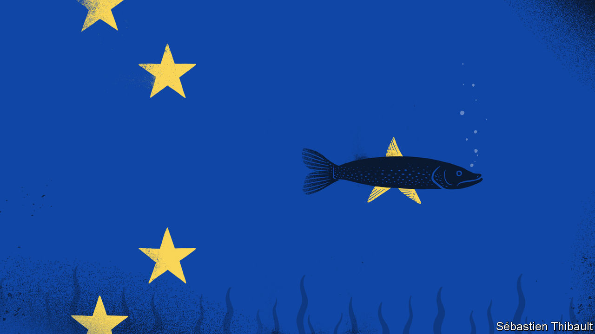
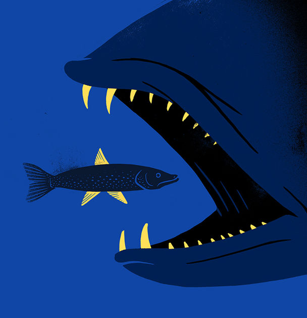

## Brexit

# Britain’s regulatory-divergence dilemma

> There will be costs to diverging from EU regulation. But there will be benefits, too

> Feb 1st 2020

BRITAIN’S DEPARTURE from the EU, says Sir Bernard Jenkin, a Conservative MP, reminds him of an experiment his grandfather once carried out on a pet pike. He put a glass wall in the middle of the fish’s tank, thus halving its swimming space. After ramming the glass, “thunk, thunk” for a while, the fish adapted to its diminished quarters. But when the wall was removed, it continued making tight circles in half of the tank: it never grasped that its freedom had been restored.

On January 31st Britain leaves the EU. It goes into a sort of limbo—a transition period—until the end of 2020, when in dozens of areas, from trade, migration, environmental rules and farming to financial services, data policy, regional subsidies and state aid, the country’s freedom to run its own affairs will be constrained only by its ambitions to do deals with other countries. The big question, says Sir Bernard, an enthusiastic Brexiter, is whether it can remember how to roam.

Boris Johnson, the prime minister, is bent on taking full advantage. There will be crowd-pleasing changes—taking back control of the VAT regime will allow the Treasury to remove the levy on tampons, for instance—and weightier divergences. Earlier this month Sajid Javid, the chancellor of the exchequer, made clear that there will be no alignment with EU regulations once Britain is out of the single market and customs union, adding that there would be winners and losers.

The riposte from Brussels to Mr Javid’s remarks was swift. Ursula von der Leyen, president of the European Commission, repeated that greater regulatory divergence would necessarily mean a more distant trading partnership with the EU. The government’s own economic analysis of Brexit last year put the long-term loss in GDP per person of a close relationship (like Norway’s) at some 1.4%, against a loss of 4.9% for a more distant one. The difference is a proxy for the cost of regulatory divergence.

British manufacturers protested. The car and aerospace industries, chemicals and pharmaceuticals firms, the Confederation of British Industry (CBI) and Unite, the biggest trade union, all talked of the adverse consequences of divergence. Ministerial promises only to diverge when that is in Britain’s interests do not much reassure them. The only way to avoid customs, rules of origin and regulatory border checks is to make legally binding commitments to observe all current and future EU rules, which the government has rejected.

Some 80% of the auto industry’s output is exported, and over half those exports go to the EU. Regulatory divergence would mean cars (and car parts) being subject to compliance checks in both directions, increasing costs and delays. Some 60% of the chemicals industry’s output goes to the EU.

But there is bound to be divergence. Regulation is the expression of public attitudes to business and the state; since those are different all over the world, Britain’s rules will become increasingly British. And there could be benefits as well as costs.

Regulation in Britain tends to be based on principles, rather than prescription; the country’s common-law system builds on it over time. European regulation, by contrast, is more codified, which leads to a lot of prescriptive detail. The very word “directive” strikes fear into executives, says Helena Morrissey, a City financier. Financial firms get snarled up in detailed EU rules. The cost to the British asset-management industry of obeying the revised Markets in Financial Instruments Directive, which came into force in 2018, for example, is an estimated €2.5bn ($2.75bn). The burden of regulation falls especially heavily on small firms, discouraging enterprise.

Britain’s new freedom to regulate flexibly and nimbly will be invaluable, says Rishi Sunak, chief secretary to the Treasury and a rising star in government. A particular opportunity, says the boss of a London-based exchange, would be to adopt America’s regime for regulating derivatives, considered the best in the industry. The EU recognises it, so London could ask to be treated in the same way, he says.

Two of the buzziest areas of finance are fintech and sustainable finance. The City has a better chance of getting ahead in those areas if it has its hands on its own regulatory levers, says Jonathan Hill, a Conservative politician and former financial-services commissioner for the EU. One approach likely to be used more widely is the “regulatory sandbox”: rather than banning an innovation or approving it for use across the system, regulators allow it to be used on a limited scale and monitor its effects. If the risks seem low, the new practice is allowed wider application.

Britain’s different political priorities are also likely to show up in regulatory divergence. Britons have, for instance, a softer spot than most Europeans for their fellow creatures; hence rumours that Mr Johnson is planning to ban exports of live farm animals for slaughter.

Of more economic significance is the divergence in attitudes to finance. The long campaign to introduce a financial transactions tax has more takers in the EU than in Britain. And hostility to wealth is probably more pronounced within the EU than in Britain, hence one of the most disliked pieces of EU regulation—a cap on bankers’ bonuses introduced in 2014, which forces banks to raise the proportion of their costs that are fixed, thus potentially making profits more volatile.

The EU’s instincts, meanwhile, are more protectionist than Britain’s. Britain is, for instance, already moving away from the EU requirement that only airlines 50% owned by local companies have unrestricted rights to fly within the EU. And the noises coming out of the commission about the need to foster local tech titans suggests that the gap on this front may widen.

In science, too, Britain is likely to diverge from Europe. Britain’s empirical approach to intellectual life makes it more permissive, while the “precautionary principle”, for which the continent has more time, tends to be inhibitive. In July 2018, for instance, the European Court of Justice (ECJ) ruled that plants obtained by modern forms of mutagenesis, of which gene-editing is an example, fall under the EU’s GMO directive from 2001. The GMO legislation, because it is complicated and expensive to comply with, amounts to a de facto ban. Sir Mark Walport, chief executive of UK Research and Innovation, attributes this hostility to GMOs in part to personal beliefs about the legitimacy or otherwise of fiddling with nature. “Now we can work in the context of UK society which in general thinks very positively about science.”

Britain is leaving the EU just as the bloc gets ready to clamp down on artificial intelligence (AI). It may impose laws for developers in what it considers high-risk sectors such as health care and transport. Many people will welcome the EU taking a robust stance on controversial AI products like facial recognition. But some worry that Brussels is rushing to regulate AI without stopping to consider the trade-offs. Post-Brexit, Britain will write its own regulations on AI and on data. Eventually there will be three regimes in the world—the EU’s, America’s and China’s. Britain’s rules could end up closer to those of America than the EU.

London’s tech industry is also excited about what a trade deal with America might bring in the field of digital services, says Nicole Sykes, head of EU negotiations for the CBI. “We could create a more stable environment for technology firms large and small,” says Stephen Booth, director of Open Europe, a Eurosceptic think-tank.

The globalist wing of the Brexit movement is keen to boost the country’s competitiveness by lightening social, economic and environmental rules. Business will have plenty of suggestions. Many dislike the requirement that obliges them to hire temporary workers after a short period of time. Smaller businesses in particular could be awarded more exemptions from labour regulations.

This worries the EU, which is particularly concerned that there should be a “level playing field”. On environmental protection, Brussels calculates that British industry could save €4.7bn a year if it departed from the EU’s rules on industrial emissions and pollution.

Yet Mr Johnson seems unlikely to go for much of this sort of deregulation. He is not that sort of Tory, and cutting labour and social protections would rile British voters—especially in the poorer areas where the Conservative Party has just made big gains. Although Britain originally got an opt-out from the Social Chapter of the Maastricht Treaty, it has sometimes gone above and beyond what Brussels wants: it has given temporary workers more rights and parents more leave than the EU demands. The green movement is strong in Britain, and will keep a protective watch on environmental regulation. The government is reportedly inclined to toe the EU line and keep most of the massive REACH law that regulates chemicals. “There are plenty of things you might want to do in your dark free-market heart but the public doesn’t want it,” says Robert Colvile, director of the Centre for Policy Studies, a Conservative think-tank.

Focused as it is on boosting growth in England’s peripheries, the government seems more likely to diverge from EU state-aid rules than from social, environmental and labour protections. Mr Johnson has put the creation of ten “freeports”, that for customs purposes are legally outside Britain, high on the agenda. Freeports can offer zero tariffs, low taxes and loose regulation. America has 250 free-trade zones. The EU claims to have 85 customs-free zones but in reality there isn’t much to them. Mr Sunak says EU single-market regulations and state-aid law have stopped Britain from using such zones properly. “The EU makes it very hard to make them seamless and really exciting,” he says.

The biggest arguments are going to be around fisheries (see [article](https://www.economist.com//britain/2020/01/30/britains-fisherfolk-fret-about-being-sold-down-the-river-yet-again)) and agriculture. Farmers and fishermen, who voted enthusiastically for Brexit, make up a tiny proportion of GDP—0.6% and less than 0.1% respectively—but their travails will loom large: Scarry’s Law, formulated over a decade ago by this newspaper and named after Richard Scarry, a children’s illustrator, states that politicians mess at their peril with groups that feature in children’s books—farmers, fishermen, train drivers and suchlike.

The EU’s approach to farming is unpopular among an impressively wide range of people. Some dislike the fact that the common agricultural policy (CAP) has shovelled vast subsidies to a tiny sector, many of whose members are landed gentry; others that it depresses the price of agricultural products, thus impoverishing developing countries. Environmentalists regard automatic payments for agricultural land as an incentive to clear wildlife habitats and cut down trees. Farmers dislike the EU’s tight rules on the use of pesticides.

The government’s new agriculture bill proposes public subsidies for farmers who promote public welfare. They will in future be paid for things like improving animal welfare and air and water quality. But their future looks uncertain. Within the EU, farmers benefited from the power of the French agriculture lobby, which ensured that tariffs were high and the CAP swallowed up more than a third of the EU’s budget. British farmers do not have that sort of clout. Declining subsidy is not the only risk they face: American farmers want access to British markets for their chlorine-washed chicken or hormone-filled beef. British farmers fear that they may find themselves sacrificed to the need for a trade deal.

Sectoral worries aside, surveys suggest that business sentiment soared after the election result. A CBI survey of manufacturers published on January 22nd reported the biggest positive swing in confidence since the poll was first taken in 1958. Manufacturers’ absolute confidence level is now as high as it was in 2014 when the economy was emerging from recession.

This surge of animal spirits is down partly to the defeat of a left-wing Labour Party and partly to greater clarity about Britain’s future relationship with the EU. But it also springs from a hope that the government will not just throw off EU rules, but also improve the way it works with business. “We’ve got to park the past and make the best of what we’ve got,” says Sir Roger Carr, chairman of BAE Systems, a defence firm. The hardest part of Brexit—negotiating a full trading relationship with the EU—is still to be achieved, but British business appears ready to be bolder than the pike. ■

Listen on: [Apple Podcasts](https://www.economist.com/https://itunes.apple.com/us/podcast/id1449631195?mt=2&ls=1) | [Spotify](https://www.economist.com/https://open.spotify.com/show/12zKAMNyS2GNentUzxq9QN) | [Google](https://www.economist.com/https://www.google.com/podcasts?feed=aHR0cHM6Ly9yc3MuYWNhc3QuY29tL3RoZWludGVsbGlnZW5jZXBvZGNhc3Q) | [Stitcher](https://www.economist.com/https://www.stitcher.com/s?fid=357733&refid=stpr) | [TuneIn](https://www.economist.com/https://tunein.com/podcasts/Business--Economics-Podcasts/Money-talks-from-Economist-Radio-p603831//)

## URL

https://www.economist.com/britain/2020/02/01/britains-regulatory-divergence-dilemma
