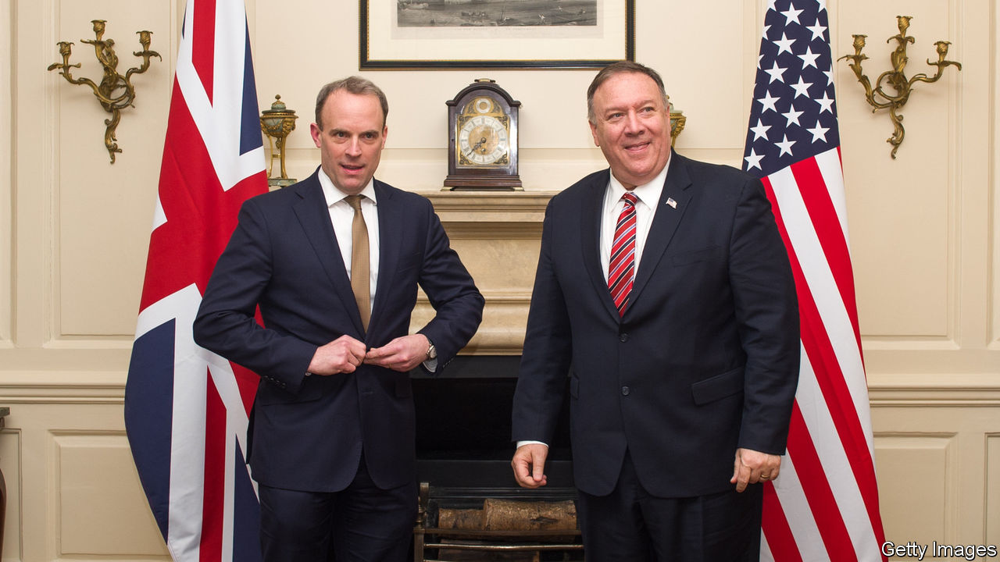
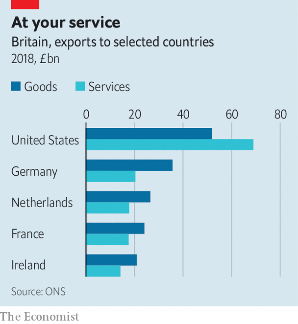

## Doing trade deals

# Post-Brexit Britain may find trade deals hard to negotiate

> Small may be beautiful

> Feb 1st 2020

THE AMERICAN reaction to Britain’s decision to give China’s Huawei a role in its 5G network was a foretaste of the difficulty of post-Brexit trade negotiations. Republican senators said it would make a bilateral trade deal more problematic.

Britain already has its work cut out simply replicating existing EU deals with South Korea, Mexico, Canada and others. The numbers are not encouraging. Brexiteers note that 90% of world growth will be outside the EU over the next decade. Yet the government’s own analysis finds that the combined benefit of free-trade deals with America, Canada, Japan, Australia and other big countries would add less than 0.5% to GDP, a small fraction of what will be lost through more trade friction with the EU.

Where to focus? America, the biggest market for exports, is an obvious candidate. Until the Huawei decision the Trump administration was positive about a quick deal. Brexiteers like it as it would make it hard to switch back to the EU. Yet America’s priorities of opening up food markets and drug prices do not appeal to consumers (or the government). A row over digital taxes may also hamper a deal.

America may allow a deal to lapse if its partner agrees one with China, and Chinese deals are one-sided. India is more promising, but its government is not trade-friendly and it sees easier visas for Indians as a precondition. Sam Lowe of the Centre for European Reform think-tank points to Japan, Australia and New Zealand as partners that might set a template for other deals. The government is keen on Japan, though one concern is that it cannot do better than the EU since the terms of the EU’s deal requires it to get the same benefits.

Most politicians favour full free-trade agreements. Yet Peter Mandelson, a former EU trade commissioner, says FTAs don’t come free, don’t cover all trade and take ages to agree. So it may be sensible to focus on removing specific barriers or on mutual recognition. It may be easier to do this for financial services with America than get a full FTA. Liam Fox, a former trade secretary, cites the removal of a Chinese tariff on Northern Irish milk as an example.

Sectors matter too. Big companies can deal with tariffs, trade and customs barriers quite easily, but small firms find it harder. Efforts to help them could pay dividends. A new report from the UK trade policy observatory at Sussex University and the Federation of Small Businesses proposes new information centres and helplines specifically designed to encourage small firms to cope with trade red tape.

Above all is the idea of looking at services, not goods. Non-tariff barriers matter more than tariffs, and they affect services most. David Henig, a trade economist, notes that services account for 80% of Britain’s GDP and 40% of its exports, a share that is growing fast. Yet progress towards freer global trade in services has been glacial. America and Britain are, respectively, the world’s biggest and second-biggest exporters of services. Could they team up to push greater liberalisation? ■

Correction (January 31st 2020): This piece originally said that America requires deals to lapse if its partner negotiates with China. Actually, the legislation permits America to allow a deal to lapse if its partner agrees one with China.