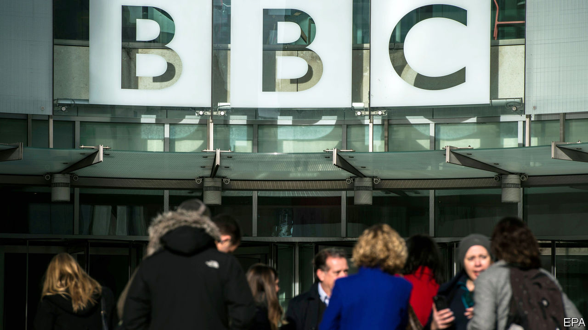

## British Broadcasting Cuts

# The BBC performs painful internal surgery

> It will cover fewer stories and attempt to reduce duplication

> Jan 30th 2020

IN JULY 1954 the BBC launched its first daily television news programme. The newsreader did not appear on screen because, he said, of the fear that he “might sully the stream of truth with inappropriate facial expressions.” Sir Ian Jacob, the organisation’s director-general, grasped the moment’s importance, though, noting that “this is a start on something we regard as extremely significant for the future.”

Six decades later, the corporation offers straight news (three times a day), mid-morning news analysis (the Victoria Derbyshire Show), evening news analysis (Newsnight), 24-hour news (on a dedicated channel), a wry look at the news (Have I Got News For You), news for children (Newsround), a weekend news chat show (with Andrew Marr), a show to debate the news (Question Time), as well as plenty more online and on radio.

The BBC’s bosses have decided that this results in too much duplication. On January 29th Fran Unsworth, the head of current affairs, announced sharp cuts to the organisation’s newsgathering operations. Some 450 jobs will be scrapped (out of 6,000 or so in news), the number of presenters will be reviewed, radio news will be slimmed down and, as leaked earlier, the Victoria Derbyshire Show will go altogether. The current approach of covering about 100 news stories a day is simply “overwhelming” to the public, Ms Unsworth argued. The aim is to stop different programmes doing the same things. Teams will be expected to produce packages for a range of programmes. Output will become more homogenous.

The decision reflects the BBC’s tight budgets. Last year it received £3.7bn ($4.8bn) from the licence fee, which all television watchers must by law purchase—a lot of money, but also a real-terms cut of about a fifth since 2010. On top of this fall in revenue, from June this year the BBC must foot the bill for a free licence for over-75s, which the government formerly took care of. Although it has decided to restrict free licences only to households where at least one person receives an old-age benefit, the giveaway is still expected to cost around £250m a year by 2021-22. Altogether the BBC needs to cut spending by £800m by 2022, of which news is expected to deliver £80m. But things could get worse: the government has ordered a review of whether the licence fee should remain compulsory. Gary Lineker, one of the organisation’s most prominent presenters, this week argued it should not.

And then there is the BBC’s uncertain future. In order to justify the existence of the licence fee, the BBC must demonstrate that it can reach all parts of society. Nearly eight in ten over-65s use BBC One as their main news source; just a third of 16- to 24-year-olds do. Estimates suggest that 16- to 34-year-olds spend roughly the same amount of time (around two-and-a-half hours a week) with Netflix as with BBC television. Their main source of news is the internet. In an attempt to adjust to this reality, the BBC has invested in podcasts and streaming, but not to the extent needed to challenge the American giants. In cutting its news offering, the organisation risks weakening its provision in an area where it genuinely does lead the world, to chase viewers it has little hope of reaching. ■