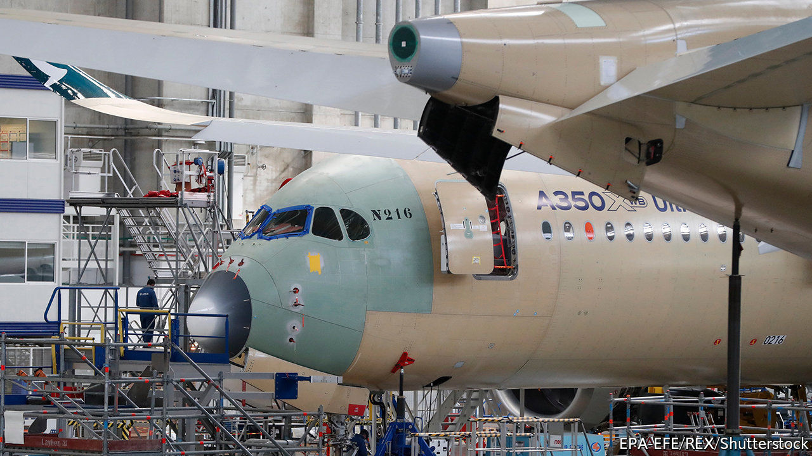
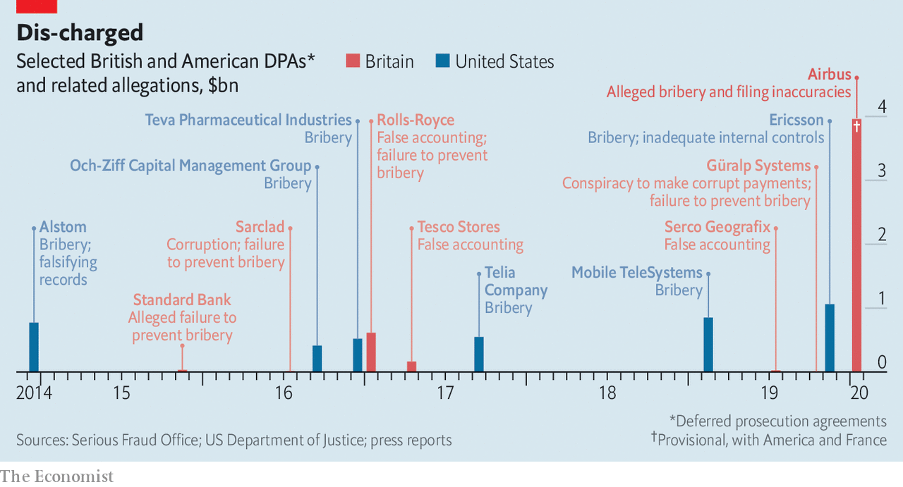

## Deferred gratification

# Airbus agrees to pay €3.6bn to settle a bribery case

> Prosecutors can still go after individuals, but their record is poor

> Feb 1st 2020

ON JANUARY 28TH Airbus agreed to pay Britain’s Serious Fraud Office and its French and American counterparts €3.6bn ($4bn) to settle a bribery case, pending court approval. The penalty relates to alleged payments to third-party consultants in several markets. Under a deferred prosecution agreement the planemaker will face no formal charges. Though prosecutors may pursue individuals, no British DPA has so far led to a conviction.

## URL

https://www.economist.com/business/2020/02/01/airbus-agrees-to-pay-eu36bn-to-settle-a-bribery-case
