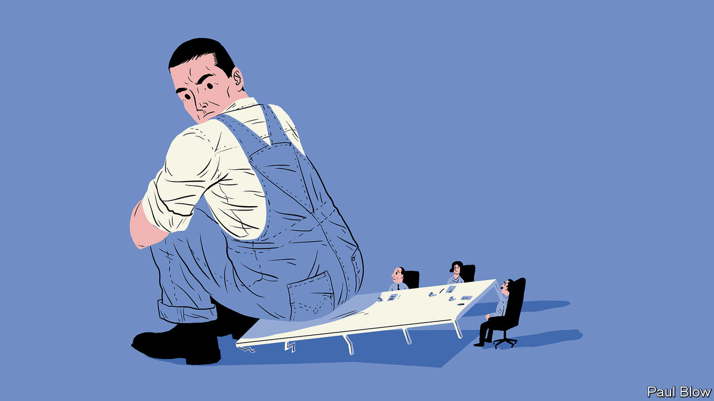
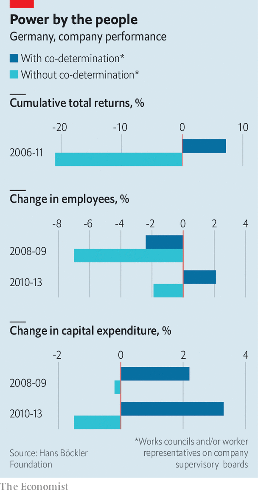

## Unseating an old idea

# Deutschland AG rethinks workers’ role in management

> As the idea of “co-determination” gains fans elsewhere, its birthplace is having second thoughts

> Feb 1st 2020BERLIN

ONE HUNDRED years ago, on January 13th 1920, thousands took to the streets of Berlin, waving red flags and chanting slogans demanding more power for workers as lawmakers in the Reichstag debated a bill on works councils. Placards called, in Gothic script, for volle Mitbestimmung. The “full co-determination” the protesters desired amounted to nothing short of an equal say for workers and bosses in company management. The security police killed 42 and injured more than 100 in the young Weimar Republic’s bloodiest episode to date. Friedrich Ebert, the president, declared a state of emergency.

In the past century German bosses, long opposed to the idea, have made their peace with it. Co-determination has become a defining feature of German capitalism. And an appealing one, across the West’s political spectrum. France’s centrist president, Emmanuel Macron, mutters about wanting more of it. Theresa May set up a commission to look into how it might work in Britain while she was the Conservative prime minister. Most volubly, Elizabeth Warren, a progressive senator from Massachusetts vying for the Democratic presidential nomination, has a bill that would, among other things, reserve 40% of board seats of companies with revenues over $1bn for workers’ representatives. Many Americans wouldn’t mind; Civis Analytics, a data firm, finds majorities of both Democratic and Republican voters in favour of allowing employees at big firms to elect representatives to the board of directors.

As other advanced economies toy with the notion, however, parts of Deutschland AG are asking whether it is fit for the times. To some captains of German industry, the answer is no longer a docile natürlich.

German co-determination comes in two varieties, enshrined in a law from 1976 passed after relations between labour and bosses soured in the wake of that decade’s oil crisis. Workers in any firm with more than five employees can by law form a works council that co-decides some issues, like working hours or maternity leave, with management and co-operates with trade unions in industry-wide collective bargaining. At firms with 500-2,000 employees, worker and union representatives get a third of seats on the supervisory board, which in Germany’s two-tier board structure oversees the management board. (In those with more than 2,000 workers employees can nominate half of supervisory-board members.)

These days only around 10% of firms with more than five employees have a works council, chiefly because nine in ten German companies have one to 20 employees, who can talk to the boss directly. But the biggest 28,000 firms still have one. In 2016, the latest year for which figures are available, 641 German firms had supervisory boards with equal worker representation, down from 767 in 2002.

Defenders of co-determination argue that it underpins many of German business’s virtues. Its globally admired apprenticeship system “would not exist without co-determination”, says Anke Hassel of the Hertie School of Governance; the works councils sustain it because they see it as an investment in the workforce and push companies to hire apprentices. More importantly, co-determination soothes industrial relations during downturns. In the dark days of the global financial crisis of 2007-09, when demand for German manufacturers’ products dried up, the system made it easier for the two sides to engineer a compromise: employees kept their jobs in exchange for agreeing to fewer hours (and so less pay) and thriftier holiday benefits. Productivity improved. When the recession ended in 2010 firms were immediately able to ramp up production.

A study published in October by the Hans Böckler Foundation, the trade unions’ think-tank, concluded that companies with labour representatives on supervisory boards did considerably better during the financial crisis and its aftermath than those without. They sacked fewer workers and reinvested more. Their cumulative total returns between 2006 and 2011 were also 28 percentage points higher. Co-determination, the reports’ authors conclude, “prevented short-sighted decisions by management”.

Armed with such numbers, and jolted by fears of what globalisation and digitisation might mean for German workers, unions are demanding more of it. Rainald Thannisch of the DGB, an umbrella group for German organised labour, wants equal representation for workers on supervisory boards at any firm employing more than 1,000 people (and one-third of the seats at firms with 250 employees). Legal loopholes that allow companies to avoid co-determination, such as being owned by a foundation, must be closed, Mr Thannisch says, and penalties for employers who prevent workers from forming a works council enforced more stringently.

Although they mostly accept co-determination’s peacemaker role in industrial relations, German bosses bridle at such proposals. Two-thirds of those who run firms with equal worker representation on the supervisory board see even the current version of co-determination as a handicap to doing business, according to the BDA, an employers’ association. Talk to chief executives and many gripe how works councils and bloated supervisory boards slow decision-making and add costs (since works-council members are paid for every hour they deliberate among themselves and with management). This, they add, discourages bold leadership and puts off foreign investors. It may tempt managers to buy labour’s support, as some of Volkswagen’s did in 2005 by creating a slush fund for the carmaker’s powerful works council to secure favourable votes in decisions on the firm’s restructuring (the executives responsible were prosecuted). Nor is it necessarily fair to all employees. One boss of a company in the DAX 30 index of Germany’s biggest listed firms notes wryly that co-determination ignores German multinationals’ foreign workers, whose interests may differ from domestic ones.

All this explains why companies that can avoid co-determination try to do so. Many in the Mittelstand, as Germany’s medium-sized export powerhouses are collectively known, convert into a Societas Europaea (SE), a public company registered under European Union corporate law that is exempt from co-determination rules, before reaching the 500-employee threshold for worker board membership. (Converters must keep co-determination if they had more than 500 workers before the conversion.) Some flee abroad, for example transforming themselves into a British plc.

Günzburger Steigtechnik, a maker of ladders in Bavaria, has more than 350 staff but no works council. Employees are involved in big decisions, insists Ferdinand Munk, the boss, whose family has owned and run it for four generations. The company pays attention to workers’ special needs—such as organising an employee’s shift around the care of his ailing wife—without badgering by a works council. A formal structure, Mr Munk thinks, would only slow things down. He says that co-determination is “actually counterproductive” in an age where speed and nimbleness are of the essence. Mario Ohoven, head of the Mittelstand association, calls it “out of date”.

Most employers concede that co-determination played a constructive role in the decades after the war. But times have changed. The world is overtaking German corporate giants. Only one, SAP, a software-maker, is among the world’s 100 biggest companies. Apple’s $1.4trn market value is roughly that of the entire DAX 30. Co-determination may not be the sole reason. European countries which do not embrace it hardly do better. But as cars go electric and manufacturing goes digital, German industry faces drastic restructuring—including of its biggest companies’ vast workforces. Bosses who agree with Mr Ohoven will be ever less timid to say so. ■

## URL

https://www.economist.com/business/2020/02/01/deutschland-ag-rethinks-workers-role-in-management
