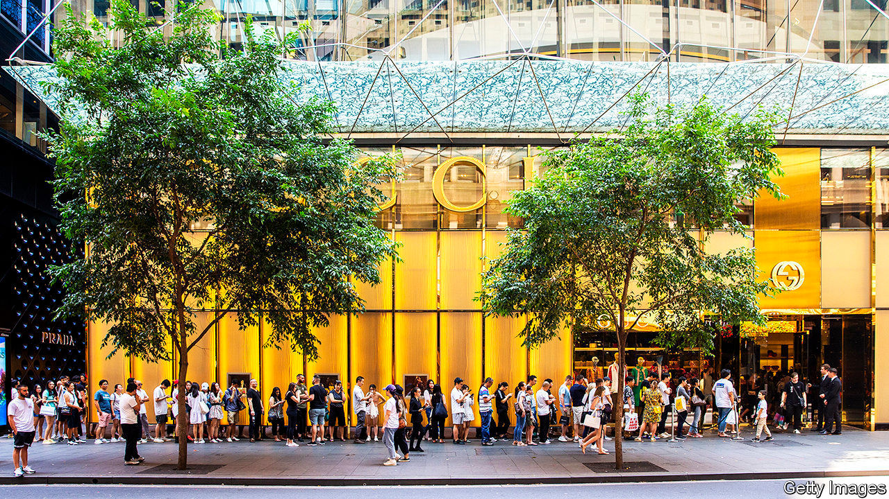

## Not for sale

# Luxury groups ponder ways to get rid of their unsold inventory

> Other than slashing prices

> Jan 30th 2020PARIS

EVERY FROCK sold by the likes of Gucci or Givenchy is billed as a must-have that season. But, it turns out, some are more must-have than others. For all the hype they generate, even leading fashion brands struggle to shift much more than half their wares at full price. Whom to sell to once fickle fashionistas have moved on to the next trend? The luxury world is desperately searching for new ways to find a worthy closet for this unwanted inventory.

Dealing with “end-of-season” merchandise is a particularly thorny problem for luxury brands. Offering discounts to offload ageing wares is a time-tested trick among retailers. But cutting prices to clear the shelves is a bad look for labels whose raison d’être is to exude exclusivity.

Chic brands used to bin last year’s garb quietly rather than sell them cheap. That changed after July 2018, when Burberry, a British purveyor of upscale macs, faced a furore as it disclosed having destroyed $38m of bling (it claimed incinerating them was a way of generating energy). France will ban the practice entirely by 2023.

Luxury groups are loth to reduce production, given that goods can be sold for ten times what they cost to make. But putting up “Sale!!!” signs is considered uncouth. Plus, says Luca Solca of Bernstein, a broker, “you have to weigh cash made from discounted sales with the damage done to the value of the brand.” Prada, a posh Italian label, said last year it would end all in-store discounts.

Some brands’ offerings are so timeless—a Hermès handbag, say—that seasonality is not an issue. Others manage to get rid of old stuff by offering discreet “sample sales” to staff and their friends. Many of the duds used to end up on the internet, sold cheaply on sites like Yoox and Saksoff5th.com (though labels now see more potential to sell online at full price).

None of this will be enough to get rid of an outmoded collection—or diminish the pile of unsold items that analysts expect as a result of the coronavirus, which will force Chinese travellers to cancel shopping trips. To really shift stocks, brands now look to outdoor malls that group together “factory outlets”. The likes of Bicester Village, an hour’s ride from central London, resemble what a Chinese tourist thinks a quaint European village ought to look like, crossed with an airport shopping concourse. The shops are full of the stuff famous brands could not sell at full price elsewhere. Goods typically sell for 70% of high-street prices.

The concept is booming. Out of an estimated €281bn in personal-luxury sales last year, €37bn were in such physical off-price stores, according to Bain, a consultancy. The figure has shot up by 85% in five years. But using the outlets for anything beyond liquidating inventory—for example by stocking them with cheaper, second-tier collections—is a way to dent a brand’s cachet permanently, warns Mr Solca. Best to keep only the most questionable styles and weirdest sizes in stock, and to push a brand’s real aficionados to Regent Street or Avenue Montaigne.

Two things may come to the rescue of exasperated inventory liquidators. The first is the rise of second-hand-clothes sales online: expect to see many “used” frocks on offer that are in fact brand new. The second is “up-cycling”, when an unsold dress gets trimmed, combined and dyed into a new fabulous outfit. For luxury brands, these two trends are unmissable.■