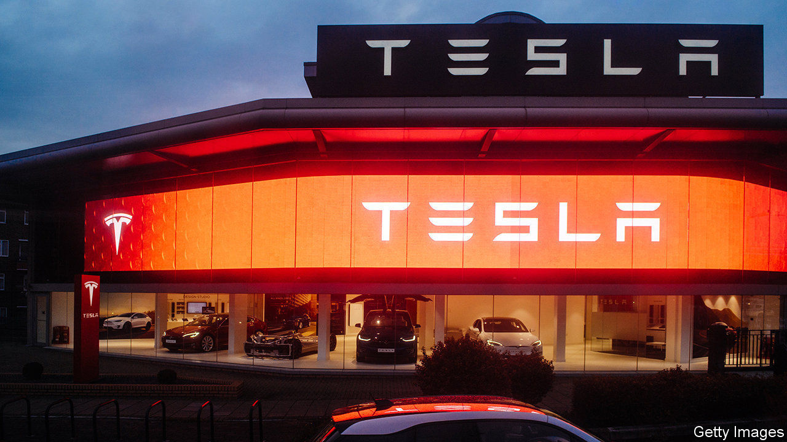
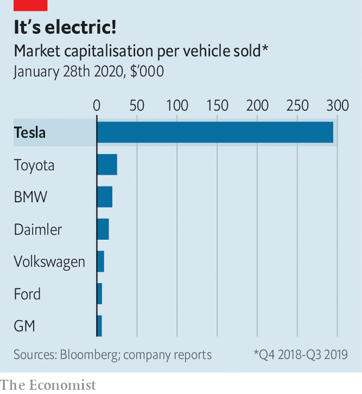

## Car stock racing

# Tesla is proving itself as a carmaker

> But is its tech-like valuation justified?

> Jan 30th 2020

IN ITS QUEST to “accelerate the world’s transition to sustainable energy” Tesla is different to other carmakers. Their mission is less to change the planet and more to make and sell as many cars as possible. Despite its technological lead in electric cars, Tesla has struggled with the mundane task of mass-producing vehicles. Of late, however, the firm has started to hit production targets. It is even turning a profit. That such milestones seem modest by car-industry standards has not stopped investors from swooning. Tesla’s market capitalisation surpassed $100bn in January and is now only exceeded by one other carmaker, Toyota, a Japanese giant. It is worth more than Germany’s Volkswagen, which made more than 10m cars last year, 30 times as many as Tesla. It has lapped premium rivals like BMW (with a market value of $47.5bn) and Daimler ($51.2bn).

The latest indication that Tesla is at last making an impression as a manufacturer came with its fourth-quarter results, unveiled on January 29th. After years of losses the firm made an operating profit—of $359m—for the second quarter in succession (though it still lost money for the year). Its boss, Elon Musk, was uncharacteristically restrained but noted revenues in 2019 of nearly $20bn without spending cash on advertising. Earlier in the month Tesla also revealed delivery numbers that pleased analysts and seemed to show that the firm has put behind it what Mr Musk had called “production hell” around the Model 3, its first mass-market car.

Profits and production are not the only reasons Tesla is joining the automotive mainstream. New products and plants are also on track. Its Cybertruck, an angular pick-up straight out of a 1980s sci-fi flick, which Mr Musk unveiled in November, is set to hit roads in 2021. This year Tesla will launch the Model Y, a smaller SUV, and the Roadster, a pricey sports car. It has just started making Model 3s at a new “Gigafactory” in China, showing that it could react far more swiftly than leaden-wheeled competitors; it got the plant in Shanghai up and running in 11 months. It is set to break ground on another in Germany.

If all goes to plan, reckons Morgan Stanley, a bank, Tesla will be making 2m vehicles a year by 2030 and its operating margin over the next decade will average 8.3%. That would put it close to the current output and profitability of both BMW and Daimler (at least before their margins began to be squeezed by heavy investment in electrification, both to catch up with Tesla and to meet European emissions rules).

But then why is Tesla worth twice as much? For one thing, its electric-car technology leaves rivals in the dust. It is also unencumbered by the legacy of a business based on internal combustion engines, which, reckons UBS, another bank, could make it the world’s most profitable carmaker. Jefferies, one more bank, points out that a stronger balance-sheet (should it in fact strengthen) would allow Tesla to start thinking beyond merely making cars. It speculates that the firm may confirm it is working on a project to develop a “million mile” battery, which will set a new standard for energy density and lifespan.

Its ambitious expansion nevertheless faces many challenges of the car industry: spiralling labour costs, warranty issues, cut-throat competition as rivals (including go-getting Chinese ones) close the technology gap. For the time being, Tesla may bask in a Big Tech valuation, predicated on its disruption of carmaking. Investors appear keener than ever to condone its joyride. But if recurring profits do not materialise, expect them to confiscate the keys. ■

## URL

https://www.economist.com/business/2020/01/30/tesla-is-proving-itself-as-a-carmaker
