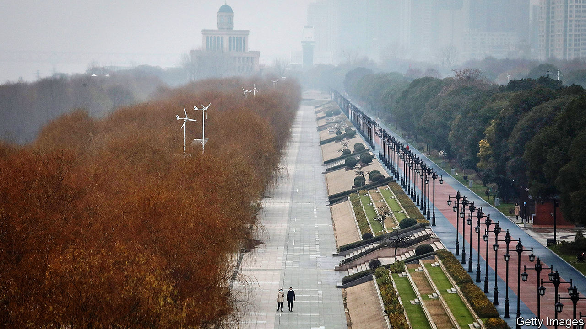
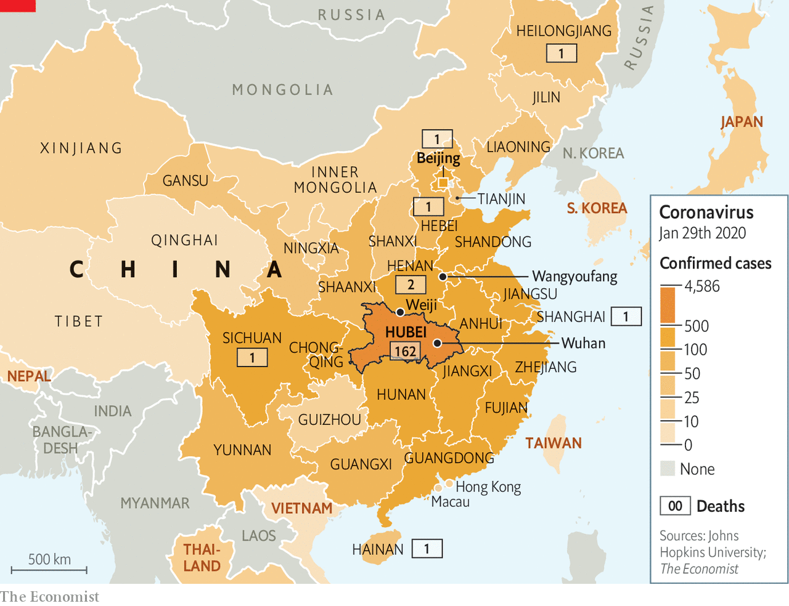
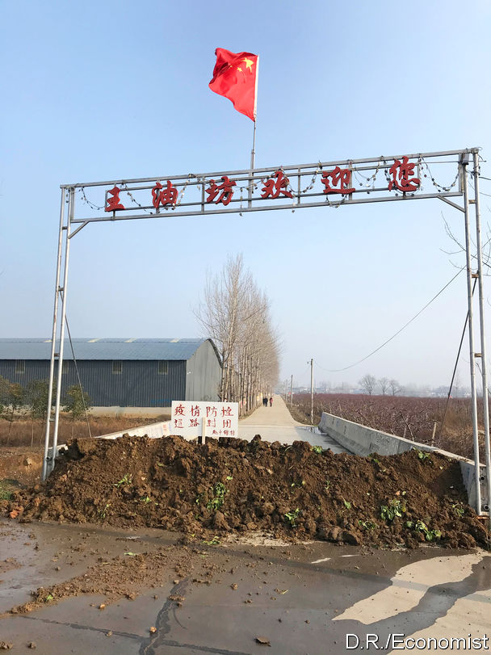

## Sealed off

# Tough quarantine measures have spread across China

> In Hubei province, a population the size of Italy’s is under lockdown

> Jan 30th 2020WEIJI VILLAGE, HENAN

WEIJI VILLAGE is a bleak spot in winter, even without the disease-control roadblock just up the road complete with medical staff in blue protective suits, using pistol-shaped electronic thermometers to check the foreheads of drivers and passengers for signs of fever. The village’s colour palette ranges from the grey of the sky to flat green fields of winter wheat and the brown of mud-filled potholes so deep that ordinary cars cannot pass. China is full of rural scenes like this one, in a forgotten corner of Henan province. Weiji’s only distinction is that it is a border village, a short walk from Hubei, an inland province of nearly 60m people (roughly the population of Italy) that has been all but sealed off from the outside world to slow the spread of a dangerous new coronavirus.

Chinese cities brim with migrant workers from villages like Weiji, hauling bricks on building sites or delivering fast food on electric mopeds. During China’s rapid growth of the past 40 years, such people have helped spread wealth to the countryside. They send money back to home villages with taps on a smartphone app—for China is way ahead of the West when it comes to mobile payments—and return in person for the lunar new year, laden with gifts of city-bought clothes and fancy foods. Not this year, however.

About 200 migrants from Weiji work in Hubei’s capital, Wuhan, the city where the virus was discovered (pictured, under lockdown). Because some returned to the village for the new year, which began on January 25th, Weiji was dragged into a vast quarantine operation that has trapped tens of millions of Chinese in their homes, grounded some international flights, halted long-distance bus services and closed the country’s largest tourist sites. The virus-control campaign explains a splash of colour on Weiji’s almost-empty main street, a red banner urging locals to be tested. It reads: “Find It Early! Treat It Early! Medical Fees All Free!”

That encouraging, cajoling sign is buttressed by a dose of coercion. The village’s fresh-faced Communist Party chief, who wears a smart black windbreaker, describes instructions from higher-ups. Cars with Hubei number plates are to be turned away, and migrants returning from that province sent back. Those who made it home to Weiji before controls were imposed on January 20th must submit to temperature checks twice a day and remain indoors in their family homes, with no visitors allowed. Foreign experts may debate the medical efficacy of mass quarantines, but locals describe a sense of comfort from doing something to fight what President Xi Jinping calls a “devil” virus.

A farmer and grandfather of two points to government notices fluttering on shuttered shop fronts. Officials have said that staying at home is “the biggest contribution one can make”, he explains. Unbidden, another local offers a patriotic commentary to the foreign reporter in his village. When the government tells the Chinese people to make sacrifices for the country, they listen, he booms. “It’s different from your Western countries.”

Many villages have shut themselves off from outsiders using barricades made of freshly-dug earth, lumps of concrete or, in one case, a parked tractor (an example outside the village of Wangyoufang, southern Henan, is pictured). At one such roadblock, old men in disposable face-masks sit at a wooden office desk, a pot of thermometers in front of them. The campaign is an odd mix of high and low technology. Henan police questioning this reporter were able to summon up his photograph and details by tapping his Chinese telephone number into a mobile device. But electronic thermometers gave very different readings in the space of a few seconds—an alarming flaw when even a hint of fever at a checkpoint can result in 14 days of quarantine.

The virus’s spread is straining a public health system that lags other Chinese infrastructure (under-staffed, ill-equipped hospitals sit next to gleaming high-speed railway stations). It is also a giant test for an authoritarian, one-party political system designed in a simpler China, when most workers toiled for the state or rural collectives, rarely moved around and relied on state and party news outlets to learn what was going on.

Today bullet trains criss-cross the country. Affluent urbanites use lunar new year to take foreign holidays. Even villagers in Weiji admit to reading criticisms of the government’s crisis response on such social-media platforms as Weibo or WeChat, though censors still race to delete any posts chiding Mr Xi and other national leaders. Posts rebuking lower-level authorities are being allowed more often than usual. When Hubei Daily, a party newspaper, warned readers to refrain from rumour-mongering, it triggered a sardonic backlash. “I can only trust the punctuation marks in Hubei Daily,” grumbled a commentator on Weibo. Police have punished actual rumour-spreaders, such as a man detained in south-eastern China for three days for (falsely) messaging friends about an infected stranger roaming his village. In contrast, eight “rumour-mongers” punished by Wuhan police, in a case announced on January 1st and covered prominently by state media, were in fact doctors sharing early tidings of a strange new virus in a medical WeChat group. In a rare intervention, the Supreme People’s Court posted an online article on January 28th lamenting the silencing of those doctors.

Schooled in the idea that they live in an all-knowing surveillance state, Chinese netizens have reacted with surprise as the virus campaign reveals the authorities’ blind spots. The websites of big state newspapers have published lists of more than 100 flights and trains taken by infected people, urging fellow-passengers to seek medical tests. How come the authorities cannot find passengers in a split second, asked a Weibo user, adding: “Aren’t we all 2020-big-data-high-tech now?”

China’s response to the virus has been unmistakably authoritarian, involving the locking down of Hubei’s cities, and mandatory orders to stay indoors for a fortnight for those who leave Hubei and head to such centres as Shanghai. But it is not totalitarian. Unlike in the Mao era, when blind loyalty was demanded from citizens, the party has at times responded to public anger with a hint of understanding. In a much-discussed state television interview, Wuhan’s mayor, Zhou Xianwang, offered to resign if the public wished. Still, his mea culpa contained an unsubtle jab at his masters in Beijing. Acknowledging that the city had held back information about the outbreak, Mr Zhou noted that he needed superiors’ permission to disclose news of an infectious disease.

The principle of quarantine is rarely challenged, even in Wuhan. Residents reached by telephone describe a mix of community spirit, such as bakeries offering free food to medics, a mass singing of the national anthem out of apartment windows as well as some grumbling about confusing and draconian local decisions. In a city of 9m people (the mayor says another 5m left, just before the quarantine was imposed, because of the holiday and the virus) taxis are now the only public transport. They can no longer be hailed on the streets, however, or summoned through an app. They have been commandeered by the city. Duties include “emergency runs” such as ferrying the sick to hospitals, says Wang Jie, a retired taxi driver. Rides are free. The city pays drivers 600 yuan ($86) a day, more than double what they make in normal times. Still, many fear being infected, says Ms Wang. Most have to buy their own protective masks, goggles and gloves.

Hundreds of expatriates left Wuhan on chartered airliners this week. Philippe Klein, a French doctor serving the city’s expatriate community (Wuhan is home to big French car factories), is staying put. Dr Klein, whose clinic is attached to the Union Hospital, describes exhausted local doctors being relieved by military medics, and by volunteer doctors from other provinces. The number of new patients seeking testing had been growing each day but has now stabilised, he says. Hospital bosses hope that the epidemic will peak in Wuhan around February 8th. If disease prevention began slowly, one reason was the cost of being tested, which put some locals off. Now the state will pay. It has built field hospitals to house those who test positive. “Overall, I am optimistic,” says Dr Klein.

Lu Xiaoyu, an academic who works in Australia but who flew back to Wuhan for the lunar new year, says morale is rising. Fine weather on January 28th brought residents out of their homes. Neighbourhood food shops have reopened, sparing people from stressful trips to large supermarkets. A lingering concern involves discrimination against Wuhan folk both inside and outside China. “We have turned into refugees,” he worries. Such concerns are well-founded. On January 27th several dozen people from Shanghai refused to board a plane in Japan when they realised that a small contingent from Wuhan was aboard. (Their accent gave them away.) The incident went viral on China’s social media. Many netizens backed the Shanghainese.

The virus has given new energy to localist sentiment within the protest movement in Hong Kong, where anti-mainland prejudice lurks alongside a yearning for greater political freedom. Bowing to public pressure, Hong Kong’s government is denying entry to Hubei residents and those recently in the province. That did not stop someone posting online bomb threats and demands to seal the mainland border, shortly after police found three small, home-made explosive devices.

Chinese leaders insist that one-party rule is vital for stability and progress. The world will judge, in due course, whether their brand of bossy, secretive authoritarianism helped to stop a pandemic, or let the coronavirus spread out of control. Already, the crisis is revealing a country which talks a lot about unity and is capable of great feats of national mobilisation, but which is easily divided and painfully low on trust. That is an ailment for which party bosses seem to have no cure. ■

## URL

https://www.economist.com/china/2020/01/30/tough-quarantine-measures-have-spread-across-china
