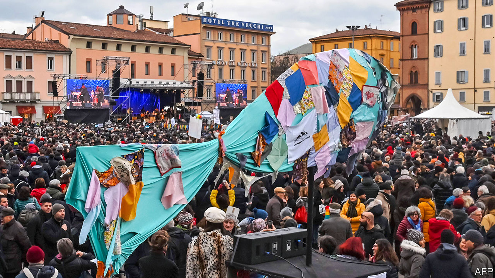

## Salvini’s Sardine surprise

# Regional elections in Italy buttress the government

> Another blunder by the populist leader of the Northern League

> Jan 30th 2020ROME

IT IS PROBABLY the most famous of modern Italian political aphorisms. “Power wears out those who do not have it,” quipped the late Giulio Andreotti, a long-serving prime minister. His words had a special relevance this week for Matteo Salvini, leader of the right-wing Northern League, as he pondered the results of his second big miscalculation in five months. On January 26th the League’s candidate for governor failed to conquer the region of Emilia-Romagna in a vote that Mr Salvini had touted as a referendum on whether he should lead Italy.

Mr Salvini has only been out of power since August last year. Until then he was one of two deputy prime ministers in the first cabinet of Giuseppe Conte, a technocrat; he wielded a decisive influence over policy as head of the party that has led in the polls since mid-2018. But then he torpedoed the coalition government in a bid to force an election, hoping it would give him an outright parliamentary majority and untrammelled powers. His rivals responded by forming a new coalition without him.

His latest big miscalculation was to put himself at the front of a campaign he should have known would be harder to win than it seemed. Emilia-Romagna, which stretches from central into northern Italy, has drifted rightwards in recent years. The left lost there in the general election in 2018 and the European election in 2019. But it has deep roots in a region the now-defunct Italian Communist Party (PCI) chose as a showcase for its moderate “Eurocommunism”. The incumbent governor, Stefano Bonaccini, who cut his political teeth in the PCI’s successor party, is widely regarded as heading an effective administration. A poll conducted last December showed that two-thirds of voters in Emilia-Romagna viewed it positively. And almost twice as many expressed confidence in Mr Bonaccini as in his League challenger. Mr Salvini’s advisers presumably warned him of similarly daunting findings.

Two other factors played a role in the League’s emphatic defeat (its candidate finished more than seven percentage points behind Mr Bonaccini). The first could not have been foreseen: the eruption onto the scene of a new movement, the so-called Sardines, a group of young, left-leaning activists who set out to best Mr Salvini at his own game of packing city squares (hence their name). They succeeded repeatedly, doubtless convincing some voters who might otherwise have abstained to cast their ballots for Mr Bonaccini and the centre-left Democratic Party (PD). The turnout shot up to 68%—30 points more than at the previous regional election in 2014. The Sardines’ role in bringing out the left-wing vote earned them an “immense thank you” from the PD’s national leader, Nicola Zingaretti.

The second factor, if not foreseeable, was certainly avoidable. In a region known for its moderation, Mr Salvini mounted his usual, xenophobic campaign. Stunts such as having video cameras record him asking a Tunisian immigrant over the intercom of his apartment block if he was a drug-peddler grabbed headlines, but not apparently very many hearts and minds in tolerant Emilia-Romagna.

In another regional ballot in the southern region of Calabria the right stormed to victory. But that was scant consolation for Mr Salvini, since the new governor is from Silvio Berlusconi’s Forza Italia party, which nowadays represents a less populist and Eurosceptic form of conservatism than the League’s. Calabria is anyhow special, a region in which political choices are heavily conditioned by the pervasive influence of its mafia, the ’Ndrangheta.

Mr Salvini’s air of invincibility dissipated last summer. But now his headstrong approach is being openly mocked. Elsa Fornero, a minister in Mario Monti’s technocratic government of 2011-13, and author of a labour-market reform Mr Salvini wanted to scrap, asked mischievously if he was foolish, or just pretending to be.

The League leader’s chances of returning to power nevertheless remain solid. Both the latest elections were disastrous for the Five Star Movement (M5S), notionally the senior partner in Mr Conte’s second government, which also includes the PD. The M5S has almost a third of the seats in parliament and the power to decide on legislation. Yet its candidates scraped 7% in Calabria and a pitiful 3% in Emilia-Romagna. They were scarcely helped by the resignation four days before polling of the movement’s leader, Luigi Di Maio, largely in response to its dismal showing in earlier ballots and the disarray that had created.

The M5s was set up to challenge the established parties, resists being called a party itself and claims to transcend the division between right and left. Inevitably, it has found itself ill at ease in power, and all the more so now it is in coalition with the mainstream PD. Since the general election in March 2018, 24 of the M5S’s 331 lawmakers have deserted it in parliament.

What happens now is unclear. Mr Zingaretti proposed that the Five Stars formally join the PD in an electoral alliance that already includes other, smaller groups. But his offer was implicitly rejected by the M5S’s stopgap leader, Vito Crimi. The movement is to hold a congress in March to decide whether to take a new direction.

That sets a leisurely timetable given the pace at which the M5S is disintegrating. The governing coalition is safe in the lower house where it has a majority of 24. But in the Senate, the Five Star defections have already left it two seats short of a majority and dependent on the support of assorted regionalists and independents.

The PD is more compact. But that is largely because it has lost almost 40 of its parliamentarians to Italia Viva, a group set up last year by a former prime minister, Matteo Renzi. Italia Viva is not yet a party and remains in the government’s orbit. But Mr Renzi, who has been wooing the more moderate wing of Forza Italia, remains a wild card. Against this background, Mr Salvini’s best course may be to sit tight and do only as much as necessary. But it is one the League’s hyperactive, publicity-hungry leader will find hard to follow. ■