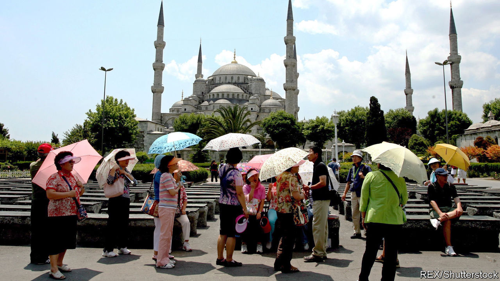

## Asia minor, and major

# Why Chinese road signs cause outrage in Istanbul

> Turks resent China’s oppression of Muslim Uighurs

> Jan 30th 2020ISTANBUL

A  FEW MONTHS ago commuters in Istanbul were treated to an unusual sight. Overnight, the names of some metro and tram stops, especially in parts of the city popular among foreign tourists, appeared in Chinese characters. Angry about China’s treatment of Turkic-speaking Uighurs in Xinjiang province, protesters ripped down some of the signs. They covered others with stickers reading: “Murderer China” or “Freedom for East Turkestan” (the name for Xinjiang preferred by Uighur separatists).

Ekrem Imamoglu, the opposition mayor, explained that the signs had been installed as part of an agreement between Istanbul and China’s embassy, and that the arrangement was temporary. The signs vanished as fast as they had appeared.

China’s footprint in Turkey is growing. The annual influx of Chinese tourists has climbed from about 60,000 a decade ago to over 400,000 last year. China has helped build Turkey’s first stretch of high-speed rail, Huawei is helping it build a 5G mobile network and Chinese investors have snapped up Turkish marble quarries to kit out luxury flats back home. Last year China’s central bank provided Turkey with $1bn under a currency-swap agreement. Rumours swirl that Chinese cash will soon pour into the country under the Belt and Road Initiative, a project to connect the world to China by building roads, railways and other infrastructure. So far, it hasn’t.

The oppression of the Uighurs seems to be the main obstacle. Last year Turkey was the only large Muslim country to complain about China locking up perhaps 1m of them for such offences as growing beards or being pious Muslims. In response, China temporarily closed its consulate in Izmir, a big coastal city. Turkey had crossed one of the Chinese government’s red lines, says Guo Changgang of the Centre for Turkish Studies at Shanghai University. Since then Turkey has trodden more carefully. Last June, after opposition deputies called for an inquiry into the repression of Uighurs, The ruling party voted down the proposal. During a subsequent trip to China President Recep Tayyip Erdogan took a softer line on the internment camps.

China will not stay away from Turkey for long. It is a market of 80m people and a gateway to Europe and the Middle East. Some day, Chinese contractors eager to join the reconstruction of war-ravaged Syria will also look to Turkish ports and cement producers for help. “Turkey has the resources and the suppliers,” says Altay Atli of Koc University in Istanbul. “The Chinese simply have to come here.”

Turkey has struggled to attract foreign investment in the past few years, largely as a result of tensions with America and Europe, over such things as its friendliness to Russia, the purchase of Russian missiles and human rights. Some in government advocate cosying up to China as well as Russia. But China is unlikely to bail out Turkey’s economy. Of the total stock of foreign investment in Turkey between 2002 and 2018, some 75% came from Europe; the Chinese share was around 1%.

At his newly opened Beijing Hotel, close to Istanbul’s main entertainment and shopping district, Jackie Cheng watches a group of Chinese guests trickle out of the main entrance, past a restaurant that serves respectable Chinese fare, and into a tour bus. Mr Cheng arrived in Turkey two decades ago, made his fortune dealing in textiles and souvenirs, and opened Istanbul’s first Chinese hotel last year. Business has been good, he says. He plans to open branches elsewhere in Turkey. Asked what might help bring in more tourists and investors from the old country, he mentions government support and simpler procedures for getting a residence permit. “But one thing that’s really needed right now”, he says, “are more signs in Chinese.” ■