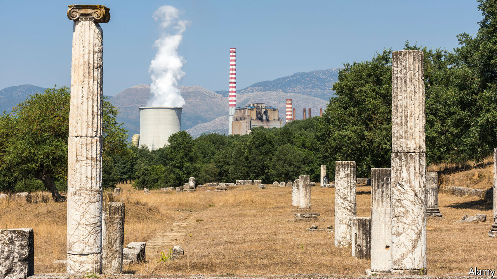

## Cleaning up Greece

# Why many Greek greens oppose wind power

> Windmills spoil the view

> Feb 1st 2020KOZANI AND KARDITSA

A  CLUSTER OF state-owned power plants in north-western Greece have been spewing smoke and toxic ash over nearby villages for decades. The plants are fuelled by lignite, a dirty brown coal extracted from open-pit mines that scar the local countryside. Studies have shown that mining communities suffer above-average rates of lung disease and cancer, yet jobs in other sectors are scarce in a region with chronically high unemployment.

Changes may be on the way. Kyriakos Mitsotakis, the new centre-right prime minister, has promised to shut down all of Greece’s 14 lignite-fired power stations by 2024. (Another lignite station currently under construction will be converted to run on natural gas.) Fleets of wind turbines and solar panels will be rolled out across rehabilitated mining areas. Mr Mitsotakis is anxious to boost Greece’s green credentials: at present its annual carbon-equivalent emissions are a third higher than those of Portugal, a similar-sized EU member state.

Despite being blessed by abundant sunshine and strong winds that blow year-round across the Aegean sea, Greece is still a clean-energy laggard. That is mostly due to PPC, the state electricity utility, which has stuck to lignite to save money, rather than switching to natural gas and renewables. In 2017 some 70% of homes and businesses consumed electricity that was produced at PPC’s lignite-fired power stations. This year the figure may fall to 50%: small private suppliers that run natural-gas-fired plants have picked up customers fleeing PPC after Mr Mitsotakis’s government hiked its electricity prices.

The prime minister has set himself a remarkably ambitious target: renewable sources are to cover 35% of Greece’s energy needs by 2030. That would mean tripling current wind and solar output, at a cost of around €40bn ($44bn). Consultants predict a bonanza for foreign investors: Chinese, American, Spanish and Italian companies already own Greek wind and solar installations and are acquiring licences to build more.

Oddly, they will face strong opposition from Greece’s increasingly active environmental movement. It takes up to seven years for a licence for a wind park to be granted; many applications are rejected by specialist judges at the council of state, Greece’s highest legal body.

Battles loom over plans to allow offshore wind parks to be built in the Aegean and Ionian seas, while increasing the size of onshore parks. Greece’s environment is “too fragile” to sustain such big projects, says Apostolos Pantelis, a hill-walker campaigning against plans to build wind parks on mountain ridges in the remote Agrafa region, a refuge for rare griffon vultures, brown bears and wolves.

Increasing numbers of hikers, mostly well-heeled northern Europeans, visit places like the Agrafa thanks to a successful new system of marking footpaths across mainland Greece and the islands. They stay in small hotels in almost deserted villages, prompting hopes that such places can be revived as destinations for “soft” tourism.

Mr Pantelis fears building wind parks would destroy the Agafra’s appeal. New roads would erode the mountainsides and noisy, 200m-high turbines would scare away its wildlife. He says that “people used to think wind energy would be beneficial for tourism. But it just ruins the view.” ■

## URL

https://www.economist.com/europe/2020/02/01/why-many-greek-greens-oppose-wind-power
