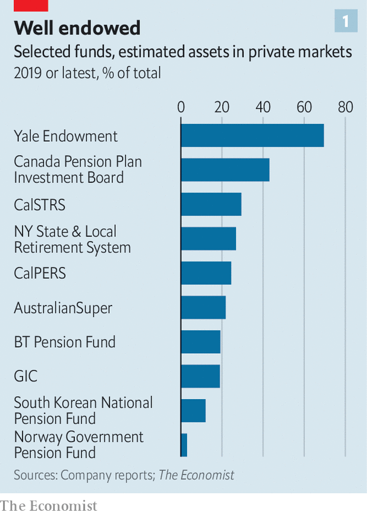
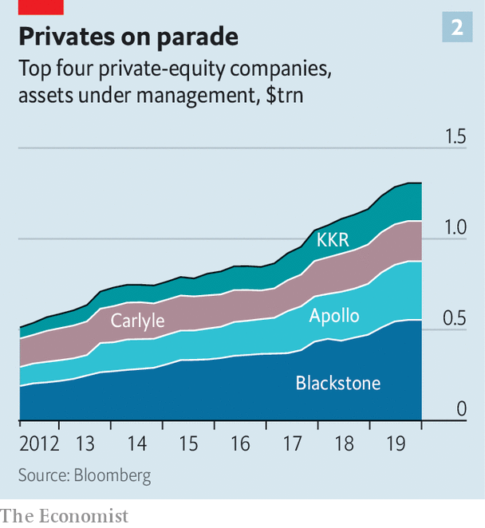
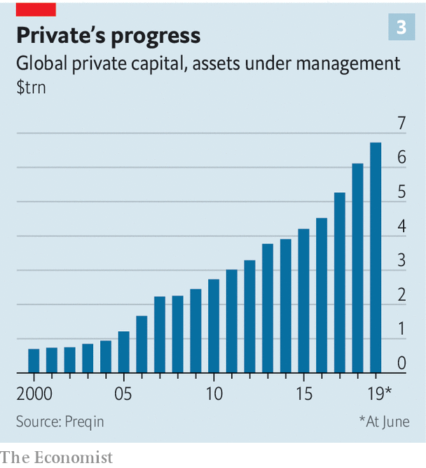

## Privacy and its limits

# Everyone now believes that private markets are better than public ones

> But when an idea is universally held it often pays to be cautious

> Jan 30th 2020

THERE WAS a time when a sure way to establish a reputation as a campus sage was to bang on about the “dialectic”, or the action of opposing historical forces. Sooner or later somebody will apply the term to asset management. The industry is not short of would-be sages. And it has historical forces of its own to contend with. Over the past decade there has been a dramatic shift towards “passive” funds. They track publicly listed stocks or bonds that are liquid—that is, easy to buy or sell. The most popular funds are huge, run by computers, widely held and have low fees.

This passive boom has spawned its antithesis—niche, run by humans, secretive, thinly traded and high-fee. Institutional investors are rushing headlong into private markets, especially into venture capital, private equity and private debt. The signs are everywhere. A large and growing share of assets allocated by big pension funds, endowments and sovereign-wealth funds is going into private markets—for a panel of ten of the world’s largest funds examined by The Economist, the median share has reached 23% (see chart 1).

Worldwide, pools of private capital, including private equity and private debt, as well as unlisted real-estate and hedge-fund assets, grew by 44% in the five years to the end of 2019, according to JPMorgan Chase. A different way to capture the scale of the private party is to look at the quartet of Wall Street firms that specialise in managing private investments for clients—Apollo, Blackstone, Carlyle and KKR. Their total managed assets have risen by 76% in the past five years, to $1.3trn. They have long specialised in buy-outs and property. More recently they have grown in private-debt markets, too—in total their funds’ credit holdings have hit $470bn.

Venture capital (VC), another part of the private universe, is feverish. SoftBank’s Vision Fund, a $100bn private-capital vehicle backed by Saudi Arabia’s sovereign-wealth fund, has funnelled cash into fashionable, unlisted startups. Other institutions have vied with it to write big cheques for Silicon Valley’s brightest new stars. Already some of these bets have gone awry. WeWork, an office-sharing deity-turned-dud, had to cancel an initial public offering (IPO) in 2019 after public-market investors balked at its valuation. This week Casper, a loss-making firm that sells mattresses on the web, announced that the value it is seeking at IPO is below its $1.1bn valuation at its previous funding round.

The flood of capital into private markets ultimately rests on the belief that they will outperform public ones. There is evidence for this—in the past the best-run private-capital managers have beaten the returns from public markets, even after generous fees. And there are grounds to believe that this was no statistical fluke. Private capital, say its boosters, reduces “agency costs”. These arise wherever somebody (the principal) delegates a task to somebody else (the agent) and their interests conflict. Consider the public markets—no one has a big enough stake to make it worthwhile to monitor firms, which as a result get complacent or indulge in short-term earnings management to the detriment of the long term. Private capital, which is closely held in a few hands, is supposed to get around such agency problems.

Yet every investment craze is liable to overreach, blindness to risk and misallocated capital. Recent converts to the private world, dazzled by the historical returns, may not fully appreciate the hazards. The capital washing into San Francisco’s venture-capital industry has bloated both the value of pre-IPO companies and the egos of founder-managers. The big concern is that a shift from public to private capital merely swaps one set of agency conflicts (shareholders v company managers) for another (shareholders v private-asset managers).

Private capital was once a fringe interest. So what changed? The growth in passive investing has made public markets less comfortable for midsized companies. They are not big or liquid enough to be in baskets of leading stocks, such as the S&P 500 or the FTSE 100, that are tracked by giant low-cost index funds. A generation ago a promising startup would typically go for an IPO within four years. Now the remaining active investors in public markets are less willing to take a punt on small firms.

Regulation has played a role, too. Legislation in the mid-1990s made it easier to set up large pools of private capital in America. Meanwhile the costs and hassle of being a public company have grown. After the financial crisis of 2007-09 new rules made it costlier for banks to lend. Even before that, America’s biggest banks preferred to lend to consumers and blue-chip firms than to midsized firms. There was a gap in corporate credit that needed to be filled.

There has also been an intellectual revolution among investors, led by the endowments of large American universities, which in the 1980s began to devote a growing share of their funds to private assets. David Swensen, at Yale, was at the forefront of this approach. The idea was straightforward. Because life-insurance funds, university endowments and sovereign-wealth funds have obligations far into the future, they can take a long-term view. They can sacrifice the liquidity of public markets for the better returns promised in private markets—where data are hard to come by; where assets are complex and value is hard to appraise; and where finding the right opportunities takes patience.

Few investors admit it, but there are other, sly benefits to private-equity funds. They can pile on more leverage in order to boost returns. Some pension schemes and insurers are forced to sell public shares at the wrong time, when markets tank, either to comply with solvency rules or because trustees panic. That is not possible when your money is locked up in private funds with lifespans of a decade.

Since the 1990s a growing band of investors have followed the Swensen formula and moved into private markets in order to capture higher returns. Measuring those can be tricky. How public companies fare is no mystery—just check the market prices. But stakes in private-capital partnerships are not traded continuously. Data are hard to collect. Funds do not begin or end at set times; they have “vintages”. Investors only really know how they have fared once a fund is liquidated. Until then managers have a lot of discretion over how assets are valued. They are notoriously prone to using metrics that flatter performance. One trick is to borrow against equity yet to be called in the early stages of a buy-out. Another is to claim to be a top performer by picking your best vintage.

Nonetheless the academic literature has concluded that private equity is not all smoke and mirrors. A landmark study in 2005 by Steven Kaplan of the University of Chicago and Antoinette Schoar of MIT introduced a metric called PME (public-market equivalent) to gauge the merits of private capital. A recent comprehensive study based on this technique—by Mr Kaplan together with Robert Harris, of the University of Virginia, and Tim Jenkinson of Oxford’s Saïd Business School—finds that venture and buy-out funds on average did better than the S&P 500 index by around 3% a year after fees. The spread around that average is considerable. Investors in the top quartile enjoyed returns that were far higher than in public equity; investors in bottom-quartile funds did a lot worse.

Better returns for investors reflect in large part better operating performance by the firms that most funds invest in. In the main, the academic literature finds that private-equity and venture-capital funds add value to the firms they own. They raise efficiency, revenue growth and profitability. The firms have better management habits than entrepreneur- or family-owned firms. Buy-outs lead to modest net job losses but big increases in both job creation and destruction. They spur greater efficiency by speeding up exit from low-productivity “sunset” firms and entry into more productive “sunrise” firms. VC backing spurs more innovation, patents and speedier product launches.

A fledgling business requires lots of attention. Patience and freedom to act are obvious virtues in venture capital. “A startup is like a sailing boat; it needs to tack quickly,” says Roelof Botha of Sequoia Capital, a VC firm. “It is better suited to the private markets.” In contrast, “a mature company is like an oil tanker and is better suited to the public markets.” Mature firms, though, sometimes need to quickly change direction too. That is hard to do in the unforgiving glare of the public markets. Anything that upsets the predictability of short-term profits is likely to frighten shareholders. Private equity can be more patient, because it has control. “We worry about the quarter-by-quarter performance only if it is symptomatic of a long-term problem,” says Joe Baratta of Blackstone.

The boss of a rival firm puts it bluntly. In private equity there is something called the 100-day plan. It sets short-term priorities (“quick wins”) for a newly acquired firm, identifies ways to raise cash quickly (to pay down the debts raised to acquire the firm) and plots the longer-term strategy. Imagine a CEO of a public company laying out such a plan on a conference call to analysts: “We’re investing in a brand-new IT system; we are putting up for sale the parts of the business we believe are not vital to our company; and we have hired some management consultants to carry out a strategic review of the other parts.” The response to this would be a run on the stock, he says.

The liberal use of debt juices up headline returns but it also helps tame the agency costs that dog public equity. A hefty interest payment each quarter is a spur to executives to cut costs and raise revenue. The bosses hired by private-equity firms to run companies are made to feel such pressures keenly. These managers are of relatively modest means, but they are required to co-invest in their firm’s equity. By stacking the firm’s capital structure with debt, a smallish investment from managers can be turned into a big slug of the total equity. Their stake is at risk should the firm falter.

Just as private firms are run better, say boosters, so private-debt markets operate in a way that is superior to public ones. In the 1980s buy-outs were financed by junk bonds. But the fuel for many private-equity deals today is leveraged loans, packaged by banks and sold to investors, and a kind of public-private hybrid. A broadly syndicated leveraged loan might have 75-100 buyers and be traded as much as a listed bond. A purely private bond might be sold to a handful of lenders or even just one. Speed is part of the appeal. If a private-equity firm can line up private-debt finance quickly it can steal a march on its rivals. Private-credit funds often prefer to be the sole debt-financiers of a deal, if they like the terms and judge the company a good risk. Should the loan sour it is easier to cut a deal that limits your losses when you are the only creditor. Once again, control—agency—is prized.

The private-investment boom shows little sign of stopping. Low interest rates mean that a global hunt is on for higher returns. The boss of a big American state-pension scheme says he wants to allocate more to private investments in order to try to plug the pension scheme’s gaping funding deficit. Like many sovereign-wealth funds, South Korea’s National Pension Service has a target to raise its allocation to alternative investments, to 15% from 12% in 2018.

Yet anyone running a big investment organisation should worry about three things. First, as even more capital floods into private markets, returns will inevitably suffer. In their big study Mr Kaplan and his colleagues find that while buy-outs’ returns beat the S&P 500 in nearly all vintages before 2006, they have more or less matched public-equity returns since. Private-equity funds used to buy businesses that were much cheaper than listed firms. But the big beasts of private equity are becoming ever bigger. They have large fixed costs to cover: to meet those, there will be pressure to do deals that would not have passed muster in the past.

This pressure is already visible in venture capital. Very few new firms are world-beating. Lots of capital has gone to startups that are variations on established themes: enterprise computing; platforms that bring providers of services (taxis, lodgings, office space) and consumers together; and retail sales via the internet. As more and more capital seeks a piece of the action, the valuations of firms are inflated. “You have a lot of zero-sum expenditure,” says a Silicon Valley bigwig. “Think of all those subsidised taxi journeys from Uber and Lyft.”

A second concern is liquidity. In principle, there are rewards for tying up money for five to ten years. It affords time for Silicon Valley to turn fledglings into global firms and for private-equity firms to transform sluggish businesses into world-beaters. But even long-horizon investors have ongoing demands on their cash, for example paying the beneficiaries of a pension scheme, meeting commitments to put fresh cash into buy-outs, or (for universities) paying for research grants and bursaries. It is a headache for investors to manage their liquidity needs when a large chunk of their assets are private and illiquid. Payment flows are unpredictable. And capital calls often come at the worst time: during recessions. It is only then that a lot of investors discover that they are less patient than they had believed themselves to be when liquidity was plentiful. Illiquid assets cannot easily be sold to take advantage of low prices in public markets, for instance during crises, when other investors are forced to sell.

The final concern is agency costs. Private capital may be a solution to the age-old agency problem between shareholders and company bosses. But it also creates another one between institutions (the limited partners) and the private-asset managers (the general partners) to whom they supply capital. Fees are high. And private-capital managers enjoy a great deal of discretion over how they value their assets and the timing of buying and selling decisions. Just as there are costs of monitoring the management of public firms there is a cost to monitoring your private-capital manager.

In some regards, private shareholders can be more lax. The 1980s buy-out boom was powered by a backlash against the imperial CEO, who was more interested in empire-building than profits. An irony is that the clubby nature of the venture-capital industry seems to have fostered a new kind of imperial founder-manager—whose behaviour is brattish, and who takes investors for granted, or even for a ride. The managers of VC firms “don’t want to piss the CEO off, because they can’t be badmouthed in startup circles,” says a Silicon Valley figure. So “you end up with a list of enablers at board level.” Agency costs are still alive and kicking.

What will people make of today’s rush into private markets in a few years’ time? Perhaps it will prove itself a truly superior form of asset ownership. But it might also be revealed as a creature of sluggish growth and rock-bottom interest rates. A near-zero cost of risk-free capital allows for venture-capital-backed business models that are loss-making but have lots of potential to grow. Private equity, meanwhile, has thrived in an era of ever-lower borrowing costs, ever-higher asset values and low productivity growth. It is well suited to squeezing more juice from the corporate lemon. An era of rising interest rates and faster growth would surely be a harder test for private markets, as would a recession. But neither examination may have to be faced soon—or, at least, that is what a queasily large number of investors are banking on with ever more abandon.■