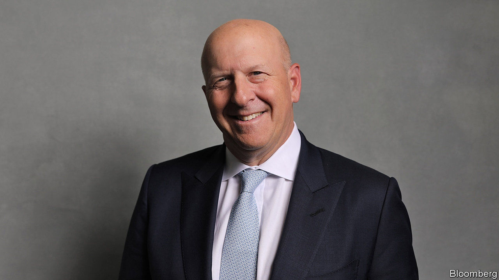

## Turntable

# Goldman Sachs bets the firm on a new identity

> It wants to be more like its stodgier peers

> Jan 30th 2020NEW YORK

DAVID SOLOMON, the boss of Goldman Sachs, plans to spin discs at a party for the Super Bowl. Ahead of that performance DJ D-Sol took centre stage at the bank’s headquarters in Manhattan on January 29th. This was a new gig: he was laying out a fresh vision for Goldman at its first-ever investor day. Until recently its bosses did not deign to join earnings calls, set financial targets or host investor days. But a decade of malaise has made that imperious attitude untenable.

The mythology of Wall Street is built around the old Goldman playbook: mammoth deals, big bets and contrarian calls. But in post-crisis finance, glamour is out and stability is in. Services such as wealth management and retail and commercial banking used to weigh down the high-octane returns that investment banking churned out. Today, bank bosses see these businesses as steadying ballast. They smooth out profits and, by attracting low-cost funding, make investment banking more competitive. Goldman was slow to catch on; but now it wants to be more like its stodgier peers.

An investor who bought shares in Goldman in 2010 has had a disappointing decade. Back then its return on equity (ROE) was 11%, easily beating the 8% average for “bulge-bracket” American investment banks, a group including JPMorgan Chase and Morgan Stanley. By 2019 the average ROE was 9.7%, and Goldman’s was 9.2%. The share price has lagged both the stockmarket and other big banks (see chart).

Goldman hopes to catch up by focusing on two goals. The first is to expand market share in services such as wealth management and to offer easy access to “alternative” investments in private equity, private debt and real estate. The second is to make the existing business more efficient. The bank’s chief financial officer, Stephen Scherr, sketched out how prosaic functions, like transaction banking—processing payments and managing cash for corporate clients—and running a digital consumer bank, could reduce funding costs because they attract deposits.

The bank has already taken steps to diversify. It launched Marcus, a digital consumer-lending and deposit-taking arm, in 2016. In 2018 it acquired Clarity Money, a personal-finance app, in order to broaden its retail offering. Last year it expanded its wealth-management services by acquiring United Capital, an advisory platform for wealthy (but not uber-rich) investors. The bank is consolidating all of its “alternative” investments into one client-facing arm.

Alongside Goldman’s goals come concrete targets. It wants to amass inflows of $100bn into alternatives in the next five years. It also hopes to collect $50bn in deposits in its transaction-banking business, a service that has not yet launched and of which Goldman itself is the first client. And it wants to increase the deposits in Marcus from $60bn to $125bn. The more wholesale funding is replaced by deposits, the more funding costs fall. All these businesses have become critical for banks wanting to be competitive in trading securities, including bonds and currencies. New regulations penalise trading desks that engage in complex activity.

Goldman also wants to be leaner by cutting $1.3bn of annual costs. JPMorgan and Bank of America have “efficiency ratios”—which measure the expenses associated with generating revenues—in the region of 55-60%. Last year Goldman’s was 68%. Diversifying and cost-cutting could push the ratio below 60%, says Steven Chubak of Wolfe Research, an equity-research firm.

Several hurdles complicate Goldman’s transition to a new business model. For all the talk of diversification, half of Goldman’s capital is locked up in its trading businesses, which earned a paltry 7% ROE in 2019. The adaptation of this business to the new regulatory regime has not so far been smooth. Goldman built an enormously clever and complex model to allocate capital requirements on a per-trade basis. But its rigidity meant the bank missed consistent business from regular clients, which is profitable overall.

The firm also awaits penalties for issuing $6.5bn-worth of bonds for 1MDB, a Malaysian investment vehicle from which $4.5bn vanished. The scandal has tarnished Goldman’s reputation; the fine, expected to be in the region of $2bn, will weigh on its profits.

All this will require managing cultural change. Half of the newest crop of analysts are women, and two-thirds from ethnic minorities—a shift from Goldman’s usual demographic. In September the Wall Street Journal reported tensions between the old guard and the new, with an eyebrow-raising 15% of partners expected to leave in 2019 (though Goldman says the attrition is normal). The challenge is to respond to the pressures that threaten Goldman’s profitability without spoiling the secret sauce that made it so successful. ■