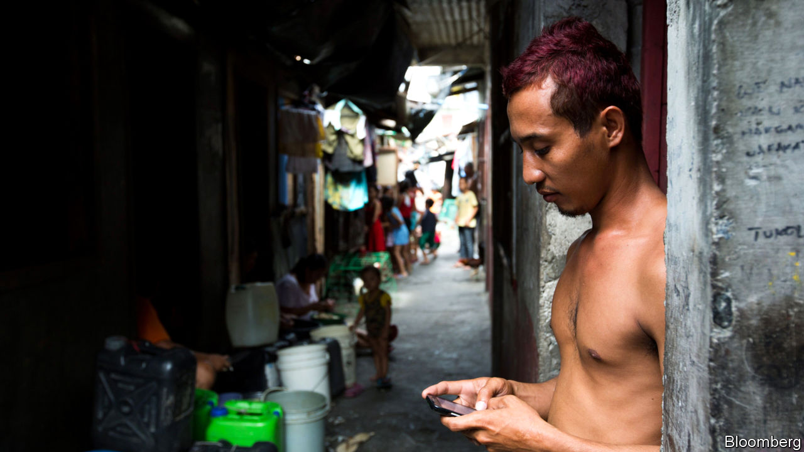

## Poverty and privacy

# How digital financial services can prey upon the poor

> Their data can be used to exploit as well as help them

> Jan 30th 2020

FOR THOSE seeking to help the worst-off in poor countries, the mobile phone has been a magic wand. Mobile-money accounts have helped deliver “financial inclusion”—making financial services accessible to the tens of millions with a phone but no bank account. But they have downsides too.

The most obvious way digital financial services harm poor people is by laying them more open to fraud. Research from 2016 cited in a new report by the Consultative Group to Assist the Poor (CGAP), a consortium of donors affiliated to the World Bank, found that in the Philippines 83% of people surveyed had been targets of mobile-phone scams, with 17% losing money. In Tanzania, 27% had been targeted and 17% fleeced; in Ghana, 56% and 12%.

For the most basic deceptions, a thief needs only a phone number. A text message might offer congratulations on winning a prize, requiring only a small contribution to unlock it. Your identity might be stolen to make you responsible for repaying a loan disbursed to somebody else. An impersonator might steal your mobile-money account when registering a new SIM card. Or your account’s security code—the PIN—might be leaked by a mobile-money agent (one of the millions of small traders whose business includes turning mobile money into hard cash).

The poor may be especially susceptible to such scams. They are more likely to be relatively new both to the online world and to formal financial services. And they are less likely to have smartphones with sophisticated security software.

It is not just money that can be stolen. So too can all the other data stored on a phone. Often, however, much has already been given away freely by its owners. Many “free” apps are in fact paid for in customer data. In every country people gaily sign away their rights to privacy by clicking consent buttons without having understood or even read what they are agreeing to.

Indeed, in financial services the implicit sale of personal data is seen as a way in which the poor can be “levelled up”. With low, unreliable incomes and few assets, they have been unable to borrow formally. Now lenders are learning to rely on other data to make credit judgments, notably payment records, such as from a mobile-money account, which can show a history of reliability.

But such data can also be abused. Predatory lenders and vendors might learn when a costly loan or product would be hard to refuse. Or an algorithm might (by design or accident) be biased against certain borrowers because, say, of their race or creed.

CGAP makes three policy recommendations. The first is to accept that the “consumer-consent” model is irretrievably broken, and to put the onus for looking after the data on the service-provider. The second is to give consumers full legal rights over their data, allowing them to view, correct and move them without charge. The third is to appoint “privacy representatives”, who, among other tasks, would check algorithms for signs of bias.

Many countries, from America to India, are looking at improving data-protection regulation. But CGAP’s suggestions seem very ambitious. “Free” financial services, such as those offered already by the Chinese giants, Ant Financial and WeChat, have an obvious appeal.

It is often assumed that the poor are relaxed about surrendering some privacy in return for access to borrowing and other services. In fact, concern about privacy is not a preserve of the rich. Research in India and Kenya has shown that even very poor borrowers would be willing to pay a higher interest rate—or join a much slower queue—for a loan that came with more guarantees that the data provided to the lender would be kept private. Persuading the tech giants that improved data security for the poor is in their business interests might be the best hope. But that will take a lot more work. ■