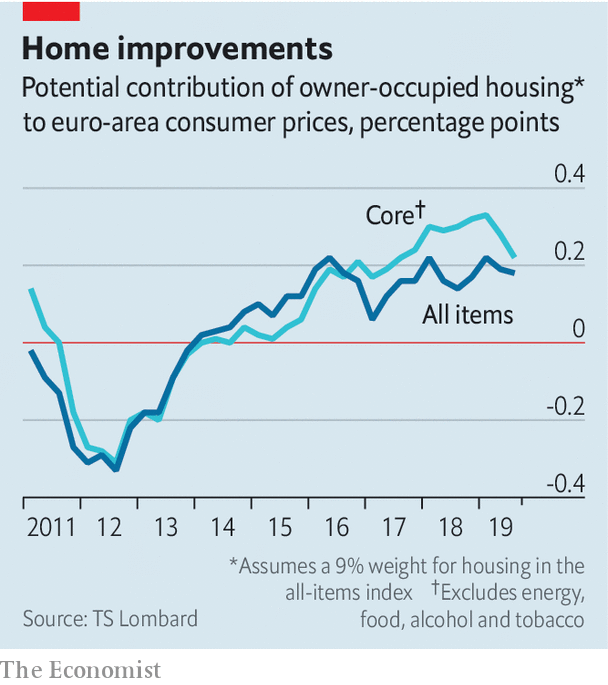

## A fuller figure

# The ECB considers counting owner-occupied housing in inflation

> Unlike America’s, the euro area’s index omits the cost of owning a home

> Feb 1st 2020

LIKE MANY good intentions, such as losing weight, the European Central Bank’s inflation target is largely aspirational. In 2003 it set itself a goal of below but close to 2%, but in the past five years inflation has averaged only 1%. That is partly why Christine Lagarde, the bank’s boss, began a review of the ECB’s monetary-policy strategy on January 23rd. The bank will ponder whether its target needs adjusting or its tools sharpening—and whether inflation figures capture prices accurately in the first place.

Consumer-price indices are meant to reflect the cost of typical baskets of goods and services. The euro area’s have a big omission. They capture rents paid by tenants, but not the costs of buying and owning property—even though two-thirds of people in the zone own their homes. As Benoît Cœuré, who until recently sat on the ECB’s board, pointed out, the bank’s chosen measure “captures only marginally the largest single lifetime expenditure of households”.

Housing is both an investible asset and, as a source of shelter, a consumable service. But isolating the cost of the service is tricky. American statisticians assume that homeowners rent their homes from themselves, and count the “imputed” rent in consumer prices. This has a weight of 11.5% in the index favoured by the Federal Reserve. Japanese and Swiss inflation figures also include owners’ housing costs. (So does headline inflation in Britain, but not the Bank of England’s target measure.)

In fact, euro-area statisticians do calculate the cost of buying and owning a home. Adding it to price indices could raise measured inflation by 0.2-0.3 percentage points, notes Davide Oneglia of TS Lombard, an investment-research firm. That is nothing to sneeze at when official inflation is only 1.3%.

But the euro area’s version has its problems. It does not fully strip out land prices (roughly, the asset-price part) from those of buildings (the consumption bit). And unlike timely, monthly inflation figures, it appears only quarterly and after a long delay. In 2018 the European Commission and the ECB decided to leave it out of consumer prices.

The strategy review has revived the subject. Ms Lagarde wants to explain better the ECB’s policies to the public (who, surveys suggest, think inflation is higher than the official figure). On January 27th Yves Mersch, an ECB board member, urged the inclusion of housing costs.

Fixing the statistical problems would, as Ms Lagarde warned, take time. Incorporating housing costs would also raise questions about the bank’s target: nudging up the inflation measure without altering the target too would look like tipping the scales. As dieters know, there’s never an easy fix.

## URL

https://www.economist.com/finance-and-economics/2020/02/01/the-ecb-considers-counting-owner-occupied-housing-in-inflation
