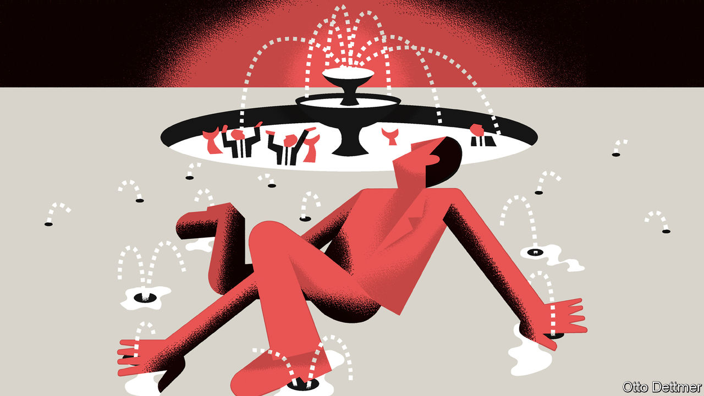

## Free exchange

# Yield-curve control could prove a useful tool in the next recession

> But it may not be potent enough by itself

> Jan 30th 2020

MANY HAZARDS complicate the job of Jerome Powell, the chairman of the Federal Reserve, from meddling presidents to pandemics. At the press conference following the Fed’s monetary-policy meeting on January 29th, he was grilled on its likely response to all of these. But Mr Powell’s biggest problem is a more enduring and global one: interest rates are stubbornly low. In recent months, members of the Fed’s Board of Governors have spoken about the need to prepare for future downturns. The Fed’s main policy rate will almost certainly be cut to zero, forcing it to rely once more on its “unconventional” tools. Mr Powell has said he is open to considering yield-curve control, a new approach borrowed from Japan. It is a promising innovation, but also a timid one, given the challenges the next recession will probably bring.

During the global financial crisis the hope was that when recovery arrived overnight interest rates—central banks’ preferred policy lever—would rise, restoring business as usual. In fact, despite a resilient global expansion, few rich-world countries have left zero behind. America, the most obvious exception, discovered last year that it could not sustain an overnight rate above 2%, even with low unemployment and a government-budget deficit approaching 5% of GDP. Some economists reckon low rates are only a minor inconvenience. In a recent lecture Ben Bernanke, a former Fed chairman, argued that the unconventional tools used during and after the crisis worked reliably and effectively, and could do so again. Others would prefer to have more powerful, and comprehensible, monetary policy ready for the next downturn.

The natural extension of interest-rate policy would be to cut overnight rates into negative territory, as central banks in Europe and Japan have already done. But the room for manoeuvre is limited. Economists worry that even modestly negative rates risk destabilising the financial system, as banks become reluctant to pass on interest-rate cuts for fear that depositors will yank their savings out. Fewer worries attach to quantitative easing (QE), the Fed’s unconventional tool of first resort, though it too has its downsides.

Before the crisis, the Fed traded bonds to keep overnight interest rates within a desired range. With QE, by contrast, bond purchases are an end in themselves. Rather than announce changes to rates, central bankers inform markets of the quantity of bonds they will buy (hence “quantitative”) with newly created money. When investors sell long-term government bonds to the central bank, the thinking goes, they use the cash they receive to buy other assets, such as corporate bonds or equities. Higher stock and bond prices in turn encourage firms to invest, boosting the economy.

Some evidence suggests that QE is subject to diminishing returns, however, and works best when credit markets are in crisis, which is not the case in most recessions. Asset-purchase programmes can also be difficult for investors to interpret. In 2013, for example, when the Fed signalled that it might curtail purchases, markets spasmed. In November Lael Brainard, a Federal Reserve Board governor, noted that the Fed’s announcements regarding QE often wrong-footed markets. This confusion may have put the Fed off using QE as aggressively as the economy required.

Yield-curve control would allow a central bank that has cut its overnight rate to zero to set rates for bonds of longer maturities. Keeping rates down at any horizon should stimulate investment and consumption, helping the economy. The Bank of Japan began its programme by targeting a yield of 0% for ten-year Japanese government bonds; an American version might begin by capping the rate for one-year bonds, then adding in longer durations as needed. No announcements regarding the buying or selling of bonds would be necessary; the Fed would simply transact in the bond market to keep yields on target, as it does for overnight rates. And this would be easier for markets to parse than tweaks to QE.

A commitment to defend interest-rate pegs unnerves some economists. Mr Bernanke warns that America’s government-bond market is so large and liquid that the Fed might have to purchase huge quantities of Treasuries to hit its target. But if markets found the yield-curve policy credible, the Fed might not need to buy many bonds at all; its commitment to intervene would deter investors from selling bonds at yields outside its target. And it might reinforce the central bank’s promises about the future path of short-term interest rates. The Bank of Japan, which conducted QE before switching to its yield-curve control policy, has kept yields at its desired level while buying fewer bonds than before.

Still, even successful yield-curve control could underwhelm. Long-term rates are already low, limiting the stimulus to be had from reductions. In Japan a pancake-flat yield curve has not pushed inflation up to the central bank’s 2% target, and low government-bond yields seem to be encouraging insurers and pension funds to load up on dangerously risky assets. Bolder change, like a shift to a higher inflation target, might offer a sustainable route away from low interest rates. But getting there might require more firepower than a central bank alone can muster.

Government spending packs a powerful punch, and sustained low rates of interest are sapping political opposition to large budget deficits. Even so, American-style deficits worry economists, who fear that markets will eventually lose their appetite for bonds. Under yield-curve control, however, the central bank would in effect guarantee the government’s low borrowing costs.

America has controlled its yield curve before—in the 1940s, when the Fed held down the government’s borrowing costs during the second world war. Few economists would endorse such a strategy outside wartime. But yield-curve control cannot fight the next recession alone. Without bigger changes to monetary policy, it will need to be paired with fiscal stimulus. Blurring the line between monetary and fiscal policy may once again become imperative. ■