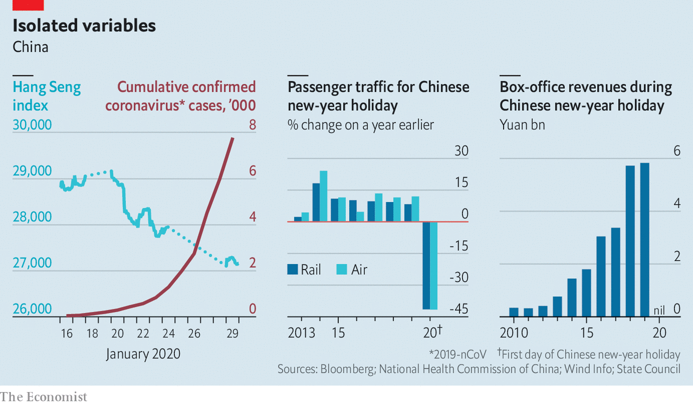

## Locked down

# China’s coronavirus semi-quarantine will hurt the global economy

> It may affect industries from tourism to plastic flowers

> Jan 30th 2020SHANGHAI

THE YU GARDEN, a 16th-century complex of pavilions and ponds in the heart of Shanghai, is all gussied up for the Chinese new-year holiday. Its walkways are bedecked with colourful lanterns, its stalls laden with dumplings, its entrances flanked by dozens of security guards to handle crowds. Just one thing is missing: people. Fearful of coronavirus, they are staying home. “I’ll be doing well if I make a few sales today,” says Li Xinming, manager of a silk-scarf shop. Last year Yu Garden attracted 700,000 visitors during the holiday week, peak season for it and its merchants. This year, Mr Li says his losses might wipe out his earnings for months to come.

The question for China, and for the many companies and countries around the world linked to its economy, is whether Mr Li’s travails are indicative of a much broader problem. The obvious reference point is China’s battle with SARS, another coronavirus, in 2003. Growth slowed sharply at the height of the epidemic but rebounded swiftly after it was contained. Other recent epidemics have reinforced the impression that economists should not be overly worried, so long as good doctors are on the job. Neither avian flu in 2006 nor swine flu in 2009 dimmed the global outlook.

Yet even flint-hearted investors are wondering whether the new epidemic might be worse. Stocks in Hong Kong have fallen by nearly 10% as reported infections have steadily increased. Tremors have also rippled through global markets.

The concern is less the severity of the virus, which seems less lethal than SARS, but rather the nature and potential duration of China’s efforts to bring the outbreak under control. And disruption in China, the world’s second-biggest economy, has global consequences. “It’s not the disease, it’s the treatment,” wrote analysts with Gavekal Dragonomics, a consultancy. The World Bank has estimated that as much as 90% of the economic damage from epidemics stems from people’s fear of associating with others, which leads offices and stores to close. In China, this is being magnified by the government’s policy of isolating affected areas and limiting interpersonal contact throughout the country. While public-health experts debate whether this is the right approach, economists will count the costs.

The most direct impact is being felt in Hubei province. First Wuhan, its capital, was placed under quarantine. Then the rest of the province, home to nearly 60m people, was locked down, too. Apart from food trucks and medical supplies, little can enter its cities and villages, and few are permitted to leave. Such a large-scale isolation is unprecedented as a public-health strategy. Economic activity of just about any kind, short of hospital care and movie streaming, has ground to a halt. Hubei generates 4.5% of China’s GDP, so the closure will leave a hole.

Other cities in China may not be under quarantine but that is what life feels like for their residents. Instead of getting together with family and friends, attending temple fairs and going to restaurants—all, depending on where one lives, staples of the holiday—people have shut themselves in. The government has encouraged them to avoid crowds; many need little prodding.

That will be a drag on consumption. The extent of the damage will depend on how long it takes to stop the virus, but the timing is already rotten. Last year retail sales exceeded 1trn ($144bn) yuan during the new-year week, a third more than an average week. This year, sales are sure to fall well short of that.

Some industries are being hit especially hard. The holiday accounted for 9% of China’s box-office revenues last year. This year almost all of the country’s 11,000 cinemas are closed. Spending on domestic tourism during the new-year week reached more than 500bn yuan last year, about 8% of the annual total. This year, fearful of the virus, people have cancelled trips.

There are also worries about how the virus will affect factories and offices. Several major economic centres, including Shanghai and Guangdong province, have extended the new-year holiday by a week, telling companies to wait until February 10th to restart. Chinese businesses are always slow to get back up to speed after the holiday. The extra week will make them slower, even if some firms such as Tencent, a tech giant, let employees work from home. Moreover, tens of millions of migrant workers, back in their hometowns for the holiday, may wait for the epidemic to recede before crowding onto trains and buses to return to their jobs.

One crucial difference compared with SARS is China’s importance for the rest of the world. In 2003 China generated 4% of global GDP. Last year, it was 16%. The slowdown in consumption and the disruption to production will not stop at its borders.

Countries accustomed to big-spending throngs of Chinese tourists face a brutal stretch. China’s government has ordered all tour groups to be suspended until the virus is contained. In Thailand, authorities expect the number of Chinese visitors will fall by 2m to 9m this year, reducing tourism revenue by some $1.5bn. Share prices of airlines have plunged; past epidemics have caused huge, if temporary, drops in passenger traffic, and China is the world’s biggest outbound international travel market.

Companies that have hitched themselves to China’s fast-growing middle class are also vulnerable. Starbucks has temporarily closed more than half of its 4,292 cafés in China. Footfall in those still open is scarce, with some posting signs that patrons may only enter if they are wearing face masks. Sales of masks are, indeed, a rare bright spot for companies such as 3M. Disney closed its resort in Shanghai for the new-year holiday, one of its busiest weeks of the year (adding insult to injury, China has just entered the Year of the Rat and the Chinese term for rats also refers to mice, a fine marketing opportunity for a brand built around them).

Factory closures will cascade through the global economy. Wuhan is a manufacturing hub, especially for autos. Nissan, Honda and General Motors have plants there. Bloomberg ranks Wuhan 13th out of 2,000 Chinese cities for its role in supply chains. One local company, Yangtze Optical Fibre and Cable, is the biggest maker of the wires that carry data around the planet.

Even if work stoppages elsewhere in China are milder, they will affect a wide range of sectors. Some are vital; roughly 80% of active ingredients for all medicines come from China. Others are less so; China supplies 90% of the world’s plastic flowers. Shares in Foxconn, which makes phones for Apple, have fallen by 10%.

Many companies were already working to reduce their reliance on China’s factories because of its trade war with America. The virus is a powerful reminder that, politics aside, a diversified base of suppliers is a good insurance policy. But the past year provided a lesson in how difficult that is; despite the tension with America, China’s share of global exports actually increased. Companies will struggle to find substitutes for its manufacturing muscle.

Adding it all up, the Chinese economy is in for a grim start to the Year of the Rat, and this will cast a shadow globally. Chen Long of Plenum, a consultancy, thinks China’s growth could slouch to 2% year-on-year in the first quarter, its weakest in decades, down from 6% in the final quarter of 2019. But he expects a strong rebound when the country gets back to normal. People long cooped up will flock to shops and restaurants. Factories will rush to make up for lost time. To give the recovery a push, officials will increase infrastructure spending.

The unknown is when normality might resume. In Yu Gardens, Mr Li could not wait. With business way down, he has told the three assistants in his silk-scarf shop to stay at home, unpaid—typical for small businesses in China. The death toll from the coronavirus is rising. And the whole country is paying a price.■

## URL

https://www.economist.com/international/2020/01/30/chinas-coronavirus-semi-quarantine-will-hurt-the-global-economy
