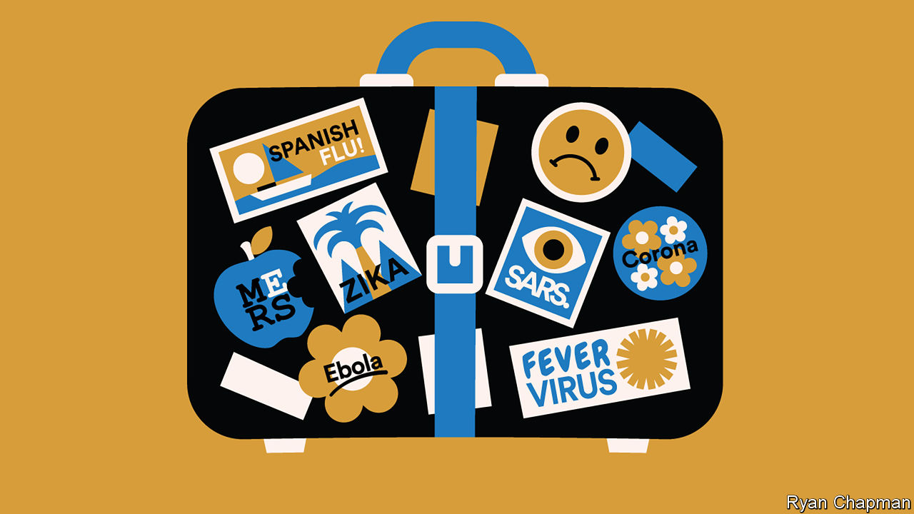

## Prepare for the worst

# How do you contain a global epidemic such as coronavirus?

> Health officials and doctors can only do so much to stop the spread of diseases

> Jan 30th 2020

“MADE IN CHINA” is a label the country’s government would prefer to be associated with slick technology. Its trending export at present, however, is 2019-nCoV, the new coronavirus that struck in the Chinese city of Wuhan in December. The virus has now spread to at least 16 countries. As The Economist went to press, the World Health Organisation (WHO) and China had confirmed almost 7,800 infections and 170 deaths, almost all in China.

When a new infectious disease begins to spread, decisions on how to stop it are based on patchy data that change by the hour. This is “the fog of war” phase, says David Heymann of the London School of Hygiene and Tropical Medicine. Health officials have to make decisions quickly and with uncertain information, says Jeremy Farrar of the Wellcome Trust, a charity.

They must first determine the deadliness of new viruses. The first cases diagnosed are usually among the worst because those people are ill enough to go to hospital. Zika is a mosquito-borne virus that commonly causes nothing more than mild flu-like symptoms. But the first recorded cases were mostly mothers who contracted the infection during pregnancy and whose babies were born with brain damage as a result. As health officials start actively trying to identify infected people, milder cases are added to the total.

As a result, early estimates tend to overstate the danger of new diseases. That is happening now with the Wuhan virus. At the end of January, reported deaths represent about 2% of confirmed infections. Around 20% of those reported to be infected become severely ill, suffering from pneumonia and respiratory failure. But modelling by Gabriel Leung and Joseph Wu at the University of Hong Kong suggests as of January 25th that the number of infections in Wuhan was closer to 44,000 (with a range of 20,000-78,000). Most of those infections will be mild, so the death rate for the virus could be as low as 0.1%—no deadlier than the common flu in America.

Officials must then gauge how contagious a new virus is. As growing numbers arrive in hospitals, patterns emerge. If it turns out that most of the newly infected people are health-care workers and relatives of the sick, that would probably mean that the virus is transmitted through close rather than casual contact, so stemming its spread should be easier. Experts must next determine how it is passed from person to person. The common cold spreads through virus-laden droplets from coughs and sneezes that travel only a few metres. Influenza and measles are far more contagious because they ride on airborne particles—so a sneeze can infect an entire room.

It is not yet clear how the Wuhan virus is transmitted. The WHO thinks that, like the one that causes Severe Acute Respiratory Syndrome (SARS), it hitches a ride on droplets. It is also unclear how often those who are infected but show no symptoms can spread the virus to others. Some infections in China and Germany seem to have been the result of this kind of transmission. If so, contagious people could be unknowingly infecting others for days. Both SARS and Middle East Respiratory Syndrome (MERS), another lethal coronavirus, had “superspreaders”—patients with unusually high viral loads, who are exceptionally infectious. In South Korea in 2015 a patient with MERS infected 81 people during a 58-hour stay at a hospital emergency room.

The threat of a global pandemic will put to the test the preparedness plans that countries and big cities have in place. These feature a worst-case scenario, usually the arrival from abroad of a hypothetical strain of influenza that is both very deadly and highly contagious—a rare combination of features that set apart the Spanish flu which swept the world in 1918, killing 20m-50m people.

City authorities and hospitals routinely carry out drills to test their readiness for such a scenario. In some cases officials huddle in a conference room and plan what they would do. On January 24th New York City’s top officials held such a drill for the Wuhan virus. In other exercises, doctors and health officials don protective gear and get out on the streets to practise their response. To test its system, New York City routinely uses “mystery patients” who show up at hospitals pretending to have symptoms of “notifiable diseases” that doctors are supposed to report to public-health departments.

When an outbreak starts to cross borders, as is now happening with the Wuhan virus, the knee-jerk reaction is to set up airport health-checks for passengers arriving from outbreak hotspots. But many health experts think such tests are a waste of time and money. In Canada, screening for SARS at airports in 2003 detected no instances of the disease; that year SARS killed 774 people, including 44 in Canada.

The theatrics of airport checks suit politicians, who are anxious to be seen to be responding to worried citizens. It is more useful to the public to provide those arriving at airports with information explaining what to do if they develop symptoms, says Agoritsa Baka of the European Centre for Disease Prevention and Control.

Efforts are better spent boosting infection-prevention measures at hospitals, says Ms Baka. Health workers are often among the first to be infected by a new virus, which they pick up from patients. They then pass it on to their families and other patients. In the global SARS outbreak in 2002-03 about a third of those infected were health workers.

The best way to nip an outbreak in the bud is for disease detectives to locate those infected. The goal is to prevent them from passing the virus to others, by isolating them in hospitals and at home. Most countries ask people to quarantine themselves voluntarily. Some will demand court orders to enforce such rules if people rebel.

When an outbreak grows from a few clusters of cases into an epidemic, cities may go further in their efforts to keep people apart. Japan and some European countries close schools for short periods if flu seasons look as though they will be particularly bad. In 2009 Mexico City shut down bars, cinemas, churches and football stadiums for 13 days to try to stop the spread of swine flu.

Locking down large areas, as China is currently doing with the entire province of Hubei, with a population of nearly 60m, is untested in modern times. Such efforts can backfire. One lesson from the Ebola outbreaks in west Africa is that if those under quarantine are not cared for and do not feel that the suffering they are enduring for the common good is respected, they will try to evade the quarantine, says Jeremy Konyndyk of the Centre for Global Development, a think-tank in Washington. That makes matters worse because in an outbreak it is crucial to know who is infected, where they have been and where they are going. A heavy-handed attempt to quarantine West Point, a settlement of 70,000 people in Monrovia, Liberia’s capital, during the Ebola outbreak in 2014 was abandoned after residents responded with riots. By contrast, a similar but well-organised quarantine in Sierra Leone, in which traditional leaders were brought on board first, did not meet resistance.

If China’s drastic measures help delay epidemics of the Wuhan virus in other countries by a few months, that could make a huge difference, says Dr Farrar. Hospitals in Europe and America will be better placed to handle a surge of infections in late spring, compared with February when they are overwhelmed by the peak in cases of the seasonal flu. Such a delay could also be crucial for testing a vaccine for the Wuhan virus. Several are already in the works in China, America and Australia. Dr Farrar reckons a vaccine could be ready for clinical trials in 6-12 months.

When it is clear that an epidemic cannot be controlled, authorities go into mitigation mode. That involves setting up places to care for patients when hospitals overflow, and systems to identify which patients should be treated first when medical supplies run short. But few countries put such measures in place in advance. China is frantically building extra hospitals in Wuhan to accommodate the current surge in numbers of patients.

Sometimes no preparation can suffice. “It will not be possible to halt the spread of a new pandemic influenza virus, and it would be a waste of public-health resources and capacity to attempt to do so,” admits Britain’s flu pandemic preparedness strategy. At that point, officials are left hoping for the best. ■