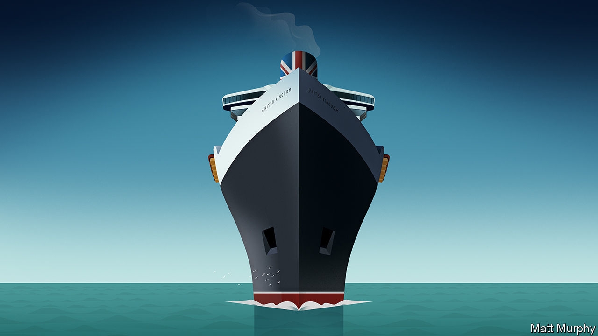

## Uncharted waters

# Britain after Brexit

> Now that Britain is sailing alone, Boris Johnson needs a lodestar. Liberalism offers one

> Jan 30th 2020

NOT MUCH will change at 11pm on January 31st. Some 50p pieces proclaiming “peace, prosperity and friendship with all nations” will go into circulation to mark Britain’s departure from the European Union, but people, goods and services will continue to move freely between Britain and the EU, for the difficult business of making a deal on trade and migration has been left to the transition period that lasts until the end of this year.

Yet leaving the EU is a huge moment. Britain will be quitting the institutional structure that governs Europe’s single market, which will necessarily imply more friction in its trade relations with a club that takes almost half its exports. Britons will lose the automatic right they now have to live and work across the EU. Brexit has also administered a shock to the country. The nation has argued long and bitterly over the issue, and its ruling elite has suffered a blow. The unarguable outcome is the most powerful government in a generation, under Boris Johnson. Much now depends on how he responds.

The Economist did not advocate this outcome. Most of the changes that Mr Johnson’s government favours could have been accomplished without leaving the EU. System-wide shocks are usually a costly way to bring about change. Yet now that Brexit is definitely happening, the country should make the most of the chance to recalibrate the economy and reset its priorities.

The last couple of times Britain pressed the reset button, in 1945 and 1979, the programmes that it put into place to create the welfare state and replace socialism with Thatcherism had been long-planned. This time is different. Mr Johnson was focused entirely on leaving the EU and is now being buffeted by the storms that brew up swiftly in the affairs of state: he had to decide this week whether to bow to American demands that Britain keep Huawei, a Chinese company, out of its mobile-phone network (he did not), and must shortly make a call on whether a high-speed rail project to link the north of England to the south (HS2) should go ahead (it should).

Mr Johnson grasps the excitement of the moment, but so far he has shown himself no more than a brilliant opportunist. If his premiership is to leave its mark, it needs to be founded on a strategic vision, not tactical campaigning.

That vision should be based on liberalism. The belief in freedom as the underpinning of civilisation, in the state as the servant of the individual rather than vice versa, and in the open exchange of goods, services and opinions, arose in Britain. It fits naturally with a national character which suspects authority and tends towards pragmatism rather than idealism. It underpinned the country’s progress in the 19th and 20th centuries and spread to become the world’s dominant political philosophy. But it is now under threat, not least in Britain.

Brexit was born in part of the instincts to throw up barriers against the world. But within it was an ultra-liberal strand, which regarded the EU as too statist and parochial. Mr Johnson needs to unite the liberals and to persuade sceptics that a system based on free markets and free trade can work for them, too.

Abroad, liberalism means using Britain’s still-considerable muscle in the service of free trade and individual rights, whether in backing the World Trade Organisation or holding China to account for abuses in Xinjiang. Mr Johnson’s decision that the country should use Huawei’s equipment was, thus, right: liberalism means not going along with President Donald Trump’s attempts to drive China out of global technology supply chains.

Liberalism may also on occasion mean diverging from how the EU regulates business. In many areas, like manufacturing or food safety, following standards set in Brussels may be sensible even after Brexit, not least because the EU market is so valuable. In others it may be a bad idea to accept the EU’s rules. In financial services, competing EU financial centres may seek to use regulation to handicap the City. In science and technology, Britain’s instinctive approach to regulation, which tends to be principles-based rather than relying on precaution, may be better suited to fostering innovation than the EU’s.

At home, liberalism means making the system open to all comers. Beneath the Brexit vote lay discontent that sprang from the sense that an economic system which pretends to be open is actually based on cronyism, run by and for a glossy, overpaid London-based elite impenetrable to those who are poor, provincial and without a foot on the property ladder.

Mr Johnson’s mantra is “levelling up” by boosting growth in the regions. He should be talking about “opening up” to give everybody the opportunity to share in prosperity. That means encouraging social mobility by spending more money on children’s early years, allowing the construction of more houses so that younger people can have decent homes, running an energetic competition policy to keep incumbents on their toes and building roads and railways in areas that have been short-changed. HS2 should be part of that: although its estimated costs keep rocketing, the gains from boosting rail capacity and speed across Britain will outweigh them.

Neither should the agenda be purely economic. Self-determination is central to liberalism, but over the past 150 years, power has slowly leached away from the English regions to Westminster. Scotland and Wales were given considerable autonomy in 1999, but England is highly centralised. Brexit was England’s revenge on Westminster (see [article](https://www.economist.com//britain/2020/01/30/brexit-and-english-nationalism)) for giving special privileges to Scotland and Wales but ignoring the regions; and the consequence may yet be the break-up of the union. But whatever the fate of the union, a liberal government needs to decentralise power, not just because decisions are best made as close to the action as possible, but also because people need to feel they have power over their own destiny.

Britain’s future is full of uncertainty. No longer part of one of the great global blocs, it has to find a new role in the world. Pulled apart by the tensions within the union, its nations need to find a new accommodation. Shaken by the bitter arguments over Brexit, it has to mend its frayed social contract. The difficulties should not be underestimated. But when Britain previously reset its course, in 1945 and 1979, the choices it made helped reshape the world. It should aim to do that again.■

## URL

https://www.economist.com/leaders/2020/01/30/britain-after-brexit
