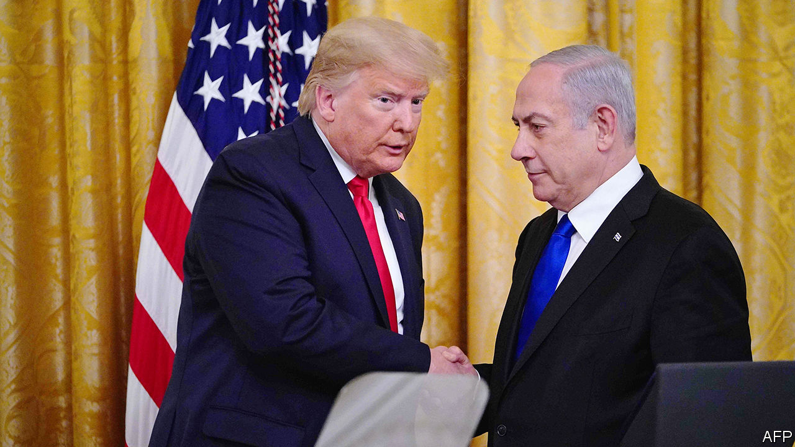

## Dead on arrival

# Donald Trump’s one-sided peace plan

> The need for new leadership on all sides has never been so clear

> Jan 30th 2020

THE PROSPECT of peace between Israel and the Palestinians has grown so dim, it is easy to forget that President Donald Trump’s efforts to end the conflict began with much promise. The dealmaker-in-chief vowed to bring fresh thinking to the decades-old feud. “As with any successful negotiation, both sides will have to make compromises,” he told Binyamin Netanyahu, Israel’s prime minister, in 2017. Mr Trump’s meeting with Mahmoud Abbas, a few months later, ended with the Palestinian president gushing: “With you we have hope.”

What followed, though, was neither bold thinking nor any demand for sacrifices on both sides. Rather, Mr Trump showered Mr Netanyahu, a fellow populist, with political gifts. He recognised the disputed holy city of Jerusalem as Israel’s capital. His State Department declared that Israeli settlements in the West Bank are lawful. (Few legal scholars agree.) Mr Trump cut aid to the Palestinians, even for health and education, and closed their diplomatic mission in Washington. All this delighted his pro-Israel supporters back home, but enraged Palestinians.

Such is the context for Mr Trump’s unveiling of his long-awaited peace plan with Mr Netanyahu on January 28th (see [article](https://www.economist.com//middle-east-and-africa/2020/01/30/donald-trump-gives-israel-the-green-light-to-annex-occupied-lands)). It will not bring peace. But it may spell the end of the two-state solution—the idea that a Palestinian state and a Jewish one might agree to co-exist.

At a different time, under a different president, the proposal might have been the starting-point for more talks. Not an evenhanded starting-point, mind. The plan favours Israeli hardliners as no previous American plan has done. It lets Israel formally annex the settlements, hang on to the Jordan valley, maintain control of holy sites and reject Palestinian refugees. For the Palestinians, there are conditional promises of something like a state at some point in the future, with a capital on the outskirts of Jerusalem, plus billions of dollars of investment and an Israeli promise to freeze some settlement-building. If they negotiate, they might get a better deal, suggests the Trump administration.

The Palestinians do not believe it. If Mr Trump were serious about peacemaking, why did he try to woo only one side? No Palestinian leader could have accepted the deal, let alone one as weak as Mr Abbas. Mr Trump did not even invite him to the unveiling, which anyway seemed designed to distract Americans from impeachment (see [article](https://www.economist.com//united-states/2020/01/30/voting-with-their-eyeballs)), and Israelis from corruption charges against Mr Netanyahu. The prime minister appears eager to end the Palestinian dream of statehood. He has already asked his cabinet to vote on annexing parts of the West Bank, and is whipping up hawkish voters ahead of a tough election on March 2nd.

Should Mr Netanyahu win another term, he will undoubtedly move ahead with annexation. His main challenger, Benny Gantz, will face pressure to do the same if he is victorious. Far from easing the conflict, Mr Trump has pushed it down a perilous path. He has given Israel a green light to take so much territory that a coherent Palestinian state is all but impossible. And he offers no viable alternative to the two-state solution. That may soon leave Israel with a choice: give the Palestinians equal rights and watch as they multiply and outvote Jews, or treat them as second-class citizens and formally become an apartheid state.

The best that can be said of the Trump plan is that it acknowledges the Oslo peace process is moribund and a new approach is needed. But a successful peace deal means not only discarding what has not worked, but also coming up with what will: a plan that demands concessions from both sides as well as fair-minded leaders to implement it. This is not that plan. And Mr Trump, Mr Netanyahu and Mr Abbas are not those leaders. ■

## URL

https://www.economist.com/leaders/2020/01/30/donald-trumps-one-sided-peace-plan
