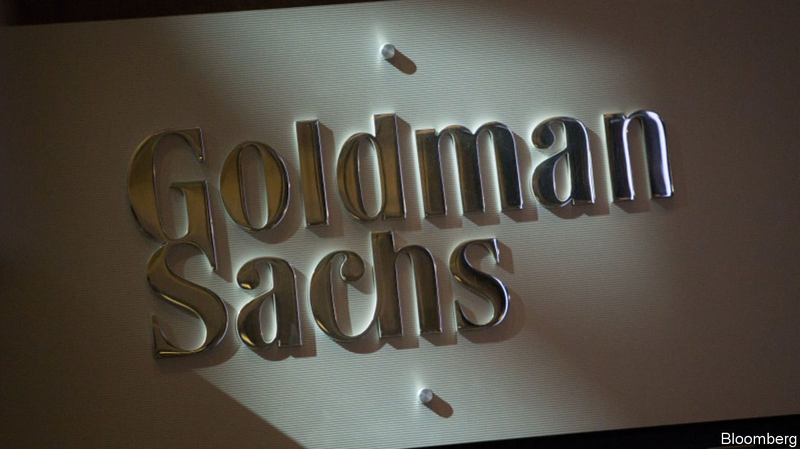

## Goldman Sachs

# How the mighty Goldman has fallen

> The bank’s search for a new identity captures the changes in global banking

> Jan 30th 2020

IN ITS PRIME Goldman Sachs was exceptional. Fifteen years ago, just before the global financial crisis, the bank easily outshone its Wall Street rivals—winning the most lucrative deals and making the most profitable trades. It printed money, both for shareholders and employees. Although the crisis imperilled the firm along with the rest of the banking industry, it navigated the chaos relatively well. Success allowed it to be haughty—while other banks engaged in the grubby game of sucking up to investors, Goldman remained secretive and enigmatic.

How times have changed. This week the firm held its first investor day, led by David Solomon, who took over as chief executive last year. It comes after a long period of underperformance. A dollar invested in Goldman in 2010 would be worth just $1.60 today. A dollar wagered on the S&P 500 would be worth $3.60, and on JPMorgan Chase, $4.10. Goldman has become a laggard.

Its predicament reflects two big changes in Western banking. One is the declining profitability of capital-markets activity, in large part the result of tighter rules, including higher capital requirements for riskier activity, penalties on lenders that rely on debt markets to fund themselves and tighter compliance regimes. The second is the rising importance of technology in the industry, as consumers and corporate borrowers shift to digital banking. This appears to give an immediate advantage to very large lenders that can support huge IT budgets, and to big tech platform firms that have vast numbers of customers who can be sold financial products, as is already the case in much of Asia.

Goldman has been on the wrong side of these trends. Consider its performance relative to JPMorgan Chase, a giant full-service firm. Goldman is still wrestling with past compliance mistakes—it is expected to pay billions of dollars in penalties for the 1MDB scandal in Malaysia. Its funding costs are higher than JPMorgan Chase’s (1.95% compared with 1.25% in 2018). Its ratio of expenses to revenues is worse. Not surprisingly, its return on tangible equity, a measure of profitability, was just 11% in 2019, compared with 19% for its rival. For Goldman’s shareholders the only consolation is that it has done better than Europe’s flailing banks—in the most recently reported quarter Barclays managed 10%, Credit Suisse 9%, and Deutsche Bank made a loss.

Mr Solomon’s new plan is, in part, to become more like JPMorgan Chase, with a broader range of services and funding. Goldman wants to expand Marcus, its fast-growing consumer arm, and also to build out its transaction-banking division that ships money around the world for companies. It plans to attract more deposits, which are typically the cheapest way to fund a bank. It has hired an army of tech experts. All this, Goldman hopes, will raise its return on tangible equity to 14%.

Goldman says it recognises the need for fundamental reform. It boasts of transforming its macho culture with a more diverse intake of recruits. But you can question how much it has really changed. It continues to allocate half its capital to its once-famed trading operation, despite its drab returns. And it still spends a lavish $12bn a year on rewarding its staff, even as the firm earned only $8bn for its shareholders in 2019. So far investors remain sceptical, with its shares priced at their book value.

If Goldman’s reinvention fails it may ultimately have to do a deal. Uniting Wells Fargo and Goldman, for example, would create something more like JPMorgan Chase (and with a similar-sized balance-sheet). In America regulators and some politicians are sceptical about bigger banks. In Europe, where the industry is more desperate, the mood has already changed, with matchmaking now encouraged. At least Goldman’s mergers-and-acquisitions advisers will be in on any action.■