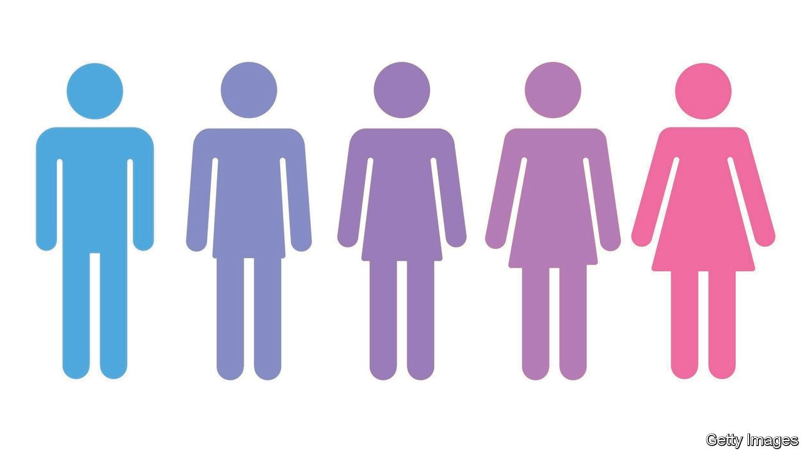
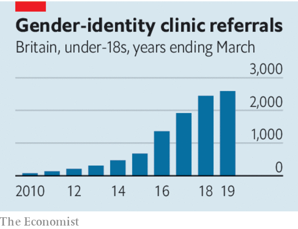

## Pill-pushers

# What to do about puberty blockers

> Drugs offered to transgender children need to be used more cautiously

> Jan 30th 2020

A RISING NUMBER of girls wish to be boys and boys wish to be girls and a rising number of them are taking drugs to block puberty. In Britain cases of children being treated for gender dysphoria by the National Health Service remain rare, but in the past decade they have climbed at a rate of 50% year on year (see chart). In America the number of gender clinics treating children has increased from just one in 2007 to perhaps 50 today.

This has bothered lawmakers. In America several states want to ban giving puberty-blocking drugs to children (see [article](https://www.economist.com//united-states/2020/01/30/a-new-push-to-ban-medical-treatments-for-transgender-children)). In Britain the high court is considering the judicial review of a clinic which complainants believe has been handing out puberty blockers too freely (see [article](https://www.economist.com//britain/2020/02/01/a-pushback-against-trans-activism-in-britain)).

The use of such drugs raises thorny questions about who decides what can happen to a child’s body and why. Put aside the culture wars, if you can. This debate should be settled in the interests of the child. Yet those can be very hard to discern.

Puberty blockers prevent adolescents from developing secondary sexual characteristics like breasts or a beard. They almost always set off a cascade of interventions that involve “cross-sex” hormones and later may also include gender-reassignment surgery. The main purpose of puberty blockers is to bring comfort to people with gender dysphoria, by sparing them the experience of, say, becoming more like a woman if they are a girl who wishes to be a boy. They also make most future surgery less severe.

However, the combination of puberty blockers and cross-sex hormones also leads to irreversible changes which, if they start early in puberty, include sterility. About a dozen studies of gender-dysphoric children who did not take puberty blockers have found that most of them, if supported by counselling, are happy with their sex once they emerge from puberty. The share often cited is 85% and many of them turn out to be gay. One sign that something is wrong is that more people are “detransitioning”—re-identifying with their biological sex. Most of them are girls who wanted to be boys when they were in their teens. If they took puberty blockers and then cross-sex hormones early they would be sterile for life, even if they did not have hysterectomies.

As of now, there is no way to distinguish the 15% or so of children who will transition successfully from the 85% who might have been happy with the gender of their birth if they had received counselling alone. Some claim that withholding puberty blockers adds to the burden on vulnerable children with gender-dysphoria and may lead to higher rates of suicide.

Choosing whom to treat is a judgment of Solomon. The decision to intervene is made harder by a reckless disregard for data. The academic studies purporting to show the higher suicide risk among trans children are unconvincing. Clinics do not publish enough studies on the effects of various treatments on their patients. Too little research compares children who have had treatment with those who have not. The field needs a better understanding of the long-term effects of puberty blockers and cross-sex hormones. Every child who is treated should be enrolled in a long-term follow-up study.

This should be with their informed consent. But so should the treatment itself. Today children and parents are not always fully informed about the potentially grave consequences of starting on puberty blockers. Their effects are often described as largely reversible—and the effects of cross-sex hormones that are almost always taken with them are not.

To ban puberty blockers in all circumstances would be unjustified. Not only would it be harsh on some children, but it would also leave the issue permanently obscured for lack of new research. However, today’s rush into treatment smacks of a fad. Many adolescents feel unhappy with the way they were made. Transitioning will be solace for some. But for others it will be a dreadful mistake. ■