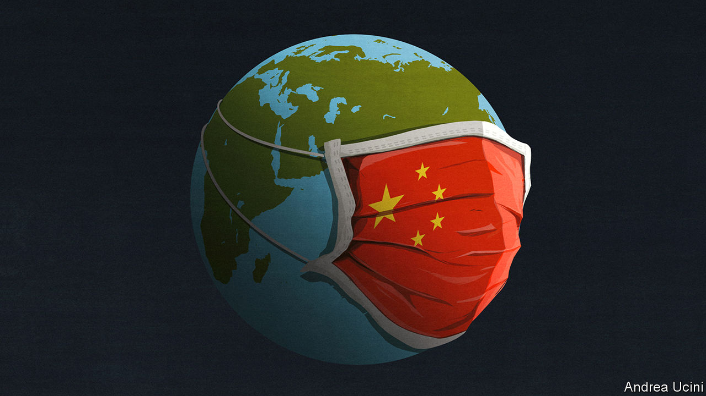

## Made in China

# Will the Wuhan virus become a pandemic?

> Probably. But public health services can help determine how severe it turns out to be

> Jan 30th 2020

TWO THINGS explain why a new infectious disease is so alarming. One is that, at first, it spreads exponentially. As tens of cases become hundreds and hundreds become thousands, the mathematics run away with you, conjuring speculation about a health-care collapse, social and economic upheaval and a deadly pandemic. The other is profound uncertainty. Sparse data and conflicting reports mean that scientists cannot rule out the worst case—and that lets bad information thrive.

So it is with a new coronavirus, known as 2019-nCoV, which has struck in China. The number of reported cases grew from 282 on January 20th to almost 7,800 just nine days later. In that time four reported cases outside mainland China have multiplied to 105 in 19 territories. Doubt clouds fundamental properties of the disease, including how it is passed on and what share of infected people die. Amid the uncertainty, a simulation of a coronavirus outbreak by Johns Hopkins University in October, in which 65m people lost their lives, was put about as a prediction. It is not.

Those are the right questions, though: will the new virus become a global disease? And how deadly will it be? A definite answer is weeks or months away, but public-health authorities have to plan today. The best guess is that the disease has taken hold in China (see [article](https://www.economist.com//china/2020/01/30/tough-quarantine-measures-have-spread-across-china)) and there is a high risk that it spreads around the world—it may even become a recurrent seasonal infection. It may turn out to be no more lethal than seasonal influenza, but that would still count as serious (see [article](https://www.economist.com//international/2020/01/30/how-do-you-contain-a-global-epidemic-such-as-coronavirus)). In the short term that would hit the world economy and, depending on how the outbreak is handled, it could also have political effects in China.

The outbreak began in December. The repeated mingling of people and animals in China means that viral mutations that infect humans are likely to arise there; and mass migration to cities means that they are likely to spread between people. This virus probably originated in bats and passed through mammals, such as palm civets or ferret badgers, ending up in Wuhan’s wet market, where wild animals were on sale. Symptoms resemble flu, but can include pneumonia, which may be fatal. About 20% of reported cases are severe, and need hospital care; about 2% of them have been fatal. As yet, there is no vaccine or antiviral treatment.

The greatest uncertainty is how many cases have gone unrecorded. Primary health care is rudimentary in China and some of the ill either avoided or were turned away from busy hospitals. Many more may have such mild symptoms that they do not realise they have the disease. Modelling by academics in Hong Kong suggests that, as of January 25th, tens of thousands of people have already been infected and that the epidemic will peak in a few months’ time. If so, the virus is more widespread than thought, and hence will be harder to contain within China. But it will also prove less lethal, because the number of deaths should be measured against a much larger base of infections. As with flu, a lot of people could die nonetheless. In 2017-18 a bad flu season saw symptoms in 45m Americans, and 61,000 deaths.

Scientists have started work on vaccines and on treatments to make infections less severe. These are six to 12 months away, so the world must fall back on public-health measures. In China that has led to the biggest quarantine in history, as Wuhan and the rest of Hubei province have been sealed off. The impact of such draconian measures has rippled throughout China. The spring holiday has been extended, keeping schools and businesses closed. The economy is running on the home-delivery of food and goods.

Many experts praise China’s efforts. Certainly, its scientists have coped better with the Wuhan virus than they did with SARS in 2003, rapidly detecting it, sequencing its genome, licensing diagnostic kits and informing international bodies. China’s politicians come off less well. They left alone the cramped markets filled with wild animals that spawned SARS. With the new virus, local officials in Wuhan first played down the science and then, when the disease had taken hold, enacted the draconian quarantine fully eight hours after announcing it, allowing perhaps 1m potentially infectious people to leave the city first.

That may have undermined a measure which is taking a substantial toll. China’s growth in the first quarter could fall to as little as 2%, from 6% before the outbreak. As China accounts for almost a fifth of world output, there will probably be a noticeable dent on global growth. Though the economy will bounce back when the virus fades, the reputation of the Communist Party and even of Xi Jinping may be more lastingly affected (see [article](https://www.economist.com//china/2020/01/30/xi-jinping-wants-to-be-both-feared-and-loved-by-chinas-people)). The party claims that, armed with science, it is more efficient at governing than democracies. The heavy-handed failure to contain the virus suggests otherwise.

Outside China such quarantines are unthinkable. The medical and economic cost will depend on governments slowing the disease’s spread. The way to do this is by isolating cases as soon as they crop up and tracing and quarantining people that victims have been in contact with—indeed, if the disease burns out in China, that might yet stop the pandemic altogether. If, by contrast, that proves inadequate, they could shut schools, discourage travel and urge the cancellation of public events. Buying time in this way has advantages even if it does not completely stop the disease. Health-care systems would have a greater chance to prepare for the onslaught, and to empty beds that are now full of people with seasonal flu.

Despite all those efforts the epidemic could still be severe. Some health systems, in Africa and the slums of Asia’s vast cities, will not be able to isolate patients and trace contacts. Much depends on whether people are infectious when their symptoms are mild (or before they show any at all, as some reports suggest), because such people are hard to spot. And also on whether the virus mutates to become more transmissible or lethal.

The world has never responded as rapidly to a disease as it has to 2019-nCoV. Even so, the virus may still do great harm. As humans encroach on new habitats, farm more animals, gather in cities, travel and warm the planet, new diseases will become more common. One estimate puts their cost at $60bn a year. SARS, MERS, Nipah, Zika, Mexican swine flu: the fever from Wuhan is the latest of a bad bunch. It will not be the last. ■

## URL

https://www.economist.com/leaders/2020/01/30/will-the-wuhan-virus-become-a-pandemic
