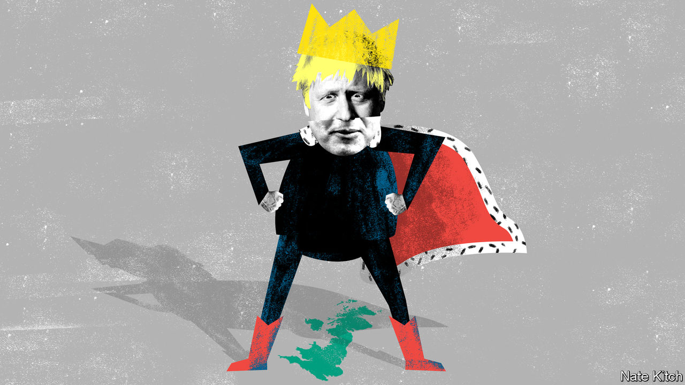

## On one-nation Tories, chips, back pain, Boeing, disgust

# Letters to the editor

> A selection of correspondence

> Jan 30th 2020

Regarding [Bagehot](https://www.economist.com//britain/2020/01/02/boris-johnson-is-reinventing-one-nation-conservatism)’s column in the January 4th issue, Benjamin Disraeli’s “one-nation” conservatism was born as a convenient historical fiction. Disraeli denoted a commitment to healing a great social divide in his novel, “Sybil: or The Two Nations”. And in two famous speeches in 1872, Disraeli spoke of “elevating the condition of the people”. But it was Stanley Baldwin in 1924 who first used the famous phrase when he told the Conservative Party that “we stand for the union of those two nations of which Disraeli spoke…union among our own people to make one nation.” During the next five years, Neville Chamberlain, the most remarkable social reformer the Tories have ever had, gave substance to Baldwin’s vision.

Conservatives today would be proclaiming proudly that they were Baldwinian one-nation Tories if his reputation had not been so gravely damaged, very unfairly in my view, by the belief after 1939 that he had not rearmed Britain in the face of the Nazi menace. Nothing more might have been heard of one nation if a number of able, ambitious younger Conservatives, including Iain Macleod and Enoch Powell, had not adopted it as the name of a group they formed.

“One Nation” adorned a pamphlet that excited the party conference in 1950. Tory Central Office decided that this badge of moderate conservatism would be more effective if a great name from the past could be attached to it. Disraeli’s speeches from 1872 were now reprinted for the party faithful, and were quoted frequently by Tory leaders from Anthony Eden on. There has been a one-nation group of MPs almost constantly since then, formulating no more than mildly controversial policies to help counter “the almost traditional anti-intellectualism of the Tory party”, as The Economist put it (“[Class of 1950](https://www.economist.com/http://media.economist.com/sites/default/files/pdfs/GP4100727994.pdf)”, December 25th 1954).

If Boris Johnson now gives real political substance to what has become an overused catchphrase, he will be recreating the Tories in the image of “Honest Stan” Baldwin. But will the ghost of Disraeli ever be laid to rest?

ALISTAIR LEXDENHouse of LordsLondon

China’s shift from investing in chip manufacturing to chip design is long overdue, but it will take significant time to plug its intellectual-property gap ([Technology Quarterly](https://www.economist.com//technology-quarterly/2020/01/02/with-the-states-help-chinese-technology-is-booming), January 4th). That is the very piece of the puzzle that creates the most enabling value, within a chip and within the end product. China still imports a vast number of semiconductors, and import substitutes have had an impact only at the low end of the chip market and for some smartphones. China is still heavily reliant on chips from America for its data centres, and chips from Japan and Europe for cars. The intellectual property within such chips is highly patented. Even with the wind at its back, it will take China some time to develop the requisite IP and steer clear of the patent landmine. At the same time, American and British innovators will continue to advance the state of the art. It is the new great game.

WOZ AHMEDChief strategy officerImagination TechnologiesKings Langley, Hertfordshire

The personal and socioeconomic costs of joint pain (“[Backs to the future](https://www.economist.com//briefing/2020/01/18/back-pain-is-a-massive-problem-which-is-badly-treated)”, January 18th) are very much greater if you include the many millions of people suffering chronic knee and hip pain, which are very similar to back pain and similarly mismanaged by over medicalisation. Yet effective, low-cost, non-medical interventions are available that could easily be scaled up to help people with joint pain live better and do more. ESCAPE-pain is an evidence-based programme that helps people understand their problems and how physical activity can help. People who complete the programme often go from considering medication and surgery as the only options, to using lifestyle changes (losing a bit of weight, being a little more physically active) to control their pain.

This move toward integrated health and social care necessitates new ways of covering its costs. Some leisure companies charge a nominal fee for the programme, or a membership fee, or devise additional classes and activities for people who want to continue exercising after completing the programme. Some health-care commissioners have given local leisure firms contracts to provide ESCAPE-pain away from hospitals. This avoids unnecessary primary- and secondary-care consultations, thereby saving precious resources.

PROFESSOR MIKE HURLEYCentre for Applied Health and Social Care ResearchSt George’s, University of London

As a recently retired doctor I agree that the overuse of opiates in particular has given many patients living with persistent pain the additional problem of opiate dependency, without relieving their symptoms. Harm from the overuse of imaging, particularly MRI, has its own acronym, VOMIT: Victim Of Medical Imaging Technology.

DOUGLAS SALMONBirmingham

The 737 MAX fiasco ([Schumpeter](https://www.economist.com//business/2020/01/11/the-last-ge-man), January 11th) was the ultimate result of running Boeing like a hard-nosed business rather than a great engineering firm. This was not its first blunder. When Airbus won the contract for the American air force’s aerial tankers, Boeing cried foul instead of sharpening its pencils for next time, got the contract reopened and won it in 2011. It has been a disaster, well over budget and still not ready for full production (the Airbus tanker has been in service since 2011).

And it was Boeing that started the spat with Airbus over subsidies. After the WTO makes a ruling this year both companies will lose out on sales, which will hurt Boeing more than Airbus because Boeing sells more to the EU than vice versa, and Airbus has an American assembly plant to get around some of the duties.

In 2016, Boeing became alarmed that Bombardier’s C Series aircraft had won a contract from Delta, and fought to kill it off through tariffs. Bombardier, a Canadian aircraft-maker, sold a majority stake in the C Series to Airbus, which converted it into the successful A220. Because of Boeing’s behaviour, the Canadian government cancelled a contract for Boeing fighter jets.

Will Boeing’s culture change under David Calhoun? The signs are not encouraging. Boeing offered the victims of the 737 MAX crashes $50m in total compensation. Dennis Muilenburg, Mr Calhoun’s predecessor, got a $60m payout. Not a good start to repairing Boeing’s reputation.

GRAEME SHELFORDThetis Island, Canada

I commend your article on the importance of culture in defining what is disgusting (“[Overcoming the yuck factor](https://www.economist.com//international/2020/01/09/what-a-museum-of-disgusting-food-reveals-about-human-nature)”, January 11th). Readers interested in the subject should turn to William Ian Miller’s superb book, “The Anatomy of Disgust”, published in 1997. Mr Miller provides such trenchant insights as “vomit may be more disgusting than faeces (only faeces is playing by the rules)”, and that “even in the Middle Ages, with its presumably high thresholds of disgust…one simply did not drink pus.”

JOHN HANSONCambridge, Massachusetts

## URL

https://www.economist.com/letters/2020/01/30/letters-to-the-editor
